## [ld2025-10-27](<../Link_Daily/ld2025-10-27.md>)
> [!note]
>- +1万 事前認識 **開始5分**

上昇から下落時のシミュ

- [x] [my](obsidian://open?vault=Teino&file=FX/my)(見ないと増える)
- [x] 指標
    - 差し込まれる可能性有り、毎日

4h
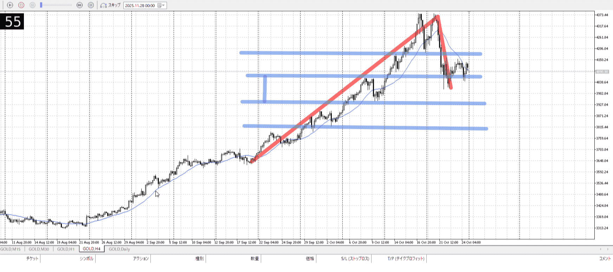
＜ここに目線画像＞

- [x] トレーディングレンジ
    - cu

方向：u

1h
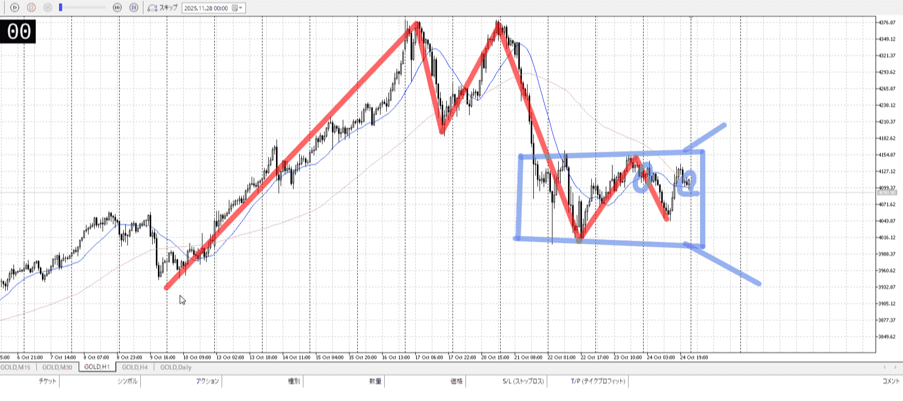
＜ここに目線画像＞

方向：dR

15m
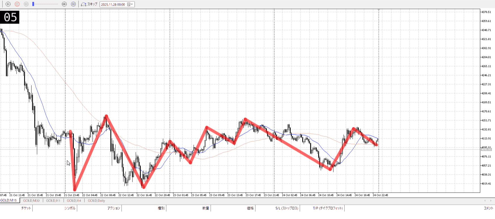
＜ここに目線画像＞

方向：uR

全方向：udRuR

- [x] 使用足全ての目線確認

＜ここにシナリオ画像＞

b:1h直近安値
s:1h前回ネック

ネックから下落したが早めに上昇

- [x] 1hシナリオ
- [x] ぶつかり
- [x] 日出日入、週出週入

目線・シナリオ・強弱・調整・横幅・PA後・平均線方向・波・**ひきつけ**
udRuR
どっちに行くかめちゃくちゃ悩んでるレンジ
4hは前回上昇からcu地点、1hに従うと売り
というか15mも2本ごときで波扱いするのは難しい、そのまま一つの売りとして見ることもできなくはないところ

15m、やる気のない上昇と下降
途中から上昇してるので、下がり力を残して売りを探しに行ってるとも取れる
cuでもあるから売るならひきつけ売り

> [!check]
> - [ ] +1万 事前認識 **開始5分**
> - [ ] +1万 5枚

OK!
Exchage Start.

---
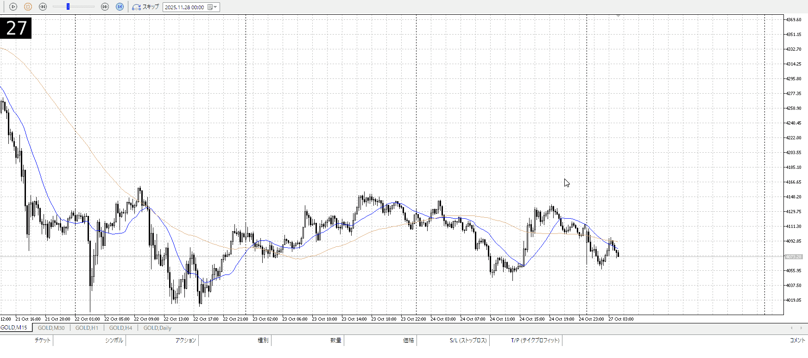

売り場どこ……
15mが一応買いなので、それが否定されるような位置。つまり15mの安値からのこの買いが下へ行くところ。

よく考えたらcuから売りなら普通に確実な戻り売りでいいわ。
1hとしては下の方。引きつけて売りたい。

15mはレンジ。売るなら上から。

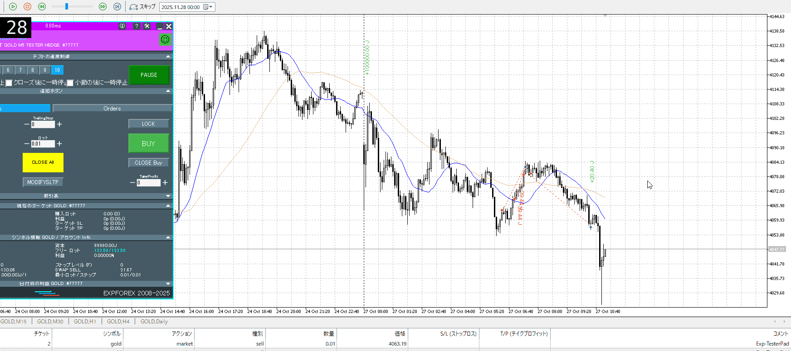

1つめは早すぎ。なんの上からでもない。
しかし抜け後の一番最初、即伸びを期待している売り。なのでさっさと手放すべきではあった。

二つ目は三つ目の高さを損切に見た売りである。
そのため三つ目のところで手放すことはできない。耐えるしかない。

それが無理であるというなら、やはり三つ目で入るしかない。

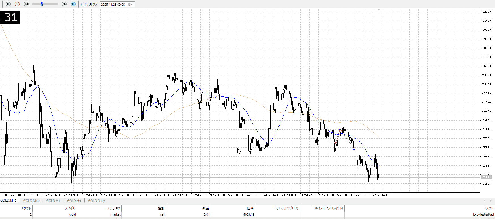

切ったとこより後は切り上げにかかるが、これをもって下まで持つべきだったか否か。
下まで持つつもりから七割を考えていれば、その前で利確は出来てた。なので利確も早い。一個前では切り上げ否定してるし。

その後は底だし深夜だしで何かはできない、はず。

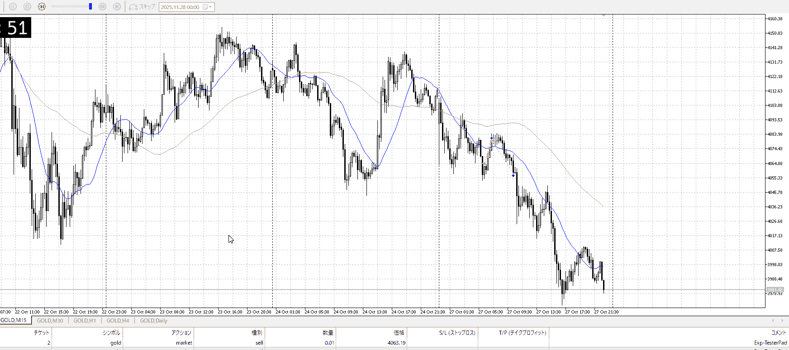
その後落ちたが力足りず。

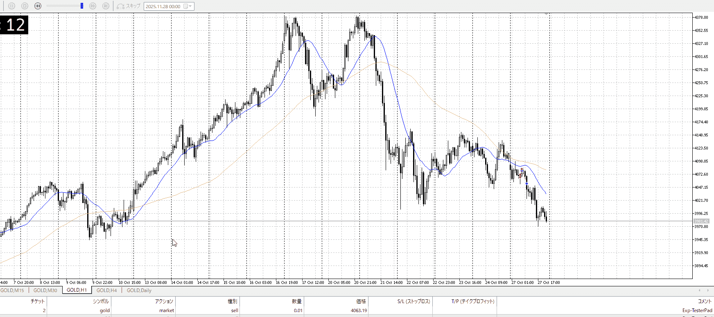

1h安値付近。

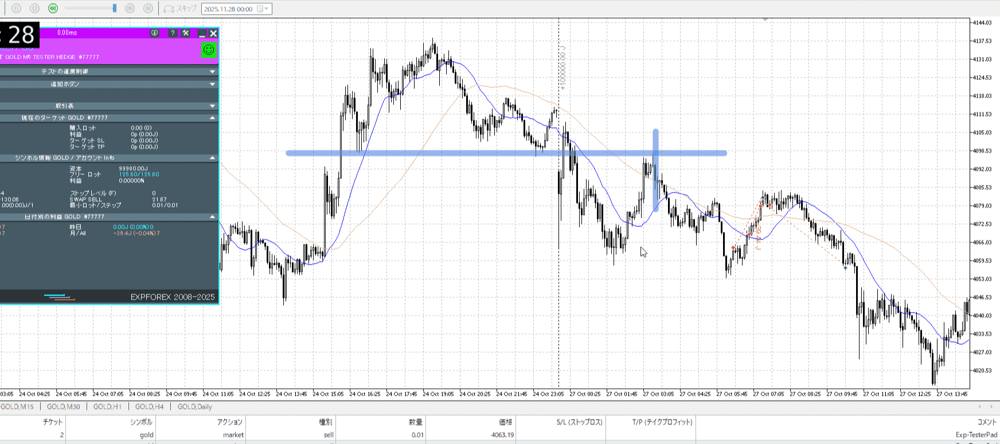

今回売った付近他、この青縦でも売れた。
ただこれは早めに戻った後、15mを一本待ってから、上昇に対してここで出しそうにない足が出たなという5m入り。すると利確も5mレベルなので。

過学習気味だが、上記とひきつけて売る奴の二つをもう一度やってちゃんと意味理解しつつ取る。

## [ld2025-10-27](<../Link_Daily/ld2025-10-27.md>)
> [!note]
>- +1万 事前認識 **開始5分**

- [x] [my](obsidian://open?vault=Teino&file=FX/my)(見ないと増える)
- [x] 指標
    - 差し込まれる可能性有り、毎日

4h
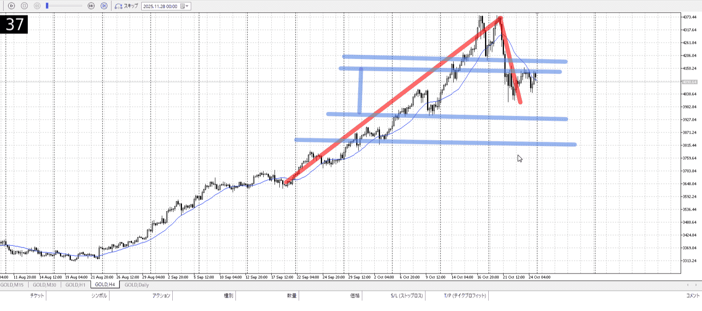
＜ここに目線画像＞

- [x] トレーディングレンジ
    - c

方向：u

1h
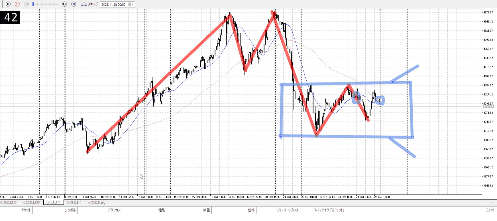
＜ここに目線画像＞

方向：d

15m
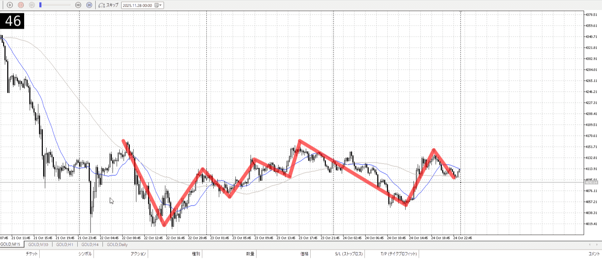
＜ここに目線画像＞

方向：u

全方向：udu

- [x] 使用足全ての目線確認

＜ここにシナリオ画像＞

b:1h前回安値
s:1hネック

上昇をネックで受け、早め戻り

- [x] 1hシナリオ
- [x] ぶつかり
- [x] 日出日入、週出週入

目線・シナリオ・強弱・調整・横幅・PA後・平均線方向・波・**ひきつけ**
15m上昇が一つの波で落ちてるので、下の力がある物として考える。

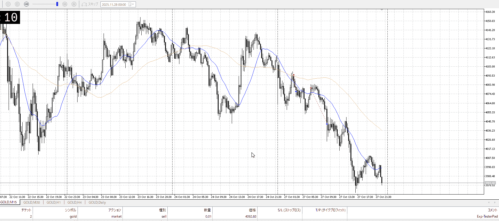

理想はこんな感じ。
13000と33000ほど。

しっかり押しや抜け後の損切ひきつけを待っている。
そしたらこのとおり。

