## [ld2025-11-03](../Link_Daily/ld2025-11-03.md)
> [!note]
>- +1万 事前認識 **開始5分**

- [x] [my](obsidian://open?vault=Teino&file=FX/my)(見ないと増える)
- [x] 指標
    - 差し込まれる可能性有り、毎日

4h
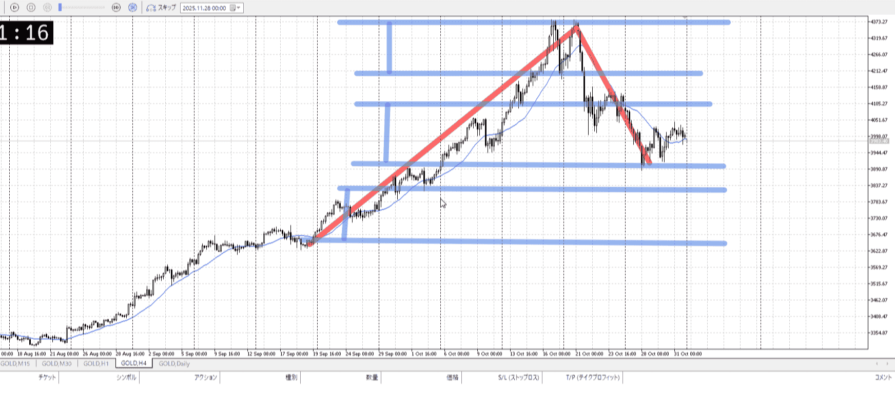
＜ここに目線画像＞

- [x] トレーディングレンジ
    - c

方向：u

1h
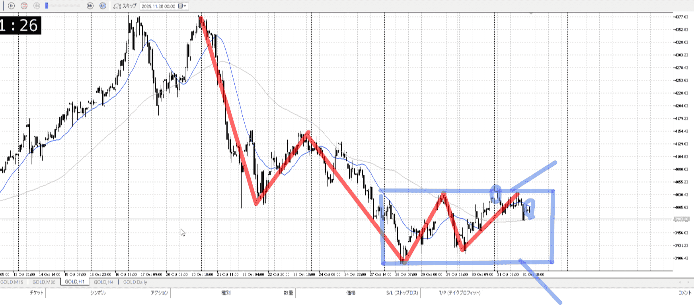
＜ここに目線画像＞

方向：d

15m
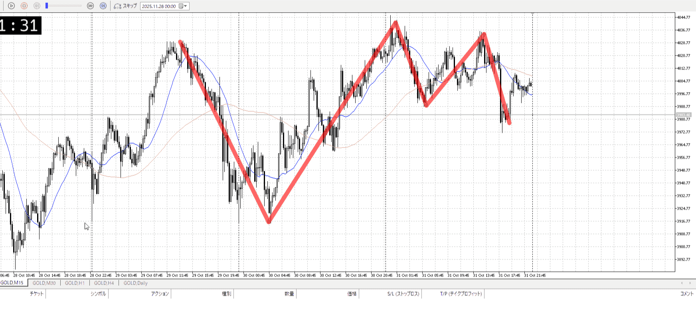
＜ここに目線画像＞

方向：uT

全方向：udRuT

- [x] 使用足全ての目線確認

＜ここにシナリオ画像＞

b:1h安値
s:1h前回レンジ下

前回頂点からほどほど落ち

- [x] 1hシナリオ
- [x] ぶつかり
- [x] 日出日入、週出週入

目線・シナリオ・強弱・調整・横幅・PA後・平均線方向・波・**ひきつけ**
udRuT
先日の落ちがほどほどで、15mは上昇。
若干売りにくい。がレンジは出てるはず。なので前回レンジ近くで引きつけ売りが出来る。

> [!check]
> - [ ] +1万 事前認識 **開始5分**
> - [ ] +1万 5枚

OK!
Exchage Start.

---

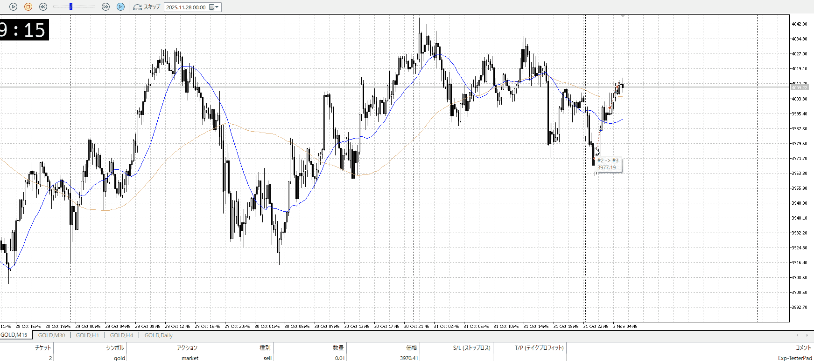

はい
[昨日](my2025-12-30.md)と違って、段々を一波で抜くなどの売り要素が無い
とはいえガッツリ返されるのはちょっと想定外

1hはまだレンジ内
買うなら15m->5mルートのみ。

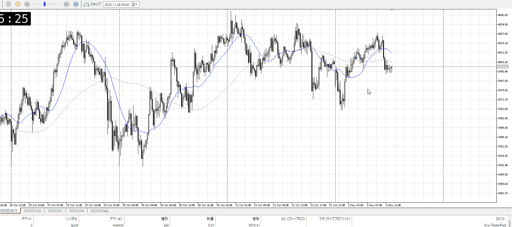

上まで行くかと思ったが、それもいかず。
仕方なく利確。

この後だが、徐々に下がってきてる
上に貼りつくレンジで徐々下がり、それはもう下から買って一気に登るほうがありそうだが。

とりあえず下からの買いに変更。
1hだと売りにしては結構グダグダ使ってるという事実もある。

まずは下がどこなのか探す。
1hに逆らうので15mの底くらいは味方にしたい。

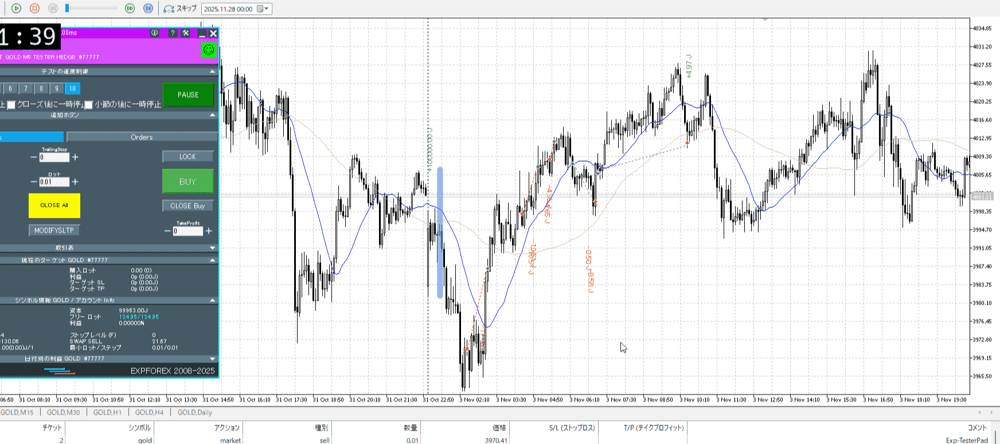

15m一本待って今日開幕からの売りが出来ればよかったが。

## [ld2025-11-04](../Link_Daily/ld2025-11-04.md)
> [!note]
>- +1万 事前認識 **開始5分**

- [x] [my](obsidian://open?vault=Teino&file=FX/my)(見ないと増える)
- [x] 指標
    - 差し込まれる可能性有り、毎日

4h
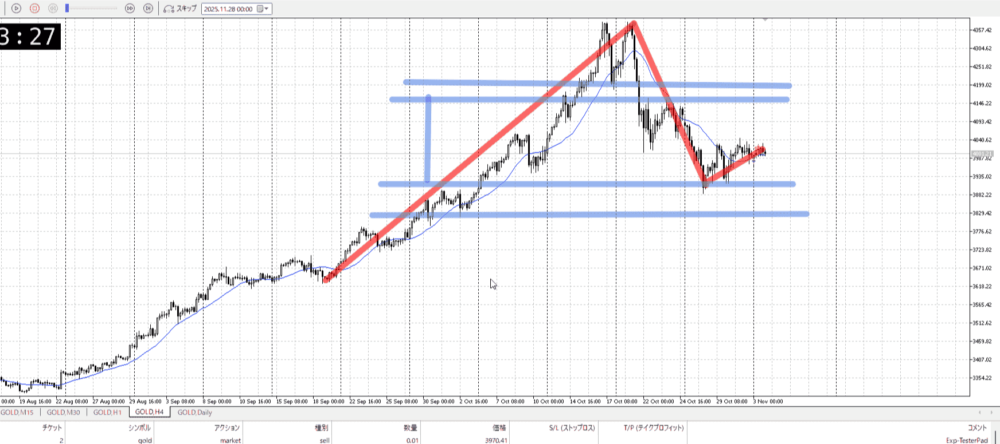
＜ここに目線画像＞

- [x] トレーディングレンジ
    - c

方向：u

1h
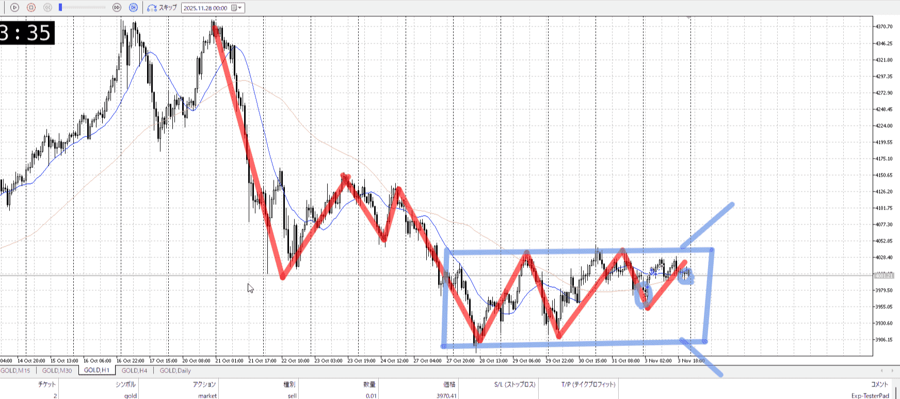
＜ここに目線画像＞

方向：dR

15m
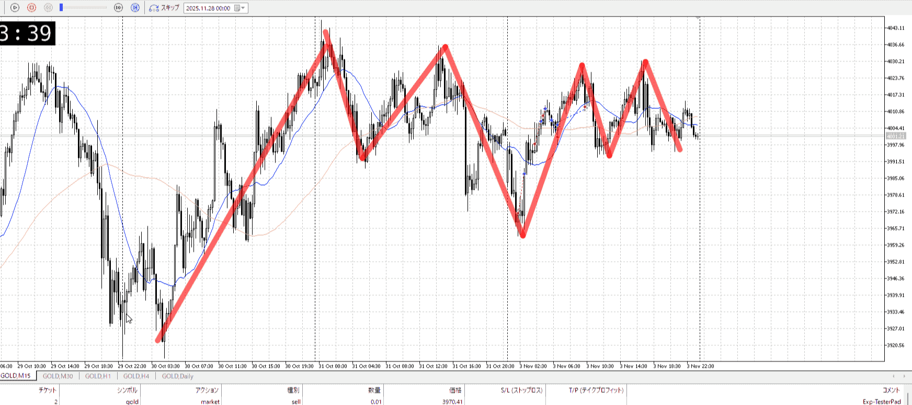
＜ここに目線画像＞

方向：uR

全方向：udRuR

- [x] 使用足全ての目線確認

＜ここにシナリオ画像＞

b:1h安値
s:1hネック

レンジ上から上昇、さらに上へ近づきネックで跳ね返りつつとどまり

- [x] 1hシナリオ
- [x] ぶつかり
- [x] 日出日入、週出週入

目線・シナリオ・強弱・調整・横幅・PA後・平均線方向・波・**ひきつけ**
udRuR
先日買いと決めたからには買い
そのうえで抜けを目指したいところ

今丁度15m小レンジ底地点
とりあえず買っておきたい、が1hでの小レンジ底ではない
ここからだと15mの力しかかからない

> [!check]
> - [ ] +1万 事前認識 **開始5分**
> - [ ] +1万 5枚

OK!
Exchage Start.

---

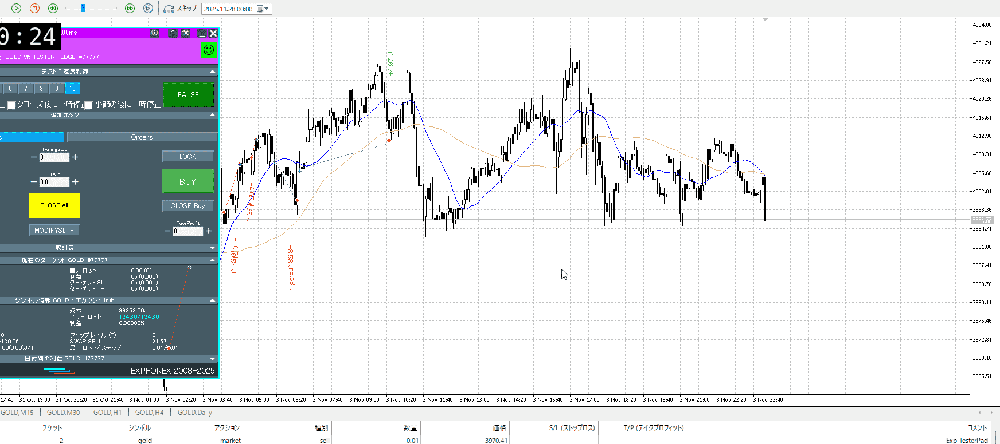

なのでこんな開幕から買えるかというと。
一旦見送りたいなというとこ。

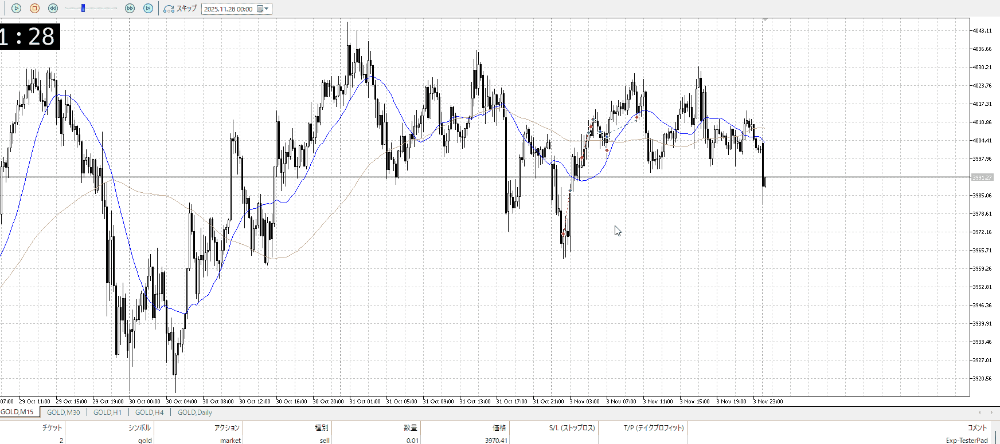

15m下抜けで固まる。
売りはしない、15mの次の底で買い狙い

---

- 1
- 2
- 3