## [ld2025-11-04](../Link_Daily/ld2025-11-04.md)
> [!note]
>- +1万 事前認識 **開始5分**

- [x] [my](obsidian://open?vault=Teino&file=FX/my)(見ないと増える)
- [x] 指標
    - 差し込まれる可能性有り、毎日

4h
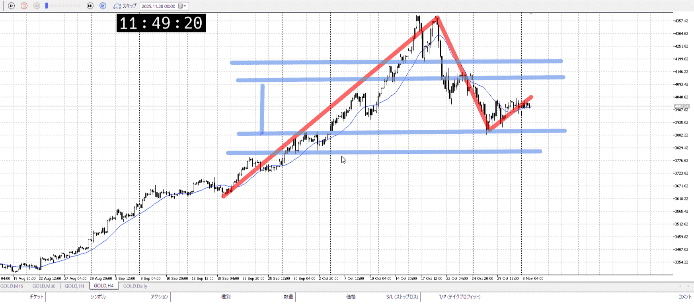
＜ここに目線画像＞

- [x] トレーディングレンジ
    - c

方向：u

1h
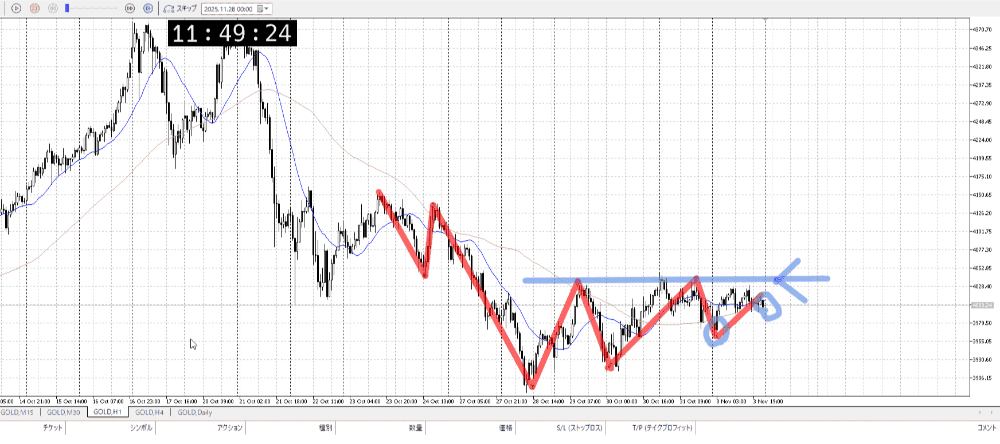
＜ここに目線画像＞

方向：d

15m
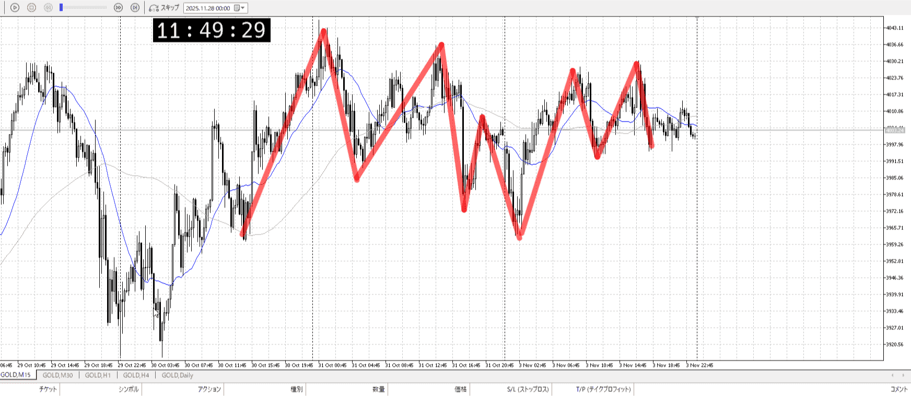
＜ここに目線画像＞

方向：u

全方向：udu

- [x] 使用足全ての目線確認

＜ここにシナリオ画像＞

b:1h安値
s:1h天井

天井からの売りで切り上げ

- [x] 1hシナリオ
- [x] ぶつかり
- [x] 日出日入、週出週入

目線・シナリオ・強弱・調整・横幅・PA後・平均線方向・波・**ひきつけ**
udu
1hからすると売りたい場面
しかしそれを何度も試しては、底に行く前に切り上げを受けている

切り上げはより下がる前の溜めにもなるが、二回やられるのはちょっと
かといって上が近いので、簡単には買えない
横幅を取ってから買いを入れたいところ、それは昨日の時点で充分じゃなかろうか

もう一度切り上げ点から買いたいが、底まで下がるかどうか。
1hで上から下がってるのは事実なので、それを一度止めないといけない

> [!check]
> - [ ] +1万 事前認識 **開始5分**
> - [ ] +1万 5枚

OK!
Exchage Start.

---

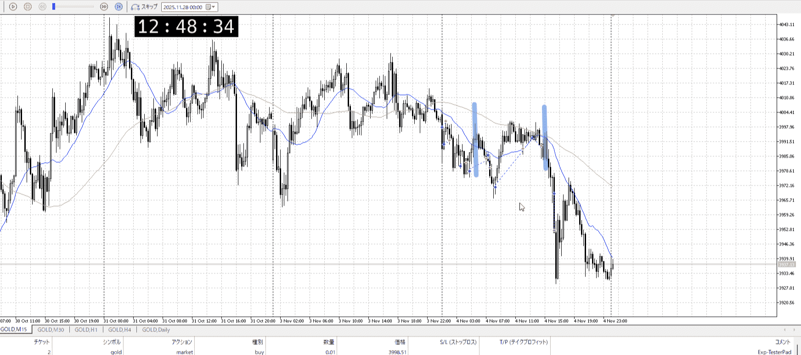

やっぱり1hに逆らうのはキツイ、というのがよく分かりました。
1hが下なので、15mの下トレンドを予測して売ればよかった。

そのうえで今日入るのはこの二箇所程度で良かった。
最初の見立てが間違ってるので、どこで取れてようとも何も言えん。

今のうちに失敗できたのはいいことだが。
原則が飛んでいる。myを見直し。

いや、一応15mは上だったのでその想定で終わるならよかったんだけど。
だから真ん中のやつだけは一応評価か。抜けを狙ってたら馬鹿。

## [ld2025-11-05](../Link_Daily/ld2025-11-05.md)
> [!note]
>- +1万 事前認識 **開始5分**

- [x] [my](obsidian://open?vault=Teino&file=FX/my)(見ないと増える)
- [x] 指標
    - 差し込まれる可能性有り、毎日

4h
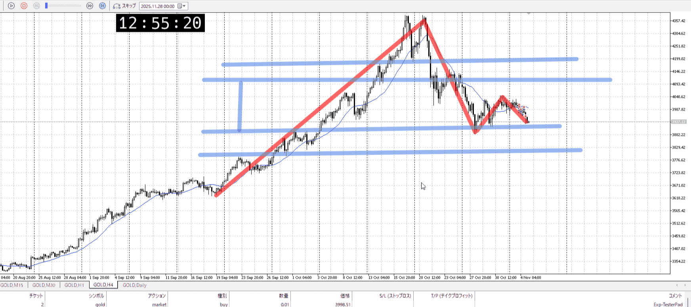
＜ここに目線画像＞

- [x] トレーディングレンジ
    - c

方向：u

1h
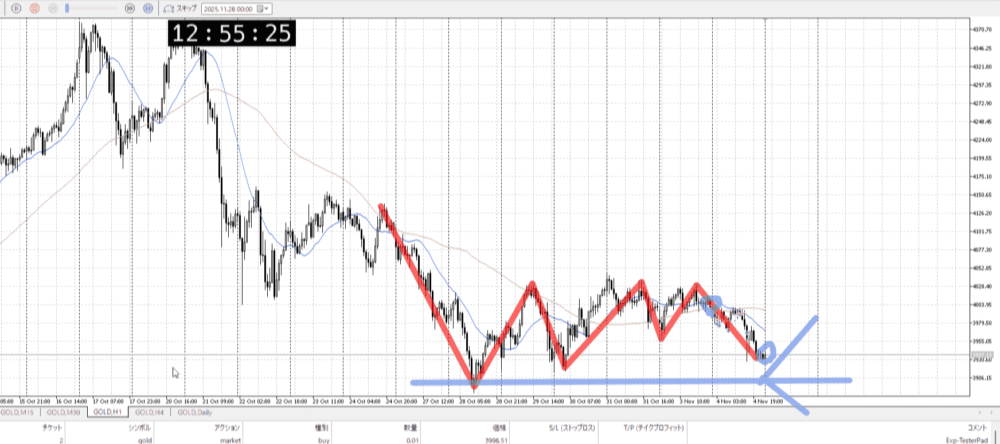

＜ここに目線画像＞

方向：d

15m
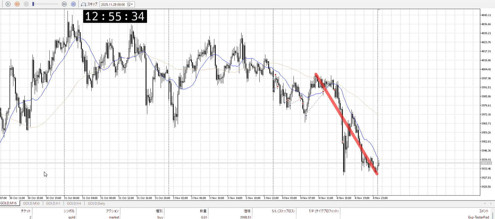
＜ここに目線画像＞

方向：d

全方向：udd

- [x] 使用足全ての目線確認

＜ここにシナリオ画像＞

b:1h安値
s:1h天井

下がって底より少し上止まり

- [x] 1hシナリオ
- [x] ぶつかり
- [x] 日出日入、週出週入

目線・シナリオ・強弱・調整・横幅・PA後・平均線方向・波・**ひきつけ**
udd
売りたい
が落ちたばかりなので調整が必要、前回のこの高さを見る限りしばらく上昇がありそう

一応引きつけてから落ち切るとこまで売ることができるはず
それ以外は無理

> [!check]
> - [x] +1万 事前認識 **開始5分**
> - [x] +1万 5枚

OK!
Exchage Start.

---

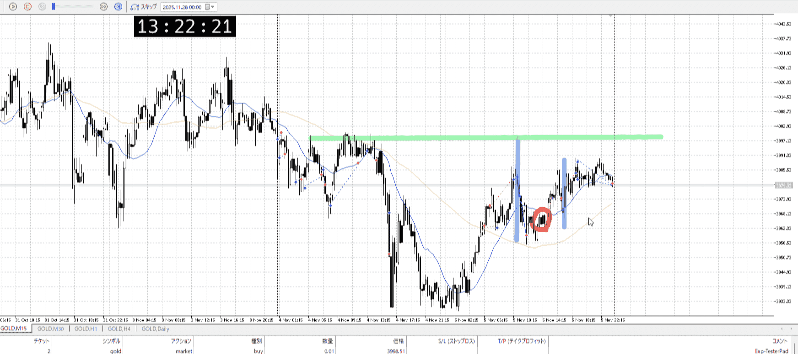

青縦1の時点では、緑横を抜いてないのでまだ売り
そこで売って赤丸らへんで手放せばいい

青縦2の時点でもまだ抜いてない
なので売りは継続すべき、レンジ化想定
その後の上昇が異常なので、様子見

その後の買いは緑横を抜いてないので早すぎ
何を待ってるのか一回書こうか

特に青縦2は売ってていいとこ
平均追いついて上向き始めなので、売りとしてよい
その後上昇する方がイレギュラーなので

## [ld2025-11-06](../Link_Daily/ld2025-11-06.md)
> [!note]
>- +1万 事前認識 **開始5分**

- [ ] [my](obsidian://open?vault=Teino&file=FX/my)(見ないと増える)
- [ ] 指標
    - 差し込まれる可能性有り、毎日

4h
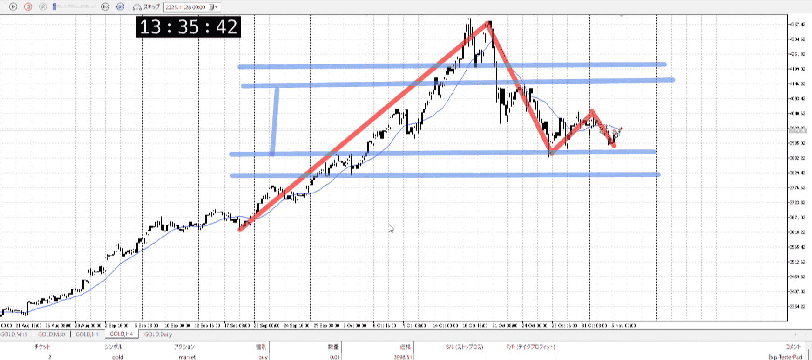
＜ここに目線画像＞

- [x] トレーディングレンジ
    - c

方向：u

1h
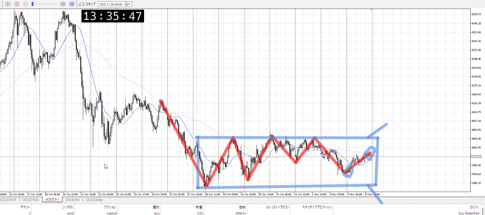
＜ここに目線画像＞

方向：d

15m
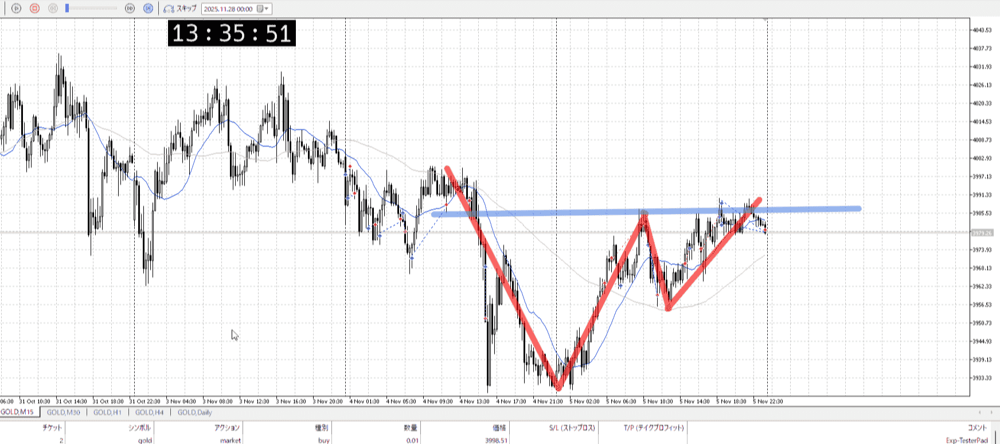
＜ここに目線画像＞

方向：d

全方向：udd

- [x] 使用足全ての目線確認

＜ここにシナリオ画像＞

b:1h安値
s:1h天井

切り上げで上昇

- [x] 1hシナリオ
- [x] ぶつかり
- [x] 日出日入、週出週入

目線・シナリオ・強弱・調整
横幅・PA後・平均線方向・波
**ひきつけ**・軸時間
udd
1hとしては売りたい、下残して戻ってる、なので売り想定
ただその売りたいの売り場に現在いる、ここを抜くようなら少しだけ短期で買える
15mとしても売り場のとこ、ここを抜くかが焦点
そうでないようなら普通に売るが

OK!
Exchage Start.

---

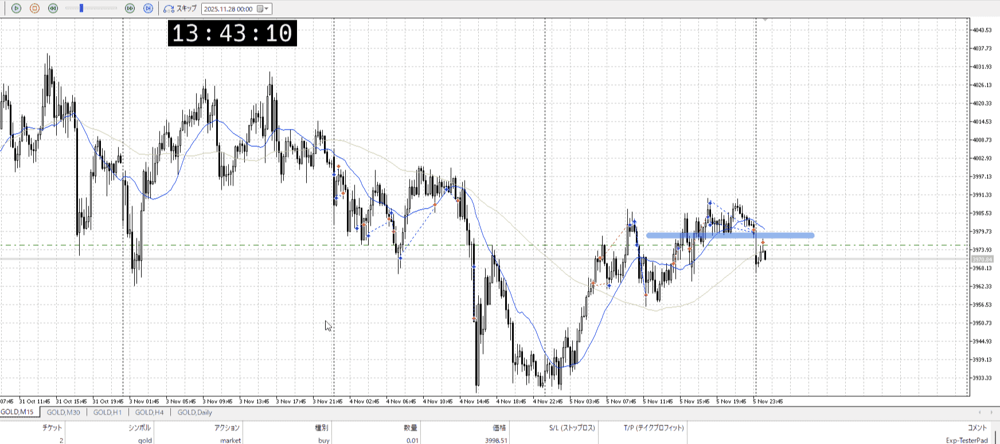

短期売り差し込み
これは一応下まで狙えるはず、1hの底まで

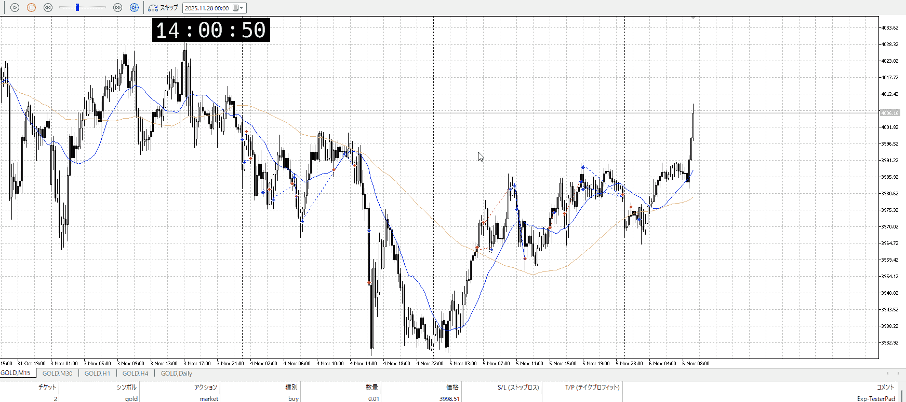

朝だったので早めに切って、上昇
どこで買うか

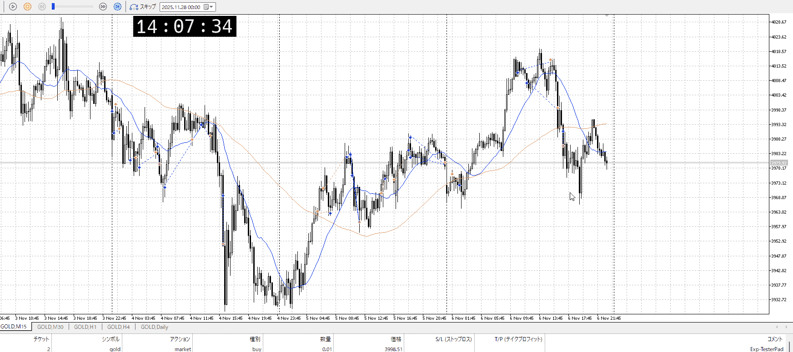

1hに反しての買いなので、この急降下から入るもんではない
それくらいなら1hに従って売るべき

利確損切量が想定できてない
前回ここやった時の方が想定できてる、これはこれで買いが早い感じだが
4日の高値くらいが精々という発想は必要だった、どの根拠も天井まで行けるとは言ってない

## [ld2025-11-07](../Link_Daily/ld2025-11-07.md)
> [!note]
>- +1万 事前認識 **開始5分**

- [x] [my](obsidian://open?vault=Teino&file=FX/my)(見ないと増える)
- [x] 指標
    - 差し込まれる可能性有り、毎日

4h
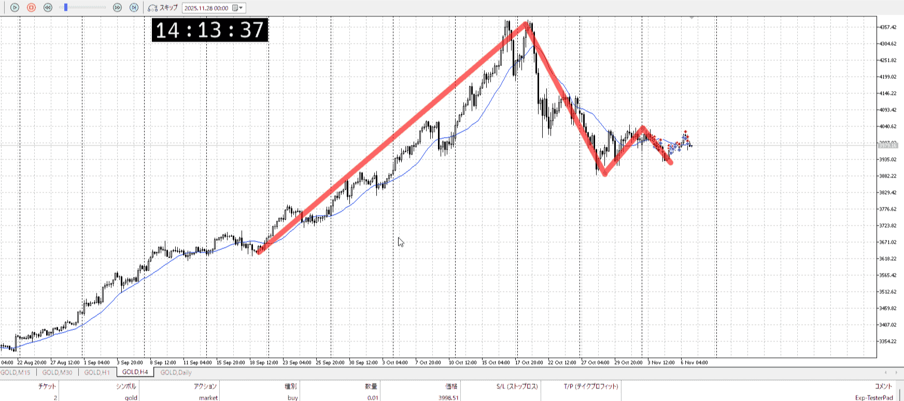
＜ここに目線画像＞

- [x] トレーディングレンジ
    - c

方向：u

1h
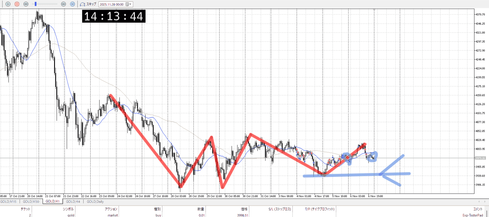
＜ここに目線画像＞

方向：d

15m
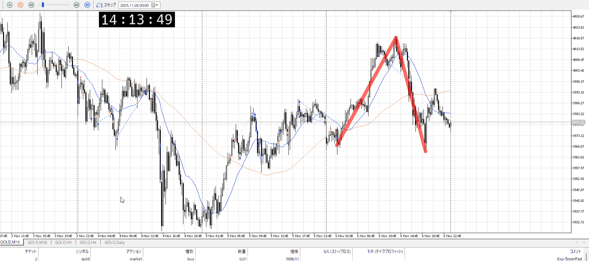
＜ここに目線画像＞

方向：u

全方向：udu

- [x] 使用足全ての目線確認

＜ここにシナリオ画像＞

b:1h底
s:1h天井

天井前で落ち、始値で止まり

- [x] 1hシナリオ
- [x] ぶつかり
- [x] 日出日入、週出週入

目線・シナリオ・強弱・調整
横幅・PA後・平均線方向・波
**ひきつけ**・軸時間
udu
やりづらい、1hとして売りたいがそれは一旦過ぎてるのでここから売るなら横幅必要
15mとして買いたいが上昇を強い売りで否定されていて買いにくい
日の出日の入りとして上昇は折られているが落ちは始値で留められている、1dとして考えるとこれは上髭

やりづらくないな、売りだ
横幅取って上から売るか下抜きの戻り取るか。それで1hの安値まで取りたいが。その七割として途中の直近安値を狙う。

OK!
Exchage Start.

---

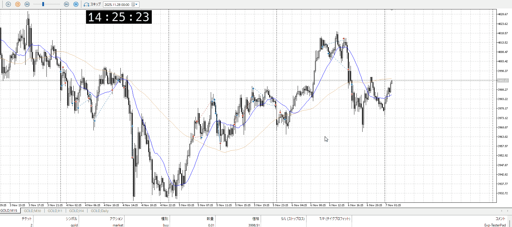

ここで上までひきつけるか、ここから売るか。

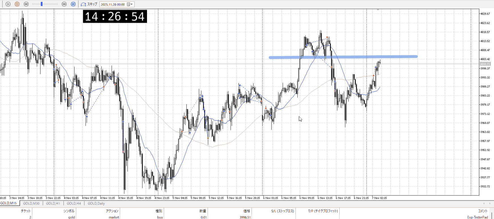

売ったけど、前回レンジの下があったわ。

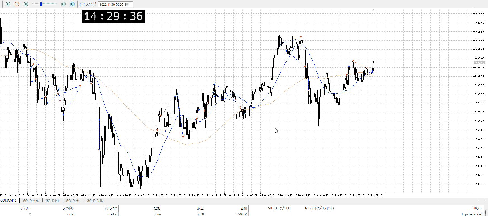

売ったが、落ちが少し上で留まるというちょっと不安なシーン
切っておく

この後
上から売るのは変わらない、

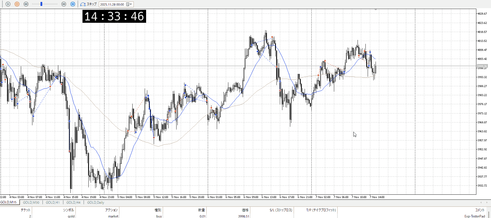

売ったが、Vにビビッてた
損切を許容しろ

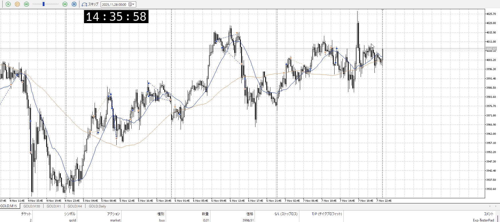

その後で損切で狩られるのは問題ないはず
というか止められすぎ、一応一つ目を止めたとこと同じとこで止められるかも

まだましな方
15mの買いを少し計算から外してた

これは普通に利益出しにくいとは思う
ガッツリ調整みたいな形なので来週が動く

ここまででレンジ
何足で入ってどこまで取るかを気を付けてないとガンガン減る
あと1hの動向

## [ld2025-11-10](../Link_Daily/ld2025-11-10.md)
> [!note]
>- +1万 事前認識 **開始5分**

- [x] [my](obsidian://open?vault=Teino&file=FX/my)(見ないと増える)
- [x] 指標
    - 差し込まれる可能性有り、毎日

4h
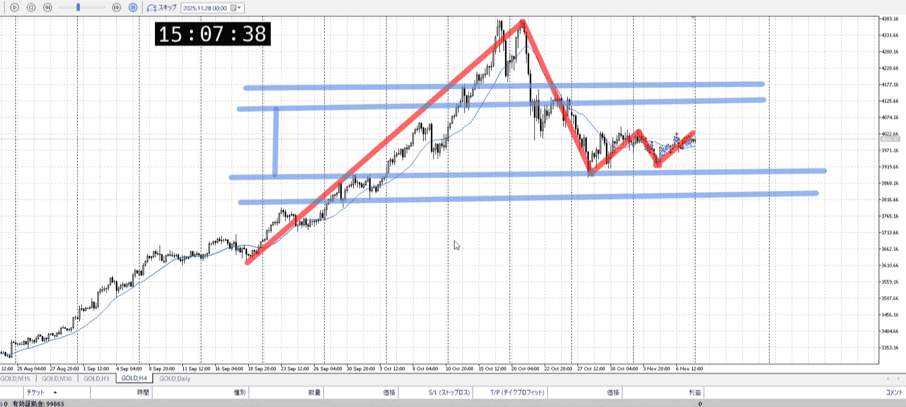
＜ここに目線画像＞

- [x] トレーディングレンジ
    - c

方向：u

1h
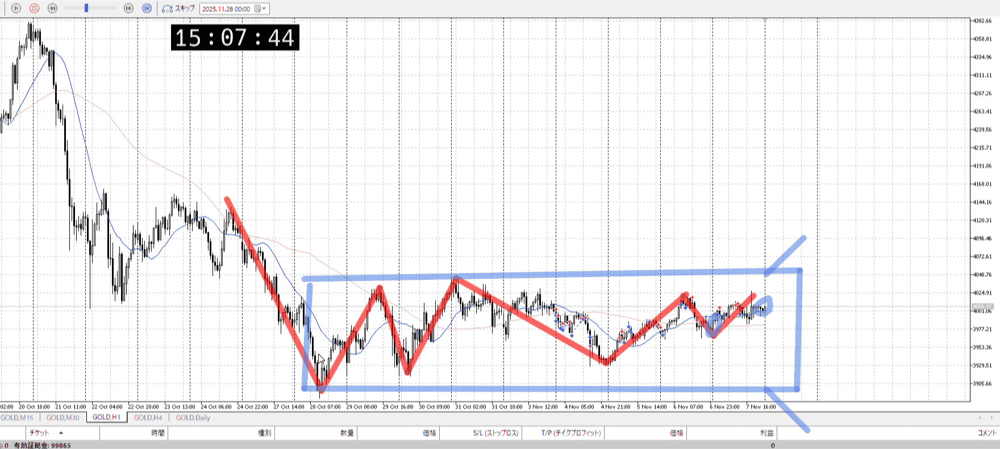
＜ここに目線画像＞

方向：d

15m
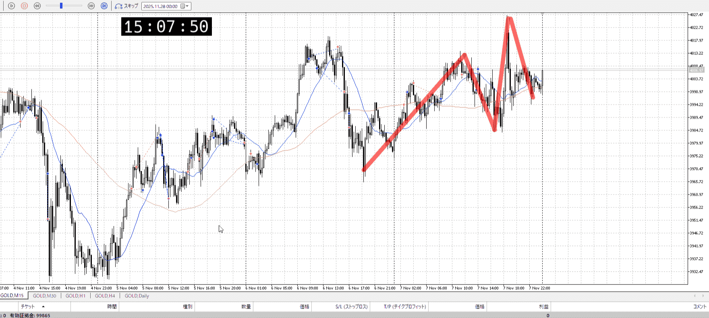
＜ここに目線画像＞

方向：u

全方向：udu

- [x] 使用足全ての目線確認

＜ここにシナリオ画像＞

b:1h安値
s:1h天井

- [x] 1hシナリオ
- [x] ぶつかり
- [x] 日出日入、週出週入

途中から買われ、直近の1h高値で折れ、少し上で終わり

目線・シナリオ・強弱・調整
横幅・PA後・平均線方向・波
**ひきつけ**・軸時間
udu
1hが売り、売りは継続する
しかしがっつり上に触れてから上髭を出して、それでなお上に留まっている
買いの力はなかなかあるはず

短期で買うなら引きつけ買い
15mでの安値にひきつけて買いたいとこ
それで抜けを狙いたい

15mを上抜けてしまったせいで、安値が移動している
短期買いならこれ以下はできない、買うならこの高さ

OK!
Exchage Start.

---

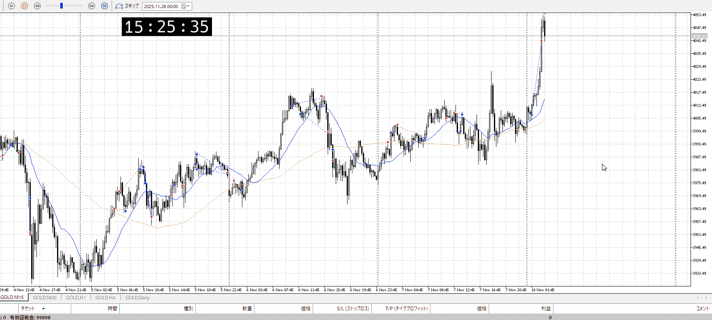

これ以上下がら無さそうな動きをしてたので買い

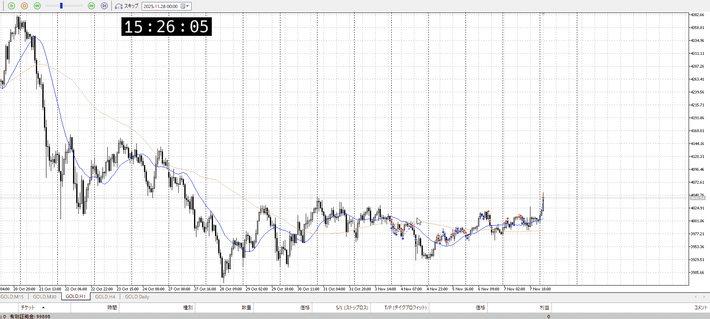

朝なのも考慮で1hの上で切ったがどうか
1hで売られるか15mで引きつけてもう一度買うか

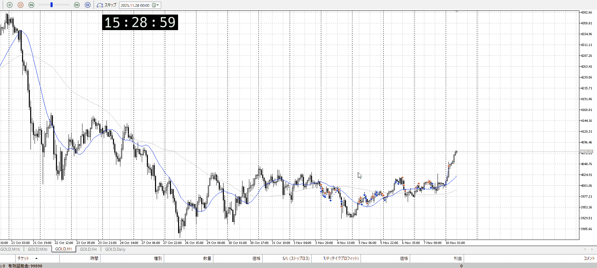

1hも抜いたので買い一辺倒
長めが出たとこの押しを買うべきだったか？いやそんなんないわ

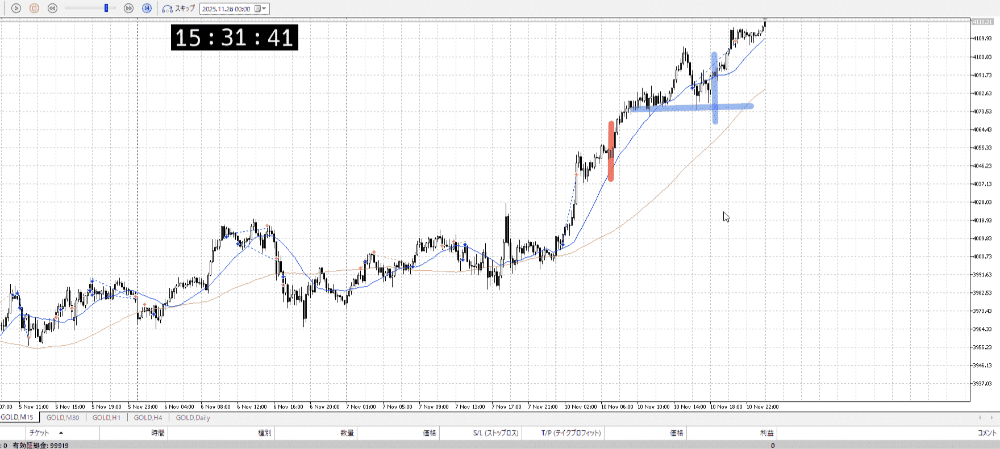

途中から買い
途中からは赤縦が出来そうに見えるが、可能性は低い
青縦位置、下髭二回超え陽線からの買いのほうが可能性はある
夜中なので直近高値に合わせておわり

抜けてすぐはレンジの底から買いと同じ感覚
同じように買えと言うわけではないが、確実性を重視でいいよねという

---

## 総括

趣旨がブレる気がするのでここで止め
元々[2026-01-02](../../Daily_Note/2026-01-02.md)のとこ、落ちてきた後のレンジをどうするかという話だった

長期売り、短期買いを繰り返す相場
実践では（何を考えていたかはともかく）短期買いを繰り返しているので、どこまで取るかがはっきりしてればこの方針で合ってる
利確が小さすぎるので絶対利確損切あってない、褒められるのは短期買いの部分だけ

4日は売れば済んだ話

5日が特に難しいのは、最初の買いのケアがどこでされるか確認してないとこ
この時点はuddなので売りだが、そう思っていても急上昇なので一度見送っておきたいところだった

6日はuduであり、短期で売りを指したい
それに対し急降下に買いを刺してしまっている、一度様子見は欲しい
あと上まで来てレンジなので、1h売り勢が活発化することを想定

7日は全然動いてないので評価はしにくい
朝の売りで少し、その後の売りを0に抑えられればいい方
上昇の売り否定と1d上髭がきつく買いは少しやりづらい

引きつけはまあいいとして、どの足の損切に引きつけてるか
急降下急上昇のケアはやったかというとこ
今回は1hと15mをほとんど見ていたことにも注目

---

この目で今日を見ると
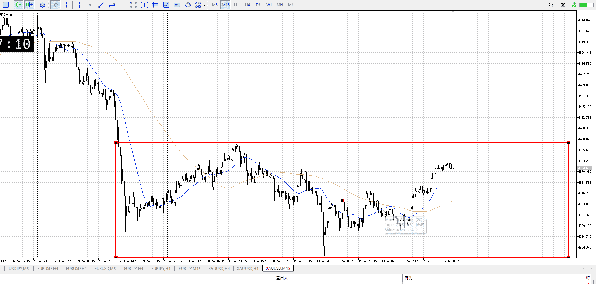
udd内で売り場を一つ越え、下がらないを15mで確認
短期買いを指して直近高値までくらい

uddTになるとはいえ、目線のサポートを受けられない
あまり無理して入らなくていいタイプ、レンジも真ん中だし

---

どうせ両方練習しなきゃいけないのはそうなんですが。
トレンドで取れなきゃレンジ処理上手くなってもしゃーないし。
トレンドの折れるところ分からなきゃ大やけどだし。

-80。そのほとんどを5日で負っている。
急上昇のケアを考えてればもう少し抑えられた。

---

## [ld2025-10-11](../Link_Daily/ld2025-10-11.md)
> [!note]
>- +1万 事前認識 **開始5分**

- [x] [my](obsidian://open?vault=Teino&file=FX/my)(見ないと増える)
- [x] 指標
    - 差し込まれる可能性有り、毎日

4h
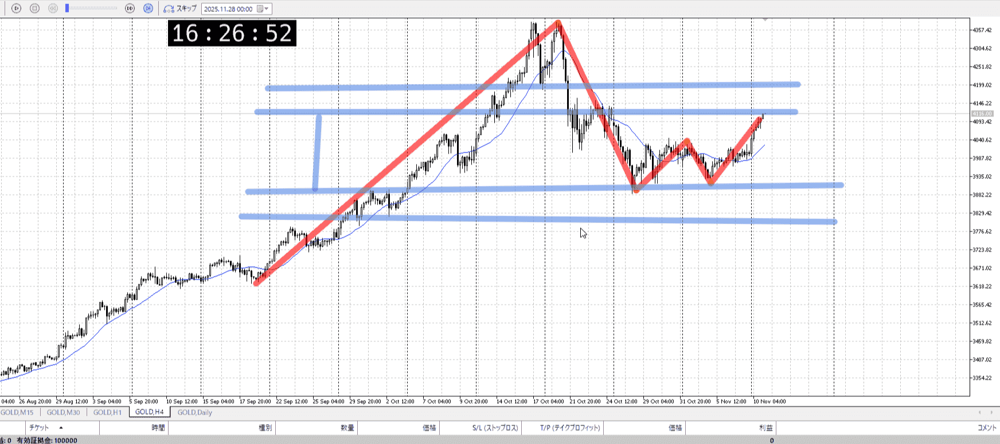
＜ここに目線画像＞

- [x] トレーディングレンジ
    - c

方向：u

1h
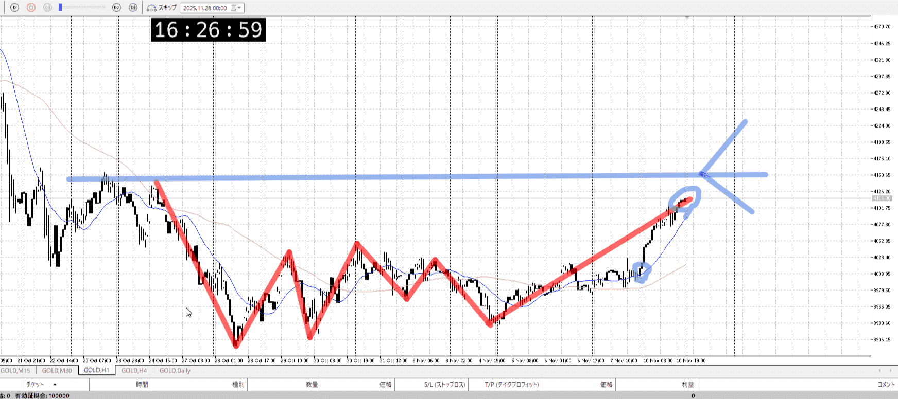
＜ここに目線画像＞

方向：dT

15m
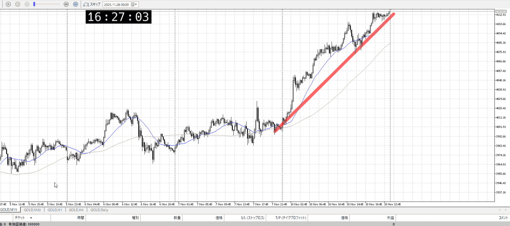
＜ここに目線画像＞

方向：u

全方向：udTu

- [x] 使用足全ての目線確認

＜ここにシナリオ画像＞

b:1hレンジ上
s:1h高値

上昇から高値に少し残し止まり

- [x] 1hシナリオ
- [x] ぶつかり
- [x] 日出日入、週出週入

目線・シナリオ・強弱・調整
横幅・PA後・平均線方向・波
**ひきつけ**・軸時間
udTu
1hがdTなのでそこまでひきつけて買いたい
15mで買う場合今のとこくらいじゃないか

1hの上の方にあるので買うなら引きつけが欲しい

OK!
Exchage Start.

---

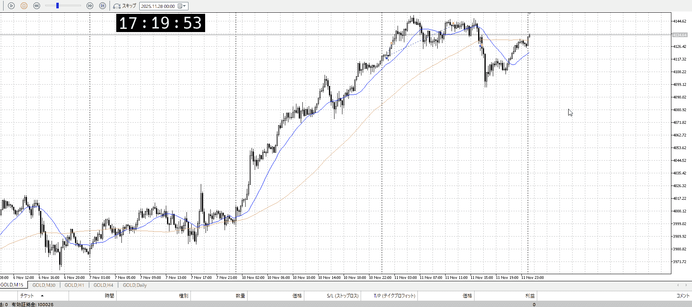

引きつけて買った
が天井で止まり気味だったので止めた

二回目の引きつけは急降下のケアが出来てないので駄目じゃないか

