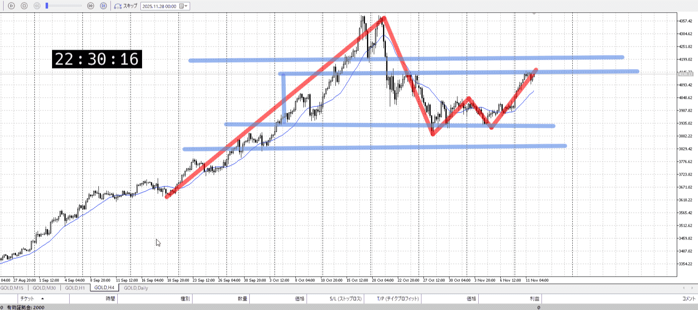
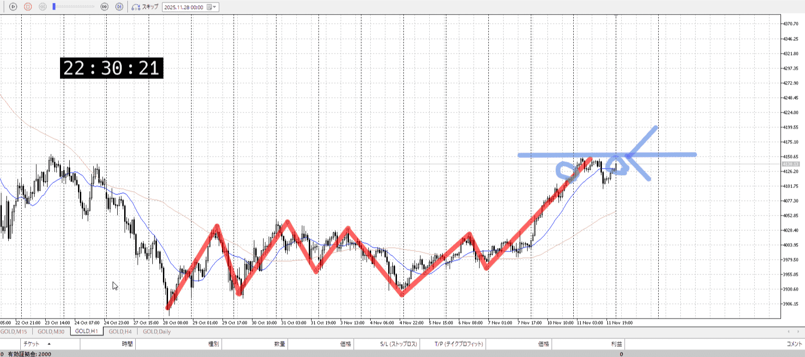
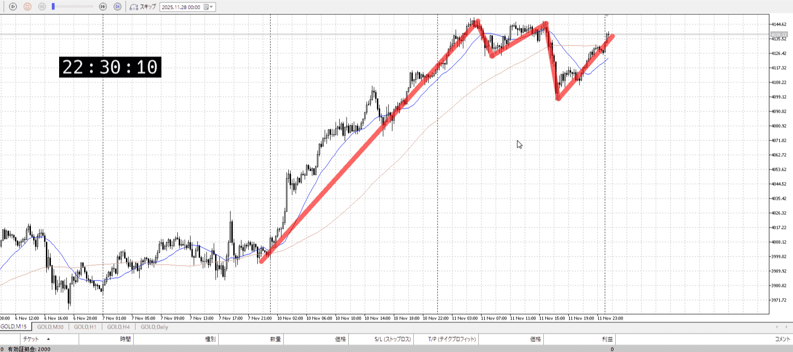
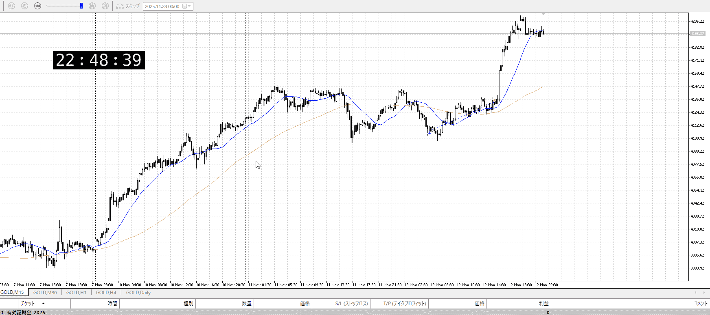

## [ld2025-11-12](../Link_Daily/ld2025-11-12.md)
> [!note]
>- +1万 事前認識 **開始5分**

- [x] [my](obsidian://open?vault=Teino&file=FX/my)(見ないと増える)
- [x] 指標
    - 差し込まれる可能性有り、毎日

4h

＜ここに目線画像＞

- [x] トレーディングレンジ
    - c

方向：u

1h

＜ここに目線画像＞

方向：u

15m

＜ここに目線画像＞

方向：u

全方向：uuu

- [x] 使用足全ての目線確認

＜ここにシナリオ画像＞

b:1hレンジ上
s:1h高値

同じ高さ、落ちず

- [x] 1hシナリオ
- [x] ぶつかり
- [x] 日出日入、週出週入

目線・シナリオ・強弱・調整
横幅・PA後・平均線方向・波
**ひきつけ**・軸時間
uuu
15mの下トレンドも無視、上昇の力がある
この上を抜くかどうか
1hレンジ上からの買いが通常だが、それは難しいのでレンジ上の引きつけ買い

OK!
Exchage Start.

---

底辺りから買いを入れて、上近くまで行くというのはありだったが。
7分目の300pipsの後に、新たにレンジ底から買う手があったが。
でもまあこれくらい取れたら、とはないか。15mの長さが凄く伸びそう。

---

- 1
- 2
- 3