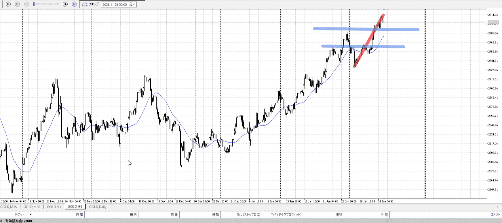
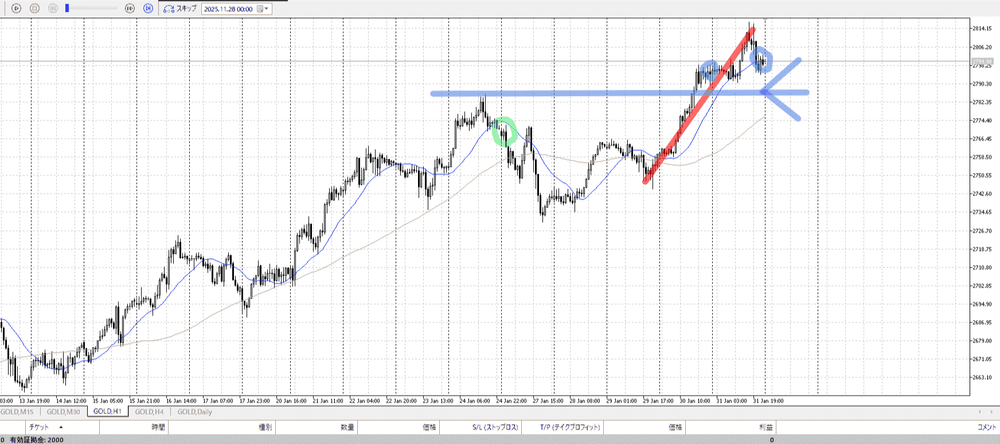
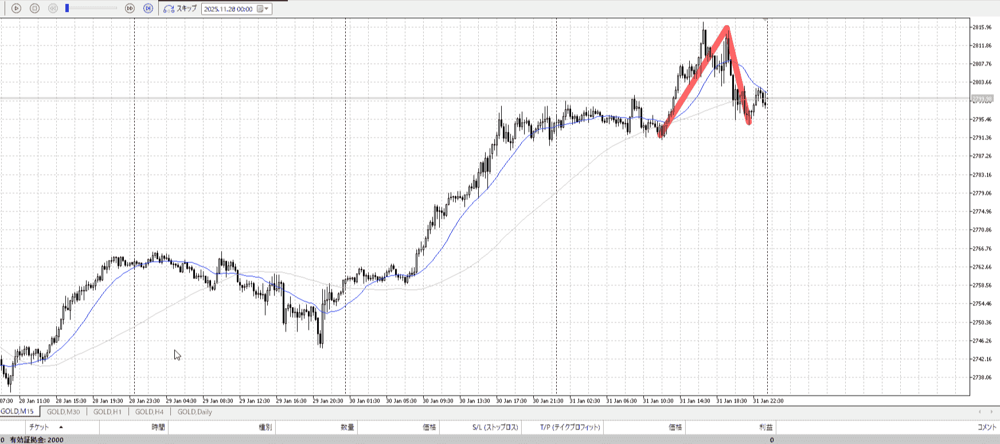
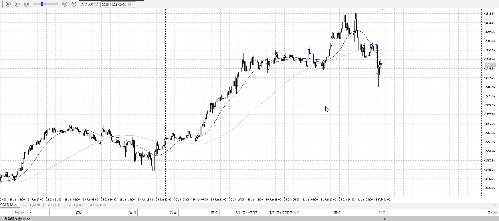
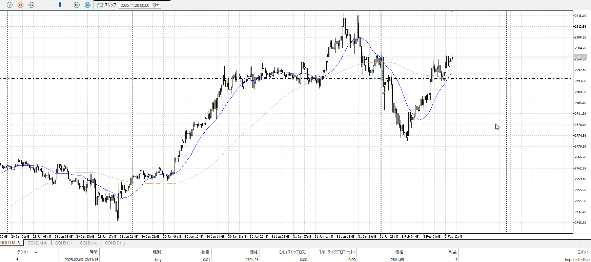
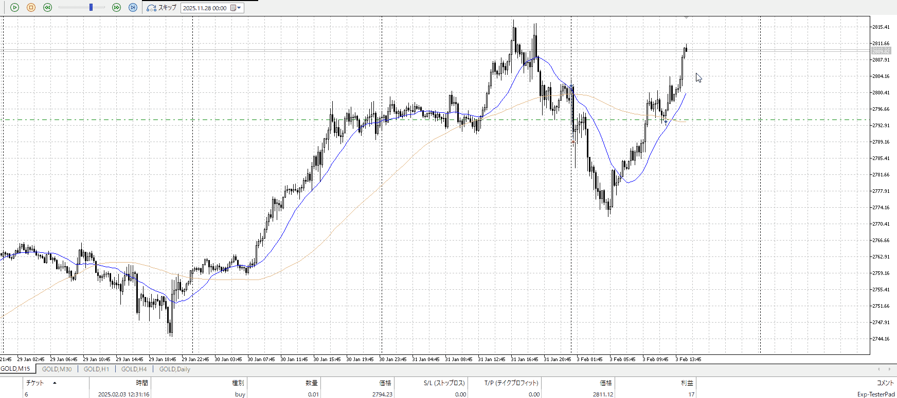
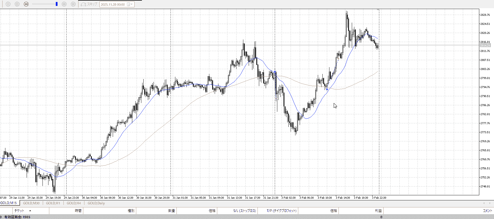

## [ld2025-02-03](../Link_Daily/ld2025-02-03.md)
> [!note]
>- +1万 事前認識 **開始5分**

- [x] [my](obsidian://open?vault=Teino&file=FX/my)(見ないと増える)
- [x] 指標
    - 差し込まれる可能性有り、毎日

4h

＜ここに目線画像＞

- [x] トレーディングレンジ
    - u

方向：u

1h

＜ここに目線画像＞

方向：u

15m

＜ここに目線画像＞

方向：u

全方向：uuu

- [x] 使用足全ての目線確認

＜ここにシナリオ画像＞

b:1h前回高値
s:none

上昇、4h抜き

- [x] 1hシナリオ
- [x] ぶつかり
- [x] 日出日入、週出週入

目線・シナリオ・強弱・調整
横幅・PA後・平均線方向・波
**ひきつけ**・軸時間
uuu
1dも抜いている、買い
15mでも見えるレンジの下が1d高値

現在はちょい下がりなので、これが止まったころに下から買えばいい

OK!
Exchage Start.

---

狙って買ったが落ちた
朝で上昇18なら下降も18使うべきだ

そもそも1d抜いたわりに勢いがなさすぎだったか

損切りできそうな売り場っぽいのなさすぎて遅れた

直近は2000や3000、動いて4000といったところ
1dを根拠の一つにすえているからもっと伸ばすことは考えられる

ここの時点で3000動いていてこれ以上はつらみ
様子見てここで切りたい

伸びた
動いて4000、七割は2800
もう動きすぎなくらいだし止め？一応1d受けなので様子見

日一日でぶち抜くのは考えにくいししゃーなし
取れるのはいいんだけど朝ダメージがでかすぎる。でも買うよな。
スプレッドを考えてれば300ほど削って上まで取って終了してた。スプレッドの意識。

---

- 1
- 2
- 3