## [ld2025-02-04](../Link_Daily/ld2025-02-04.md)
> [!note]
>- +1万 事前認識 **開始5分**

- [x] [my](obsidian://open?vault=Teino&file=FX/my)(見ないと増える)
- [x] 指標
    - 差し込まれる可能性有り、毎日

4h
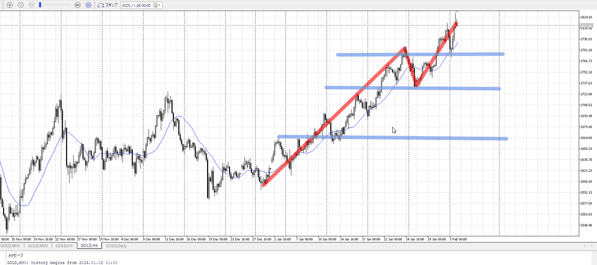
＜ここに目線画像＞

- [x] トレーディングレンジ
    - u

方向：u

1h
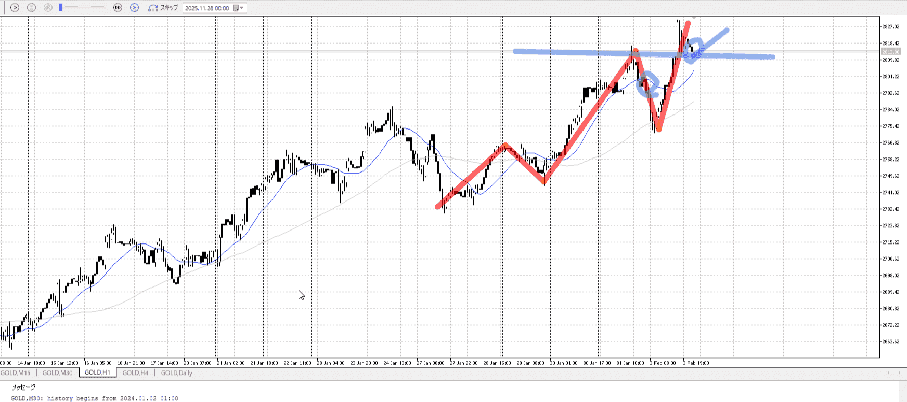
＜ここに目線画像＞ ^4bb92f

方向：u

15m
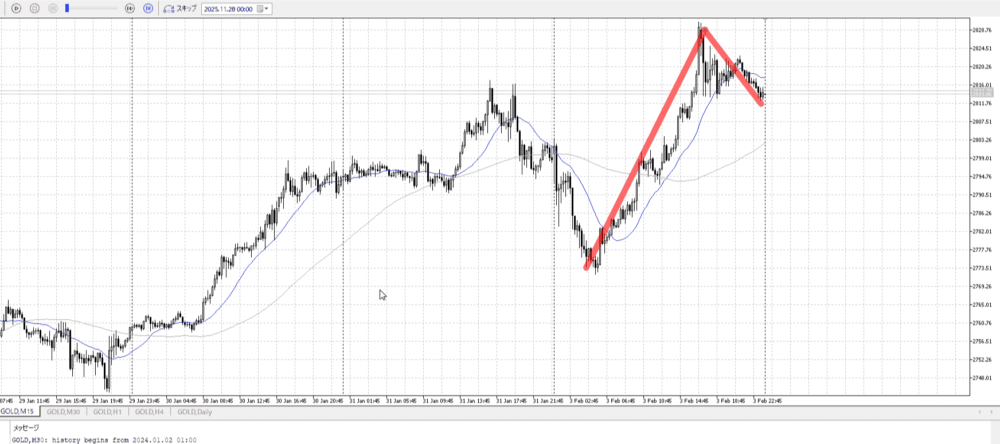
＜ここに目線画像＞

方向：u

全方向：uuu

- [x] 使用足全ての目線確認


＜ここにシナリオ画像＞

b:1h安値
s:？

上昇、しかし止まり

- [x] 1hシナリオ
- [x] ぶつかり
- [x] 日出日入、週出週入

- [x] 推進
- [ ] 調整
- [ ] 間

- [x] 前移動値
    - 5800


目線・シナリオ・強弱・調整
横幅・PA後・平均線方向・波
**ひきつけ**・軸時間
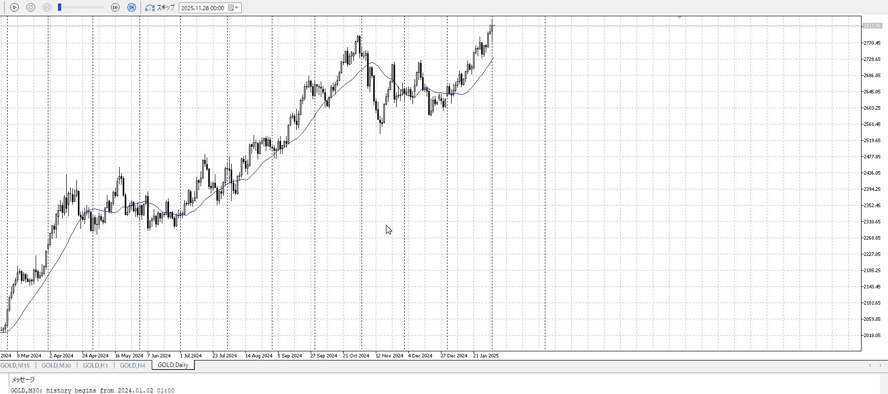

1d
天井抜いている

uuu
天井抜いてるので買っていきたいが、ここで買うと抜け
必ずどっかで押してくるのを念頭にしつつ、1h4hとしてはその押しまで買う

まだ推進内なので、間になるとこまでは待ちたい

15mでは既に間
しかしこの辺で1Ⅾ抜いてるので、ここより下は若干むずい
あっても降りてから跳ねるなどか

15mなら間から売り場を抜いて、その後から


OK!
Exchage Start.

---

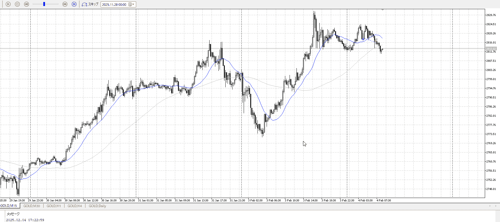

相手が1dであるので、15mでは足りない
1hから間、調整、売り場抜きを待つ

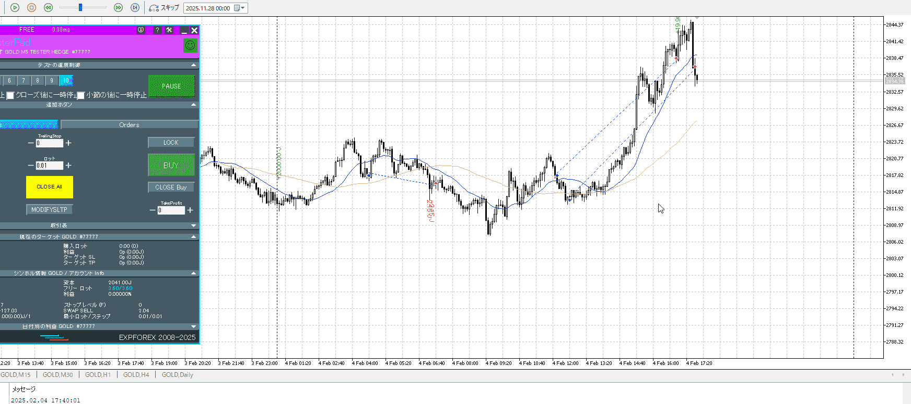

下振ったのでレンジ下という売り場が使える
それを抜いた後、もう一つ売り場を抜いたら入り
これは早いと思う、本来はもう少し→の15：00あたりがいいか

利確は前回の7割くらいをめどにしてた
ただちょっと手前で終わってる、一つは利確したのならもう一つはもっと持ってていいのでは？

## [ld2025-02-05](../Link_Daily/ld2025-02-05.md)
> [!note]
>- +1万 事前認識 **開始5分**

- [x] [my](obsidian://open?vault=Teino&file=FX/my)(見ないと増える)
- [x] 指標
    - 差し込まれる可能性有り、毎日

4h
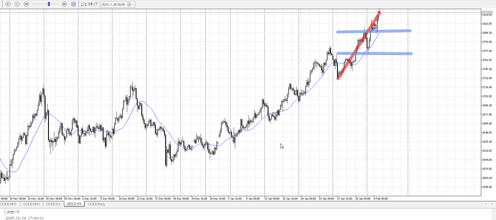
＜ここに目線画像＞

- [x] トレーディングレンジ
    - u

方向：u

1h
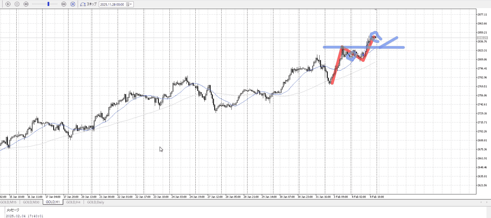
＜ここに目線画像＞ ^4bb92f

方向：u

15m
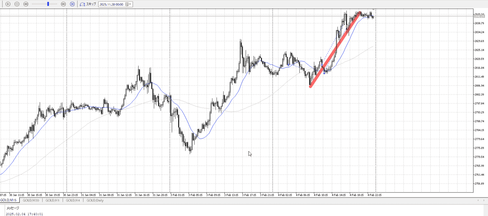
＜ここに目線画像＞

方向：u

全方向：uuu

- [x] 使用足全ての目線確認


＜ここにシナリオ画像＞

b:1h安値
s:？

上昇、ちょい止め

- [x] 1hシナリオ
- [x] ぶつかり
- [x] 日出日入、週出週入

- [x] 推進
- [ ] 調整
- [ ] 間

- [x] 前移動値
    - 3900


目線・シナリオ・強弱・調整
横幅・PA後・平均線方向・波
**ひきつけ**・軸時間
uuu
上の方でレンジ
1d分の押しをまだやってないことは留意、それまで買い

ここで直で上抜けするなら抜け買い
1hAが追いついてない推進波、待ち


OK!
Exchage Start.

---

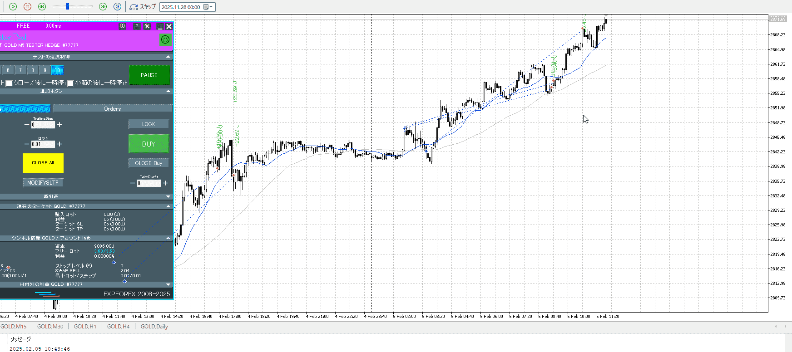
今回は抜けの後、ちゃんと買える押しがあった

それより利確場所がやっぱり甘い
七割を抜くべきなので、後の方のがまずマストの高さ
その前での利益確定は早すぎ

一旦どこかで利益確定をしたいというのはわかるが、そもそも毎回狙ってる部分自体が最低値
ここに辿り着くのが最低、その後を持つのが追加

時間がかかりすぎて近くに引き直し、というのはまた別の話


# [ld2025-02-06](../Link_Daily/ld2025-02-06.md)
> [!note]
>- +1万 事前認識 **開始5分**

- [x] [my](obsidian://open?vault=Teino&file=FX/my)(見ないと増える)
- [x] 指標
    - 差し込まれる可能性有り、毎日

## 4h
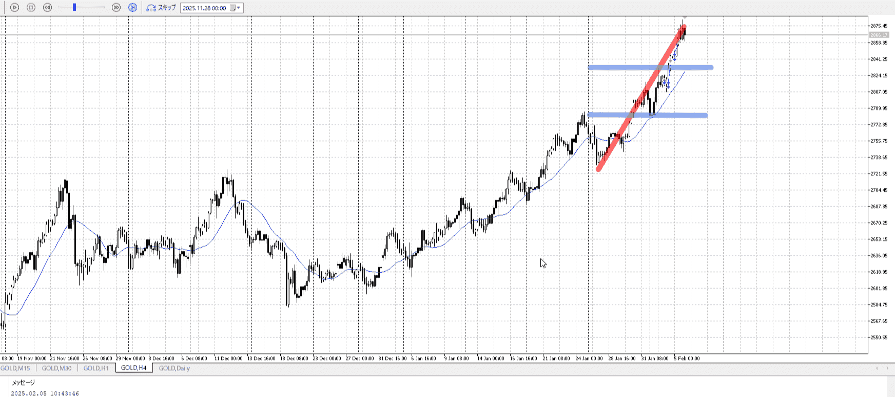
＜ここに目線画像＞

- [ ] トレーディングレンジ
    - 

方向：

## 1h
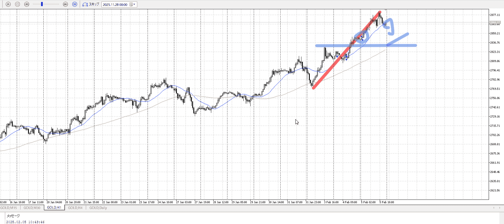
＜ここに目線画像＞ ^4bb92f

方向：

## 15m
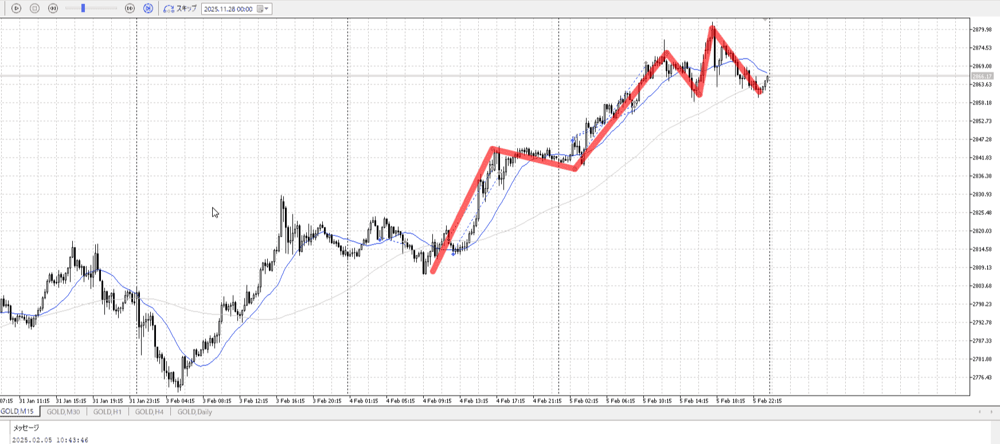
＜ここに目線画像＞

方向：

全方向：

- [ ] 使用足全ての目線確認

## シナリオ

＜ここにシナリオ画像＞

b:
s:

- [ ] 1hシナリオ
- [ ] ぶつかり
- [ ] 日出日入、週出週入

## 位置、値

- [ ] 推進
- [ ] 調整
- [ ] 間

- [ ] 前移動値
    - 

## 方針
目線・シナリオ・強弱・調整
横幅・PA後・平均線方向・波
**ひきつけ**・軸時間


```meta-bind-button
style: default
label: Send
actions:
  - type: "replaceSelf"
    replacement: "OK!\nExchage Start.\n\n---"
```

## メモ


---

- 1
- 2
- 3