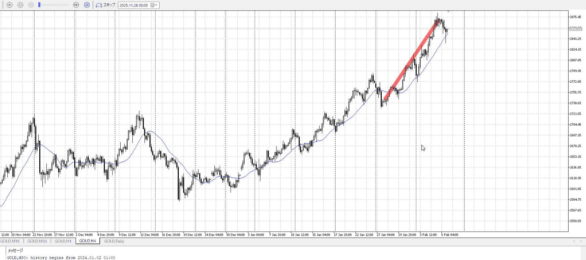
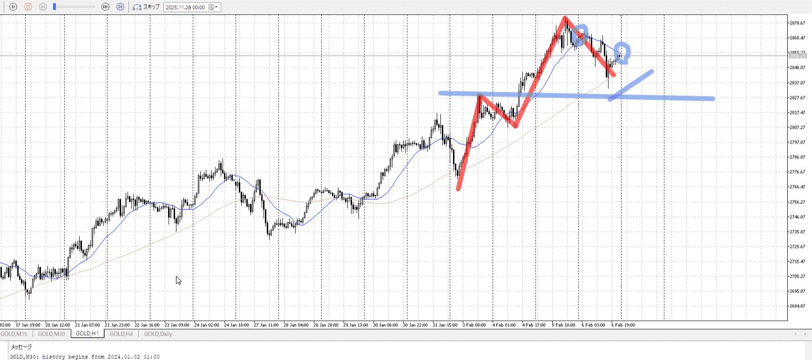
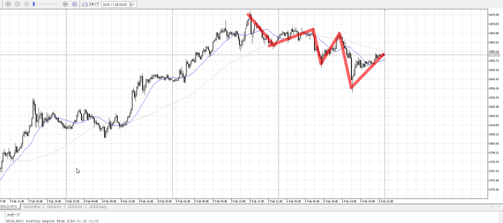

# 
> [!note]
>- +1万 事前認識 **開始5分**

- [ ] [my](obsidian://open?vault=Teino&file=FX/my)(見ないと増える)
- [ ] 指標
    - 差し込まれる可能性有り、毎日

## 4h

＜ここに目線画像＞

- [x] トレーディングレンジ
    - u

方向：u

## 1h

＜ここに目線画像＞ ^4bb92f

方向：u

## 15m

＜ここに目線画像＞

方向：d

全方向：uud

- [x] 使用足全ての目線確認

## シナリオ

＜ここにシナリオ画像＞

b:1h安値
s:？

下降

- [x] 1hシナリオ
- [x] ぶつかり
- [x] 日出日入、週出週入
- [x] 前移動値
    - 3500
- [x] 前回上昇・下降値
    - 7500
## 位置

- [ ] 推進
- [x] 調整


## 方針
目線・シナリオ・強弱・調整
横幅・PA後・平均線方向・波
**ひきつけ**・軸時間
uud


```meta-bind-button
style: default
label: Send
actions:
  - type: "replaceSelf"
    replacement: "\n\nOK!\nExchage Start.\n\n---"
```

## メモ


---

- 1
- 2
- 3