# [ld2025-02-07](../Link_Daily/ld2025-02-07.md)
> [!note]
>- +1万 事前認識 **開始5分**

- [x] [my](../FX/my.md)(見ないと増える)
- [x] 指標
    - 差し込まれる可能性有り、毎日

## 4h
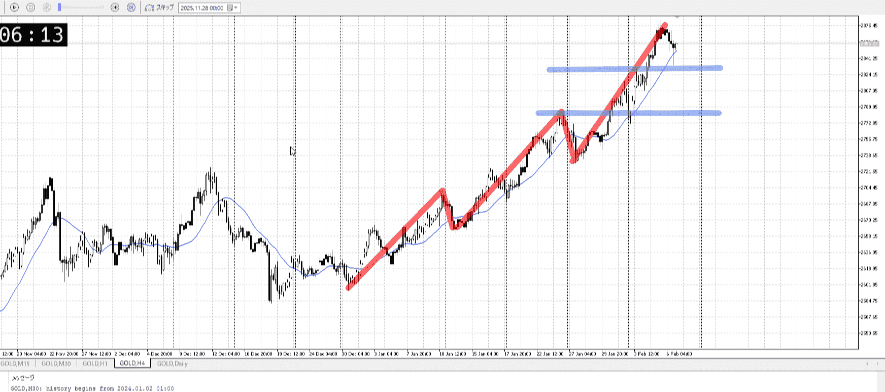
＜ここに目線画像＞

- [x] トレーディングレンジ
    - u

方向：u

## 1h
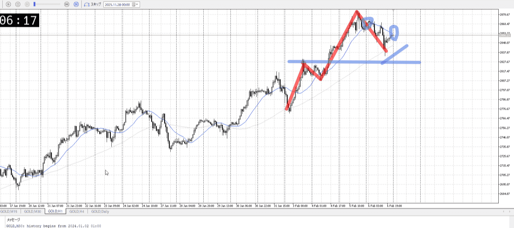
＜ここに目線画像＞ ^4bb92f

方向：u

## 15m
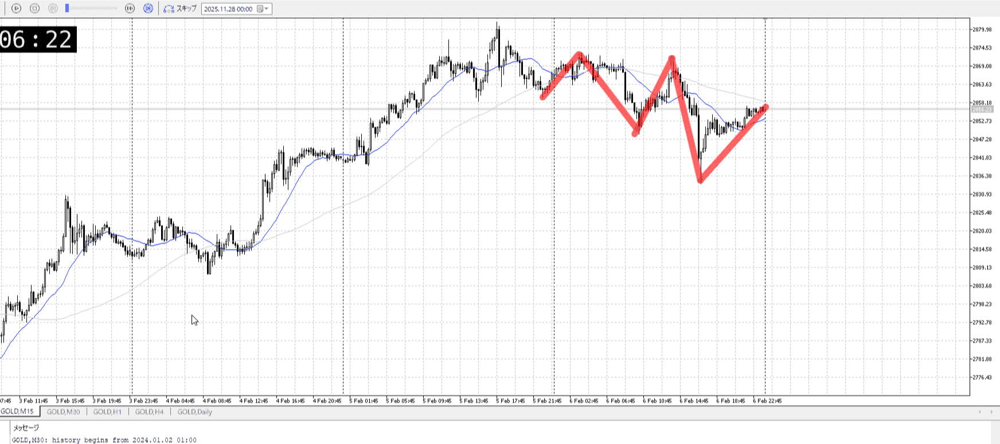
＜ここに目線画像＞

方向：d

全方向：uud

- [x] 使用足全ての目線確認

## シナリオ

＜ここにシナリオ画像＞

調整からの買い

b:1h買い
s:?

降下始め

- [x] 1hシナリオ
    - [x] 明確か ? 続行 : 確定後考え直し
- [x] 時間足ぶつかり
- [x] 日出日入、週出週入

- [x] 前移動値
    - 3.7k
- [x] 前回上昇・下降値
    - 7.4k

## 位置

- [ ] 推進
- [x] 調整

## 方針
目線・シナリオ・強弱・調整
横幅・PA後・平均線方向・波
**ひきつけ**・軸時間
uud
買いたい、そして調整中
調整の終わりを見て買っていきたい

終わり始めになりそうな下髭が15mの根にある
短期戻り売りになりそうな上昇をしている、これが失敗したらそれはそれで買える

15mの傾き比率は売り偏重、売り側に行く可能性は十分ある
これで落ちたらその止まりを見て買いたいとこ

超上にいて売り根拠が不明なのはしゃーなし

OK!
Exchage Start.

---

## メモ
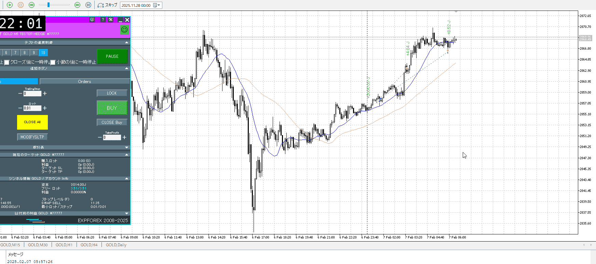

分析かければいける
ただ1hの調整を待った割に、ここは低くない？

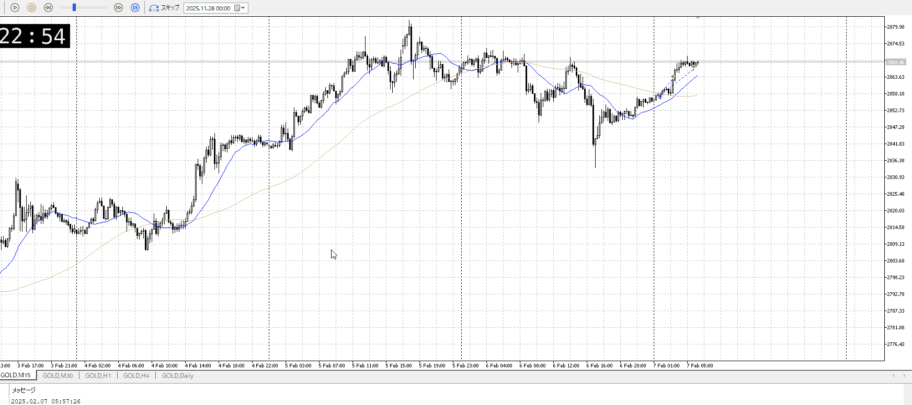

15mでもこう、平均もまだ追いついてないし1hもいまから伸びるとこ
もう少し持ってても良かったと思う、取り分は低くなるが明確じゃない

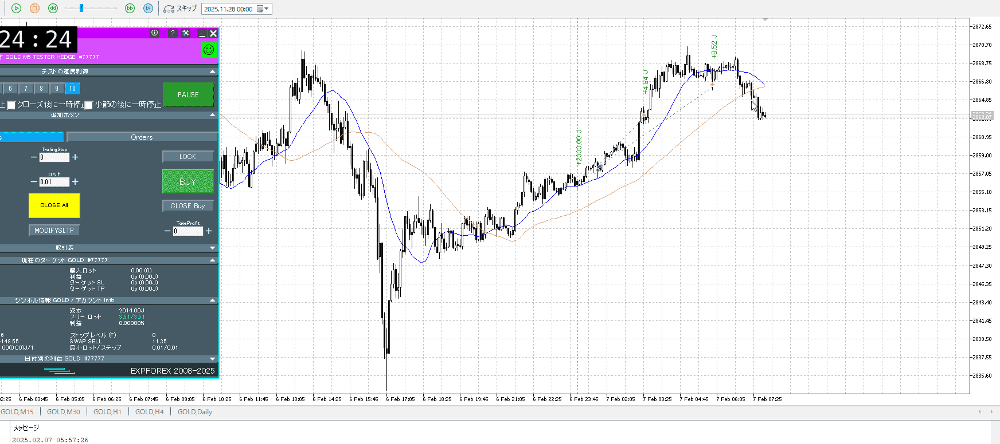

例えばこことかで手放せば明確だった
その前から下髭に対して伸びが明確じゃないからきつそう、そこで切っても可

この後
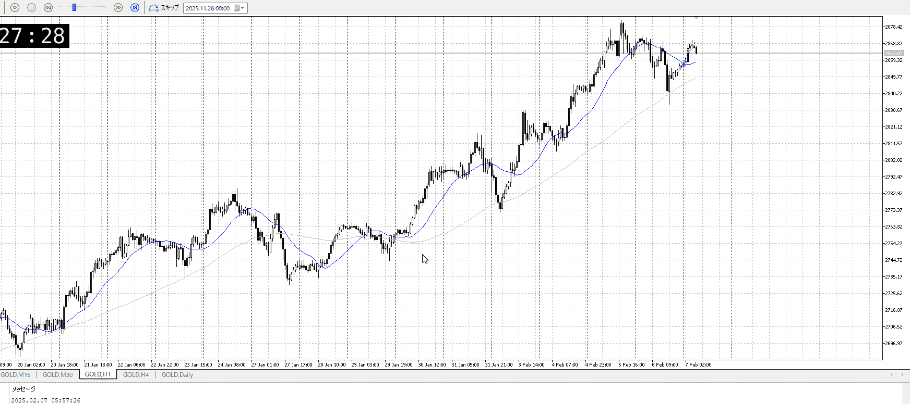
1hで直近高値を抜く前に落ちた
売りが強い

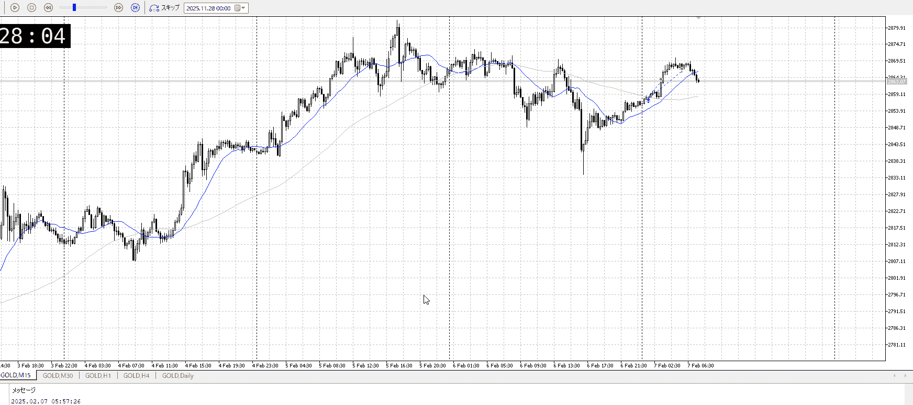
15mだと反転で落ちてる
オバシュも取れず1hとしても微妙に転換期でもないので、取りにくい
一応15mで取れなくはないが

15mの売りが継続
というよりはレンジかも、底を決めたうえで高値を更新できなかった

15mで売っていったなら、1hの半値程度、あるいは15m上昇根が一つの利確
買いはそれに合わせたいはず
半値を再度確認する

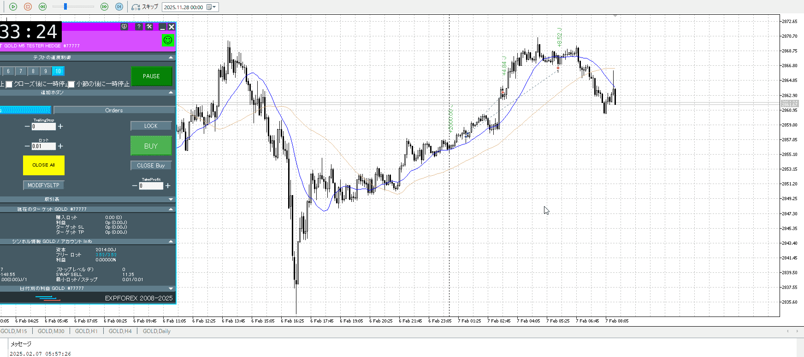

根で上昇かと思いきや、レンジ下で戻り売り
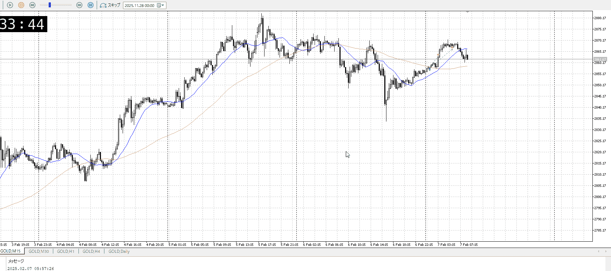

これは15mにも出てきた
かなり売り優勢

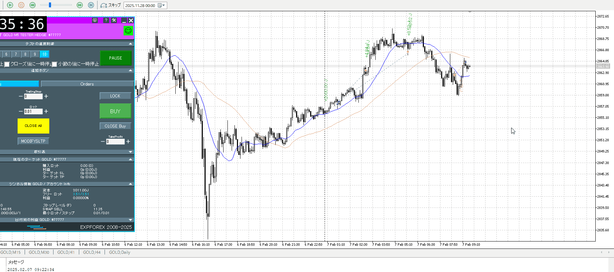

また小さくなってたか。
建値乙がこれはたぶん正解。あるいは根まで持って短期終わり。

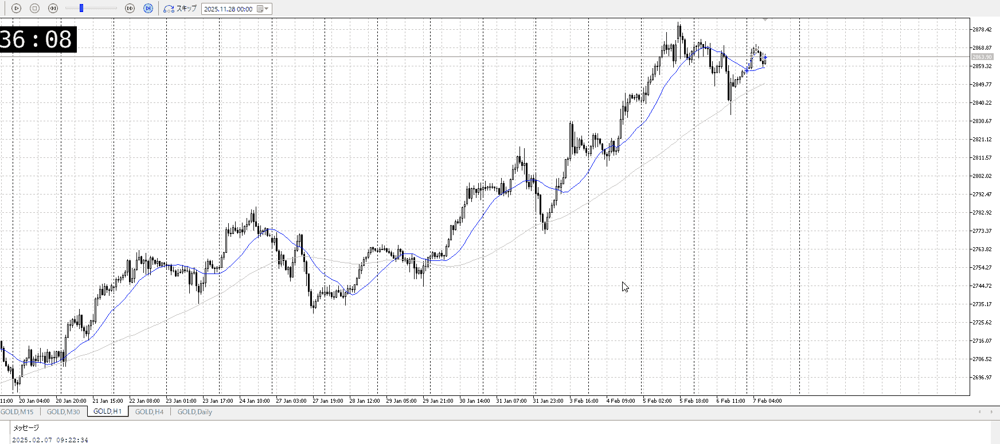

1hとしては買いは崩れてない
15mでそれを探していくのはそう

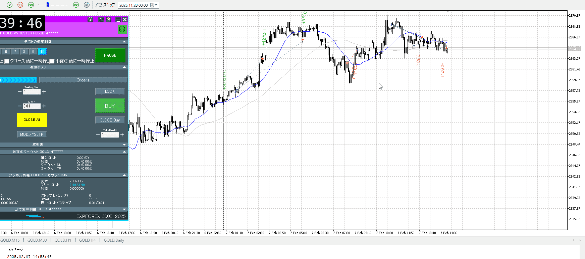

はい
なんで高値で入った。引きつけろ。
何でかと言うと15mの小さいレンジの抜きを見た気になってたから。15mのレンジはもっと大きい。また目が小さくなってる。
その後の買いならまだわかる範囲。ただそれでも上抜きしたわけでもない上昇を根拠にするのはやはりつらい。

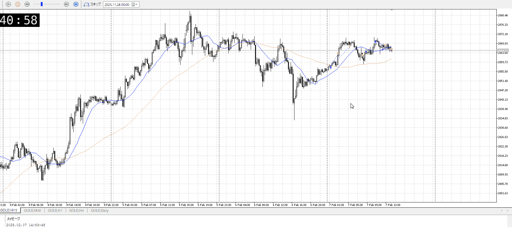

今はこの通り上張り付き……ではないな元がそんなに勢いないし
普通にエネルギー溜めてる場面

グダグダ上がった割に上にはりつきっぱなし
どっちかというと上抜けを見たい、1h平均も近づいてる

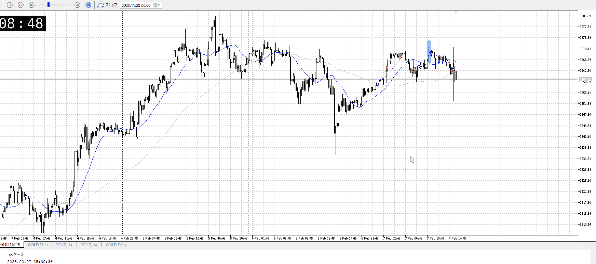
……方向感が出なかった理由はこれを待ってたから。
そもそも、方向感が出なかった時点で一旦待って抜けや戻りを見ればいい
その前の最後の上昇である青線も上髭が出てるので入りにくい。入りにくいからやめろ。

この後
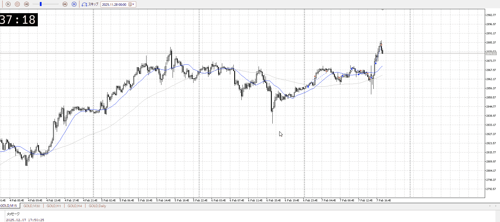

方向性が決まってからならこの通り。
この勢いをすぐに終わらせるのはどうか？

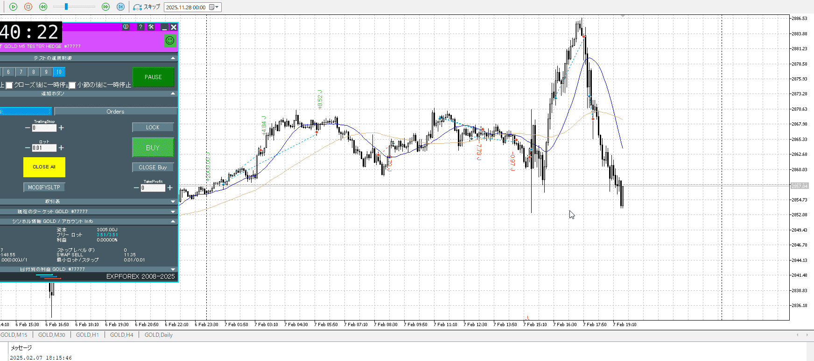

流石にこの勢いで買いはきつかった。

この後は1hで見ながらネック抜け売りを試したい。

---

どこまで持つかを明確に
これは15mで入って1hのぶつかりまで

方向感が出てからのことを考える
出てないとこを無理に狙わない、小さくなる要因

1h髭を見ろ

