# [ld2025-02-10](../Link_Daily/ld2025-02-10.md)
> [!note]
>- +1万 事前認識 **開始5分**

- [x] [my](../my.md)(見ないと増える)
- [x] 指標
    - 差し込まれる可能性有り、毎日

## 4h
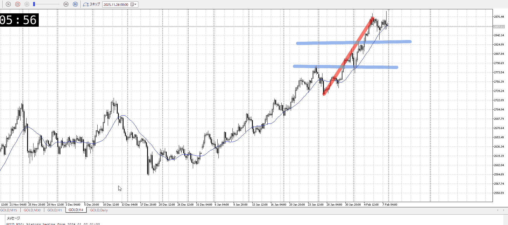
＜ここに目線画像＞

- [x] トレーディングレンジ
    - u

方向：u

## 1h
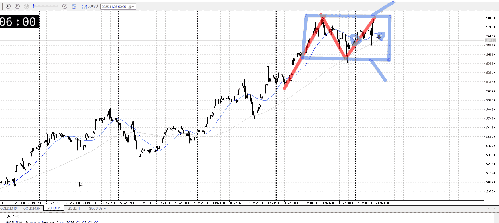
＜ここに目線画像＞ ^4bb92f

方向：uR

## 15m
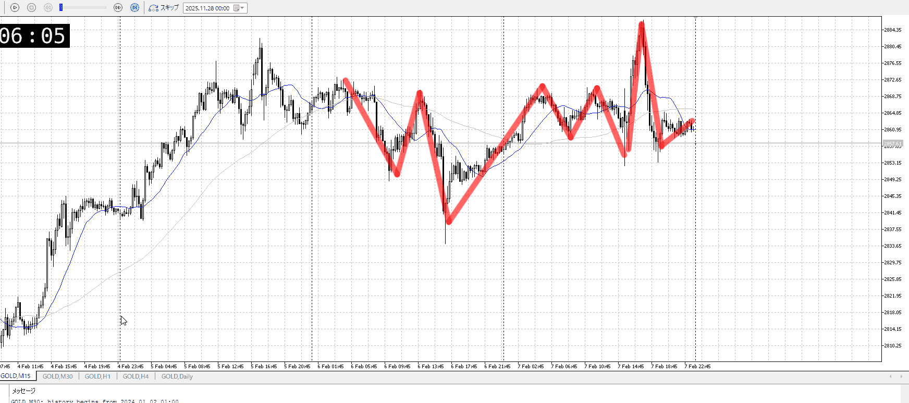
＜ここに目線画像＞

方向：u

全方向：uuu

- [x] 使用足全ての目線確認

## シナリオ


シナリオ:
レンジからどっちいくか

b:1h安値
s:1h高値

同値

- [x] 1hシナリオ
    - [x] 明確か ? 続行 : 確定後考え直し
- [x] 時間足ぶつかり
- [x] 日出日入、週出週入

- [x] 前移動値
    - 3.3k
- [x] 前回上昇・下降値
    - 7.5k

## 位置

- [ ] 推進
- [x] 調整

## 方針
目線・シナリオ・強弱・調整
横幅・PA後・平均線方向・波
**ひきつけ**・軸時間・傾き比率
uuRu
のろのろ上昇から天井割れず
戻ってくるが決定的な下降は無し
つまりレンジ

1hレンジを抜いてからでもいいのだが、一応考える
取るにして短期

今は15mがuながら、直近の上昇を同等の下降で打ち消し、かつ下で留まるという動きを見せている
結構売り寄りの動き、1hレンジ下までは売れそう


OK!
Exchage Start.

---

## メモ
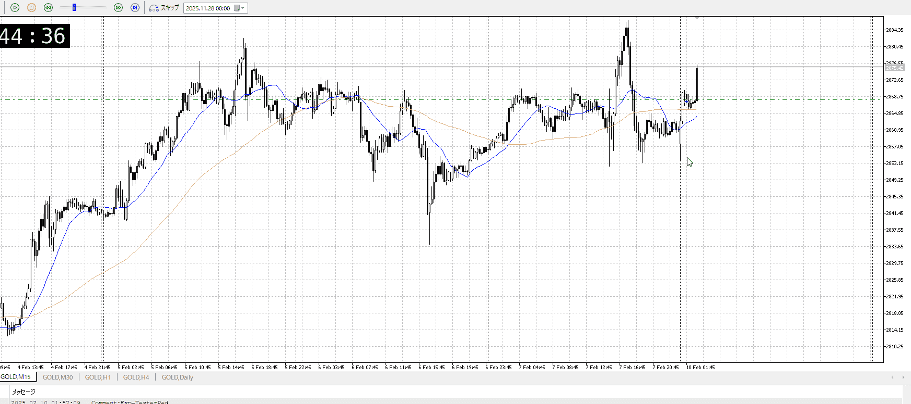

売りよりの中だったが、15mでしっかり上昇したのでついていってみる

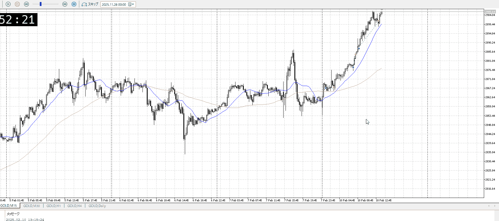

その追跡が一回上髭出したので止めたが下は割らなかった、もっと持っておくべきだった
二回目の持ちはもう割前提で持ち続けても良かったか
三回目は利確が分からないが1hを取っとくか？

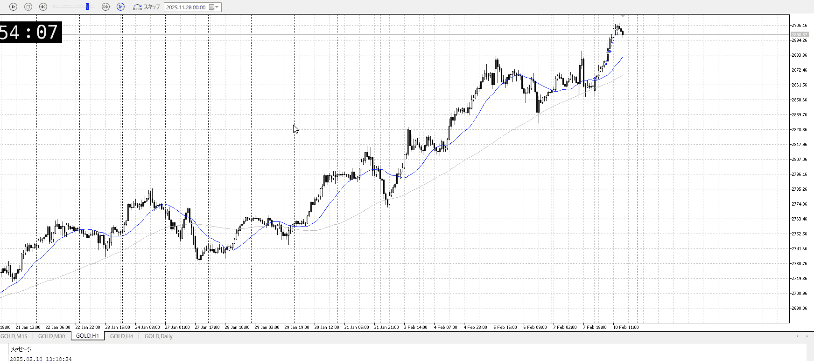

あれが正解だな

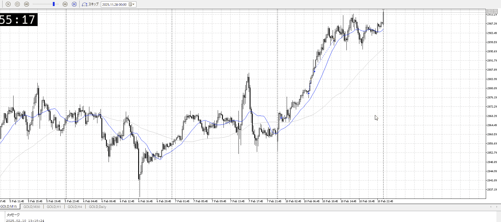

再び溜め
なんかラストで溜めを破ってるように見えるが

# [ld2025-02-11](../Link_Daily/ld2025-02-11.md)
> [!note]
>- +1万 事前認識 **開始5分**

- [x] [my](my.md)(見ないと増える)
- [x] 指標
    - 差し込まれる可能性有り、毎日

## 4h
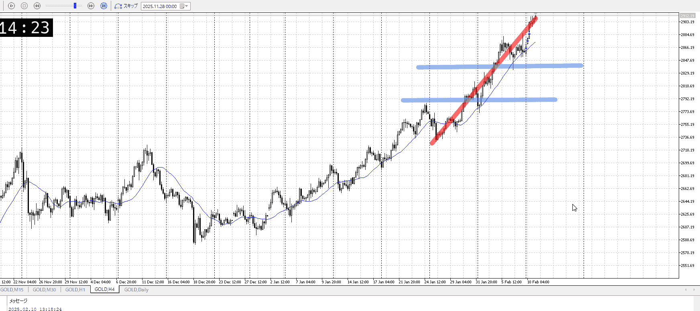
＜ここに目線画像＞

- [x] トレーディングレンジ
    - u

方向：u

## 1h
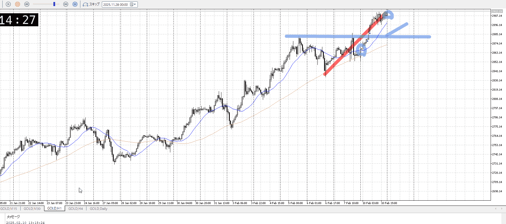
＜ここに目線画像＞ ^4bb92f

方向：u

## 15m
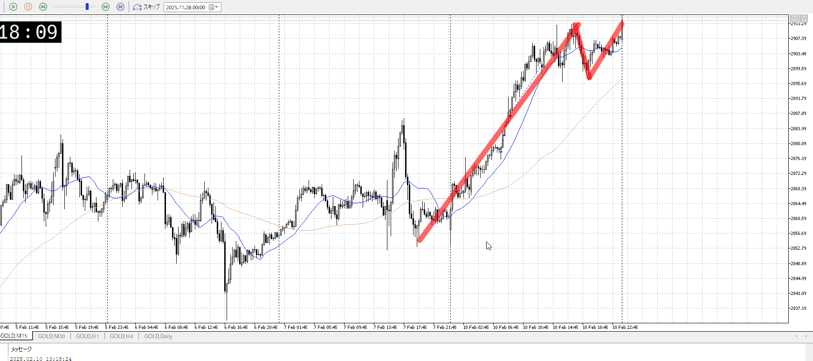
＜ここに目線画像＞

方向：u

全方向：uuu

- [x] 使用足全ての目線確認

## シナリオ


シナリオ:
一応押し目買いを想定してるが、押しそうにない

b:1h安値
s:？

上昇

- [x] 1hシナリオ
    - [x] 明確か ? 続行 : 確定後考え直し
- [x] 時間足ぶつかり
- [x] 日出日入、週出週入

- [x] 前移動値
    - 5.8k
- [x] 前回上昇・下降値
    - 7.2k

## 位置

- [x] 推進
- [ ] 調整

## 方針
目線・シナリオ・強弱・調整
横幅・PA後・平均線方向・波
**ひきつけ**・軸時間・傾き比率
uuu
推進中なのであまり買いたくないが、上昇後の一度目なのでギリギリ
前回は7.2kだが、今の上昇を根から数えると7.4k上がってる
まだ上がる可能性は十分


OK!
Exchage Start.

---

## メモ
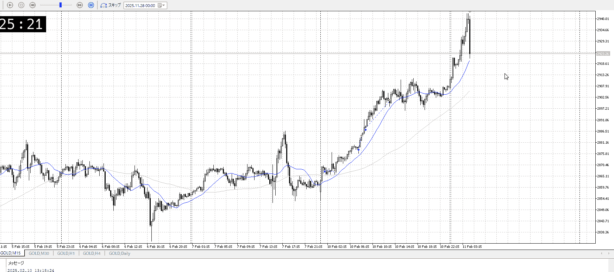
だったのだが加速させすぎちゃった
急激な落ちも見えたので、これがどうなるか見てからにする

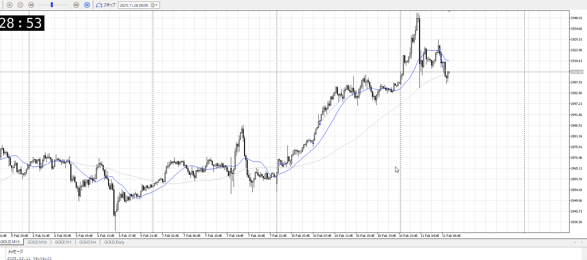

この落ちに対して買うのはやはり勝率が低い
比率的にも急降下だし、前回勝てたのは比率で急上昇と同等になってたから

一方で売るのかと言われると
売ったら1hの買いまで調整波を持つことになるが、余りにも近い
この1h買いを抜いてからでないと売るのは難しい

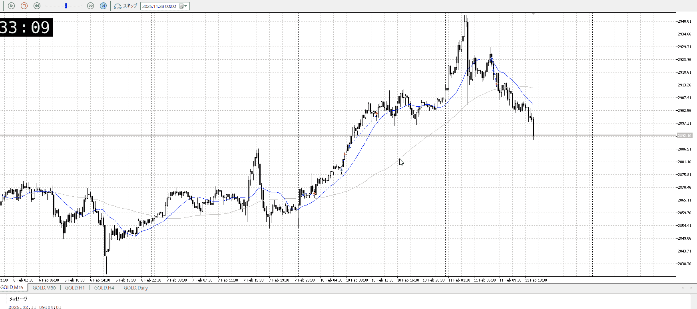

そうそんなん

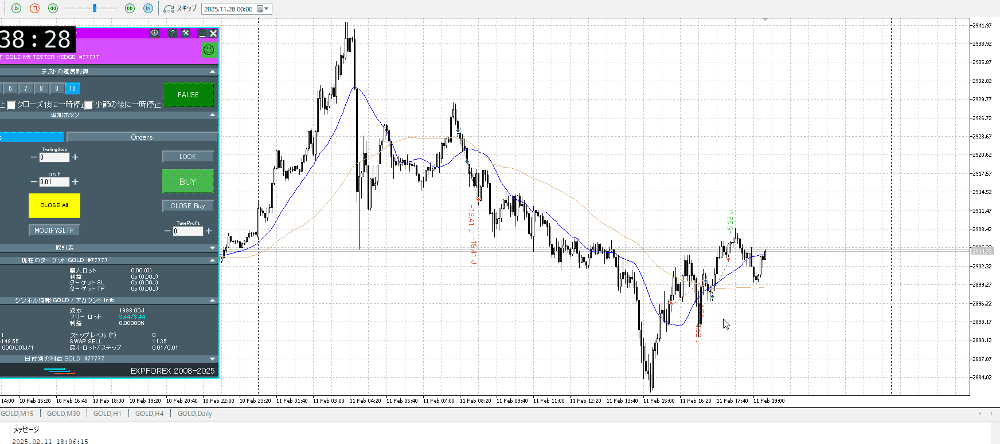
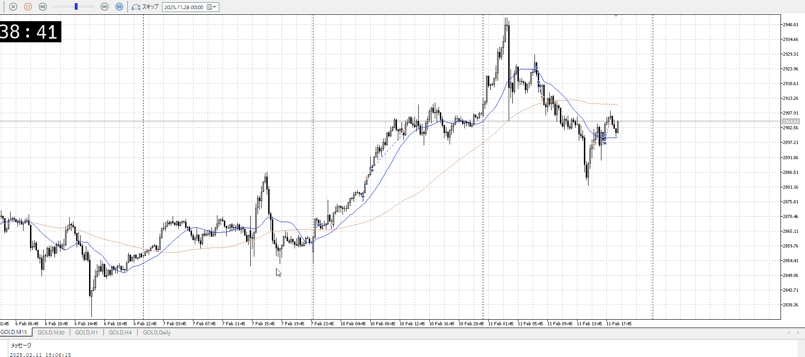

かといって戻り売るには比率がきつかったか
オバシュ上昇に巻き込まれたっぽいので買いで直近高値までちょっと取って終了

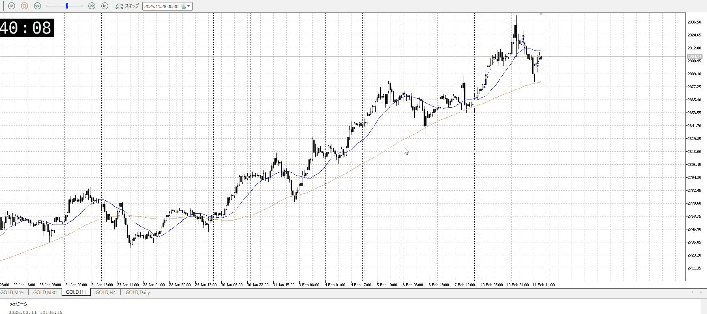
そもそも根拠にするには15mレンジ抜け程度だったかも

1hはこのまま押し目買いが継続されそう、ここから上がるなら一旦溜めが欲しいところ
後は深夜だし勝手に溜まるだろう

---

再検証
落ちからの買いは比率を見る
波を恣意的に使ってしまった、比率をより重点

# [ld2025-02-12](../Link_Daily/ld2025-02-12.md)
> [!note]
>- +1万 事前認識 **開始5分**

- [x] [my](my.md)(見ないと増える)
- [x] 指標
    - 差し込まれる可能性有り、毎日

## 4h
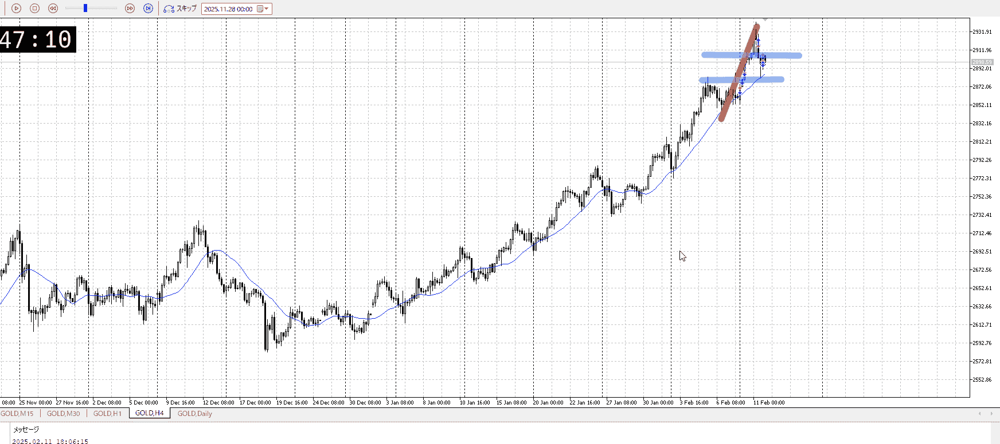
＜ここに目線画像＞

- [ ] トレーディングレンジ
    - 

方向：

## 1h
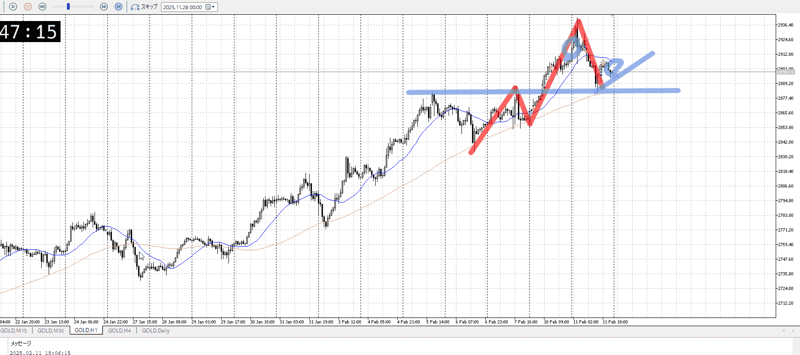
＜ここに目線画像＞ ^4bb92f

方向：

## 15m
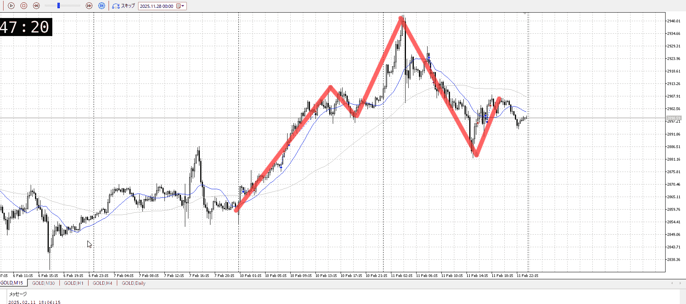
＜ここに目線画像＞

方向：

全方向：

- [ ] 使用足全ての目線確認

## シナリオ


- [ ] 1hシナリオ
    - [ ] 明確か ? 続行 : 確定後考え直し

b:
s:
- [ ] 時間足ぶつかり


- [ ] 日出日入、週出週入

- [ ] 前移動値
    - 
- [ ] 前回上昇・下降値
    - 

## 位置

- [ ] 推進
- [ ] 調整

## 方針
目線・シナリオ・強弱・調整
横幅・PA後・平均線方向・波
**ひきつけ**・軸時間・傾き比率


```meta-bind-button
style: default
label: Send
actions:
  - type: "replaceSelf"
    replacement: "\n\nOK!\nExchage Start.\n\n---"
```

## メモ


---

再検証


