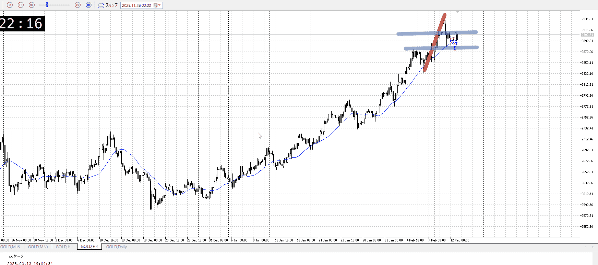
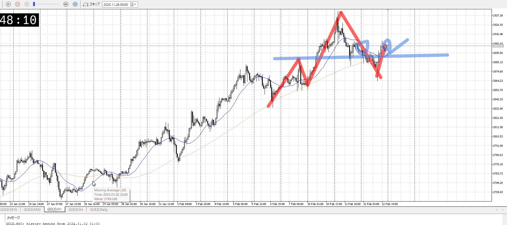
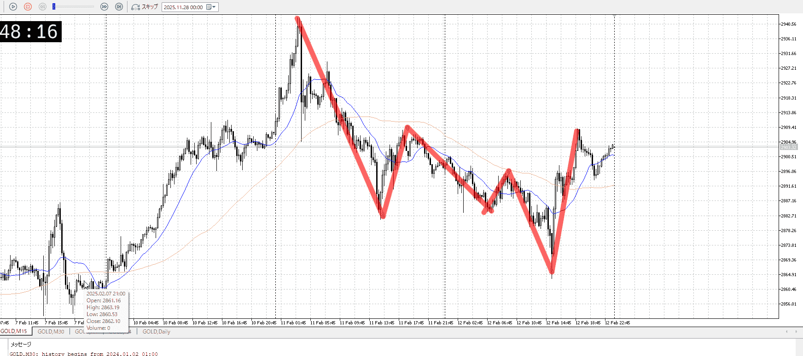
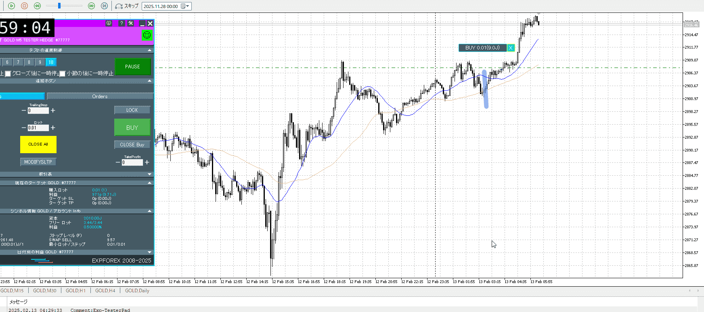
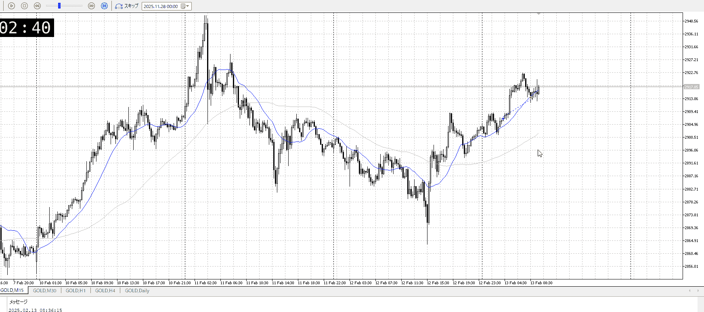
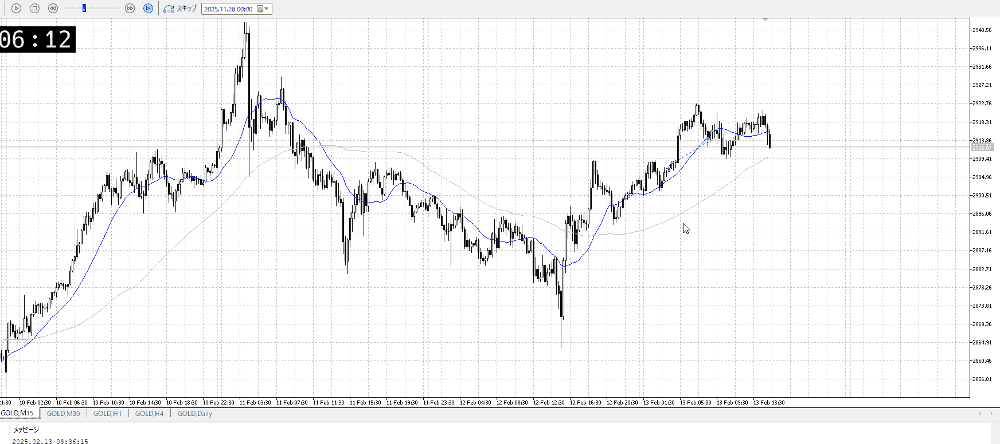
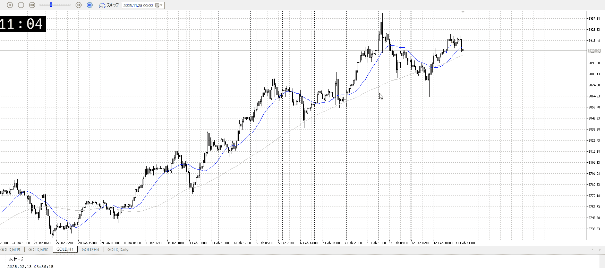
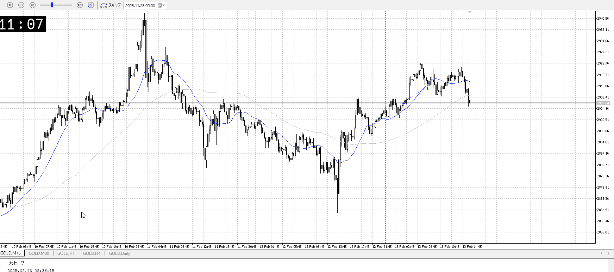
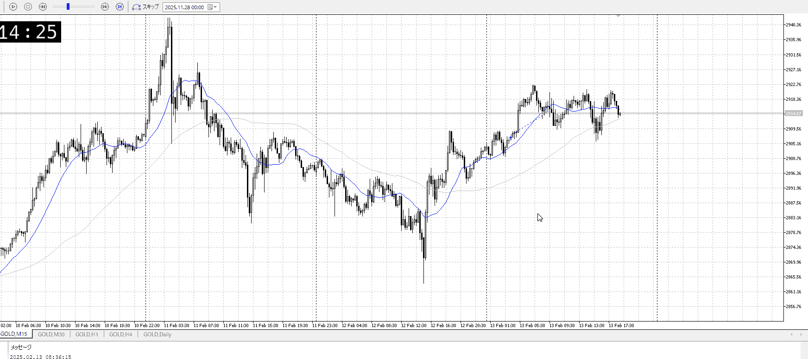
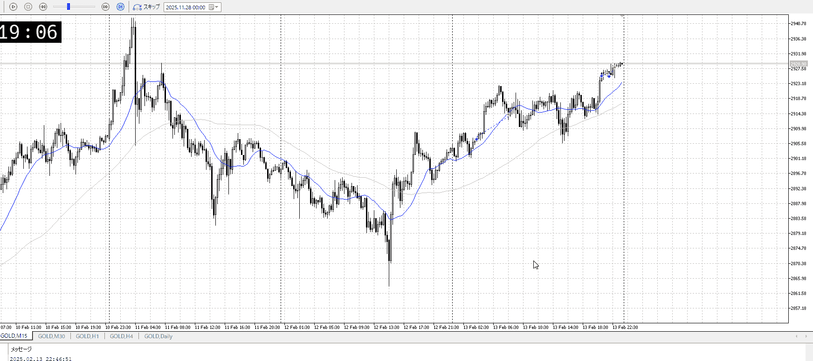

# [ld2025-02-13](../Link_Daily/ld2025-02-13.md)
> [!note]
>- +1万 事前認識 **開始5分**

- [x] [my](my.md)(見ないと増える)
- [x] 指標
    - 差し込まれる可能性有り、毎日

## 4h

＜ここに目線画像＞

- [x] トレーディングレンジ
    - m

方向：u

## 1h

＜ここに目線画像＞ ^4bb92f

方向：u

## 15m

＜ここに目線画像＞

方向：u

全方向： uuu
^1d4903

- [x] 使用足全ての目線確認

## シナリオ

b:1h安値
s:？
- [x] 時間足ぶつかり

押し目から買い。
もう上がってるけどついていけるかも。これで無理なら1h半値とかとのレンジ抜け狙いとかになってくる。
- [x] 1hシナリオ
    - [x] 明確か ? 続行 : 確定後考え直し

同値
- [x] 日出日入、週出週入

34バーの下降に4バーで半値。
その前は56上昇に34半値いったん止まりだった。
- [x] 傾き比率

- [x] 前移動値
    - 4.6k
- [x] 前回上昇・下降値
    - 10.5k

## 位置

- [x] 推進
- [ ] 調整

## 方針
目線・シナリオ・強弱・調整
横幅・PA後・平均線方向・波
**ひきつけ**・軸時間・傾き比率

推進に入り始めている。
買いたいが間に合ったらの話。間に合わなければ再度レンジ出るまで待ち。

買うなら
15m高値抜けに押し

売るなら
1h半値

OK!
Exchage Start.

---

## メモ

遅くね？

青で買おうと思ったが、損切持てるのかなと不安に。
その後上昇して落ちそうにない下髭をつけ始めたので高値ながら買い。普段だと遅いと思う。

損切を持てるなら青がベスト。今の買ってるとこで買うと5mで持ったことになる。だんだん目が小さくなってる。

その後下髭抜けで切ったが、これも小さいな
平均線をよく見て、気にされてる値を見つける

押してきた
ここを抜けると1h押し目失敗になりかねない場面
といって一応買うとかやろうにはエネルギーが足りない、高い

1h推進にしては引っかかりが多いし、このレンジ抜けてからデモ考えは遅くないか

15mは抜けたっぽさあるが、1hは見えない
15mでは上昇と同等程度のレンジ

これで1hにかてるか

まあ無理で、と言ってその否定買いもダメで。
そろそろ1hレンジ。

確認しておくが、全員上目線。
上に抜けるなら一気にいけるか。下は知らぬ。

全員待望の買い……というには妙に動きが鈍い
深夜だからか？

買いは変わってないので、押し目で買うことを繰り返す

タイミングに加え、
利確・損切ラインを変えない場合どうなるかのデータ

エントリーがよかった・タイミング
 - 高さがよかった
 - 横軸が良かった
分析がよかった
 - 4hで方向取れてる
 - 1hで戦略立ててる

そのそれぞれで、予想してる利確損切までやった場合の結果
これを集める

---

再検証
損切持てるかなじゃないが。
直近で買いの形は出てるので、引きつけて持たないと死ぬ。なので高値で買うのは悪手。

