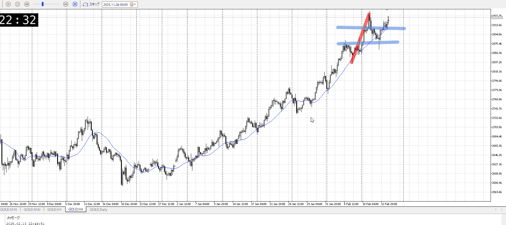
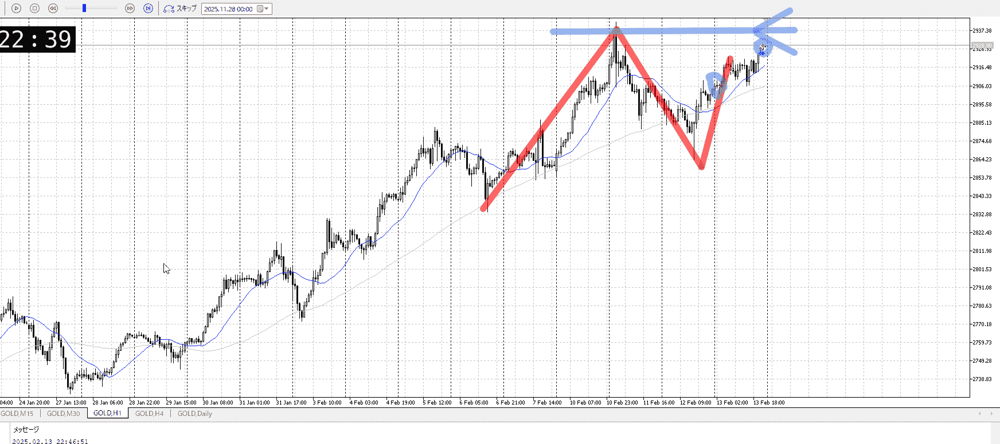
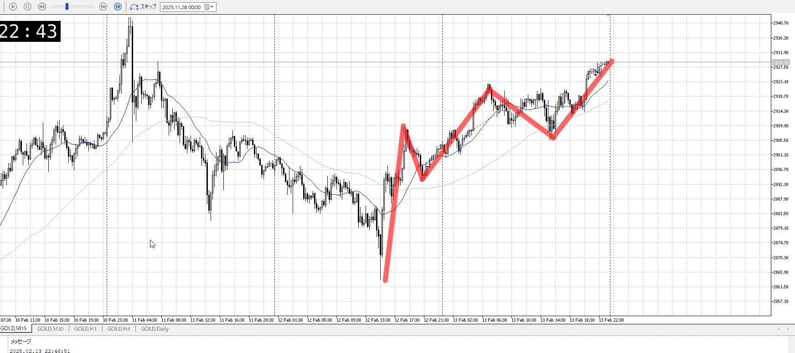

# [ld2025-02-14](../Link_Daily/ld2025-02-14.md)
> [!note]
>- +1万 事前認識 **開始5分**

- [x] [my](my.md)(見ないと増える)
- [x] 指標
    - 差し込まれる可能性有り、毎日

## 4h

＜ここに目線画像＞

- [x] トレーディングレンジ
    - u

方向：u

## 1h

＜ここに目線画像＞ ^4bb92f

方向：u

## 15m

＜ここに目線画像＞

方向：u

全方向：uuu
^1d4903

- [x] 使用足全ての目線確認

## シナリオ

b:1h安値
s:1h高値
- [x] 時間足ぶつかり

買い推進なんだから抜けるんだろうけど、妙に動きが鈍いので売りを少し警戒
- [x] 1hシナリオ
    - [x] 明確か ? 続行 : 確定後考え直し

上昇
- [x] 日出日入、週出週入

下降と同等で上昇
- [x] 傾き比率

- [x] 前移動値
    - 3k
- [x] 前回上昇・下降値
    - 10.5k

## 位置

- [x] 推進
- [ ] 調整

## 方針
目線・シナリオ・強弱・調整
横幅・PA後・平均線方向・波
**ひきつけ**・軸時間・傾き比率

重いには重いが、しっかり上がってはいる
買って上がって、考えるのはそれから
ただ正直ここまでくると買いは難しいと思う、静観がいいか

- [ ] 買いたいなら
    - 高値当たって抜け後
- [ ] 売りたいなら
    - 高値当たって上昇止まり確認後

OK!
Exchage Start.

---

## メモ
買いは変わってないので、押し目で買うことを繰り返す

タイミングに加え、
利確・損切ラインを変えない場合どうなるかのデータ

エントリーがよかった・タイミング
 - 高さがよかった
 - 横軸が良かった
分析がよかった
 - 4hで方向取れてる
 - 1hで戦略立ててる

そのそれぞれで、予想してる利確損切までやった場合の結果
これを集める

---

再検証

