# [ld2025-02-17](../Link_Daily/ld2025-02-17.md)
> [!note]
>- +1万 事前認識 **開始5分**

- [ ] [my](my.md)(見ないと増える)
- [ ] 指標
    - 差し込まれる可能性有り、毎日

## 1d
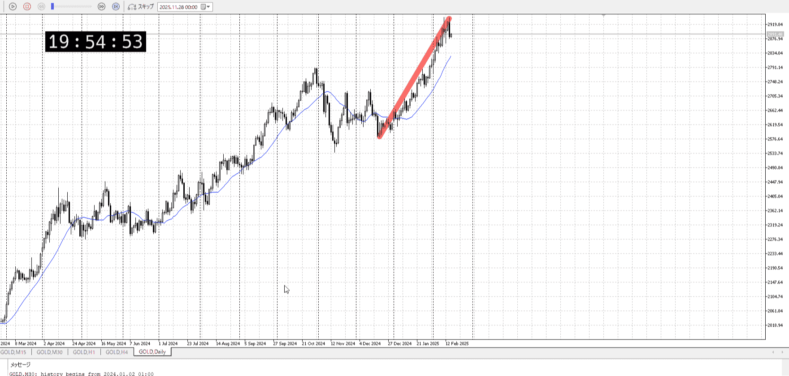

上昇中
上髭-下髭-大きく落ちたが抜かず
## 4h
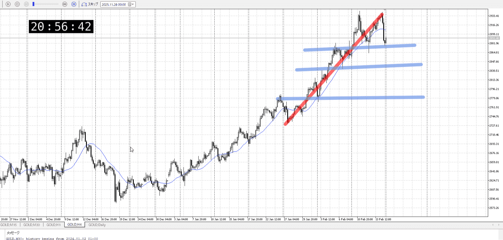
＜ここに目線画像＞

- [x] トレーディングレンジ
    - u

方向：u

## 1h
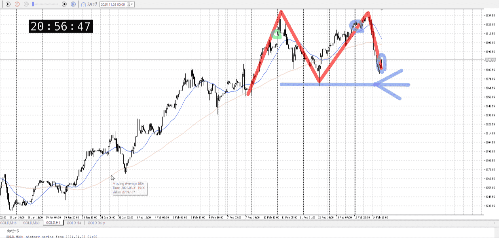
＜ここに目線画像＞ ^4bb92f

方向：uR

## 15m
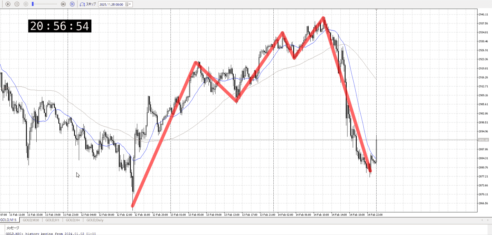
＜ここに目線画像＞

方向：d

全方向：uud
^1d4903

- [x] 使用足全ての目線確認

## シナリオ

b:1h底
s:15m前回安値
- [x] 時間足ぶつかり

1h底に15mが一気に向かってる
それが抜くか1h返すか
- [x] 1hシナリオ
    - [x] 明確か ? 続行 : 確定後考え直し

落ち
- [x] 日出日入、週出週入

一気に落ちて来てるので、どこで止まるかを見極めろ
- [x] 傾き比率

- [ ] 前移動値
    - 63k 
- [ ] 前回上昇・下降値
    - d77k

## 位置

- [ ] 推進
- [x] 調整

## 方針
目線・シナリオ・強弱・調整
横幅・PA後・平均線方向・波
**ひきつけ**・軸時間・傾き比率

少し上昇緩やかから、天井触れて一気に落ち今底
1h押すか、15m抜くかの戦い
ここで買うのは無理、止まったのを見る

- [ ] 買いたいなら
    - 止まってから近場の高値を抜いたところで押し買い
- [ ] 売りたいなら
    - 下抜きしてから、目線がそのままでは辛い
    - 1hに最低勝たないと

OK!
Exchage Start.

---

## メモ
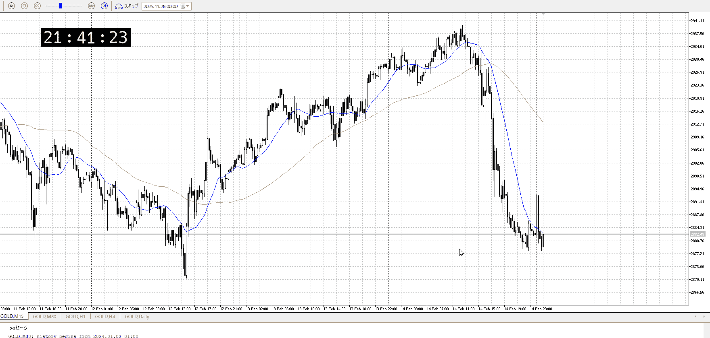
上行って落ちずに止まり
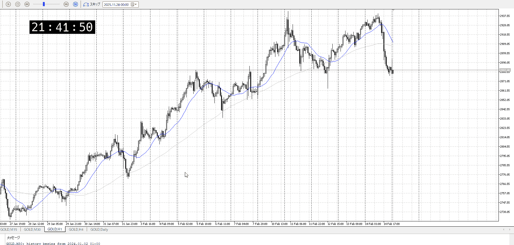

1hだと上髭
買えはしない、売るには横幅短くないか
1hA待ちたいんだが

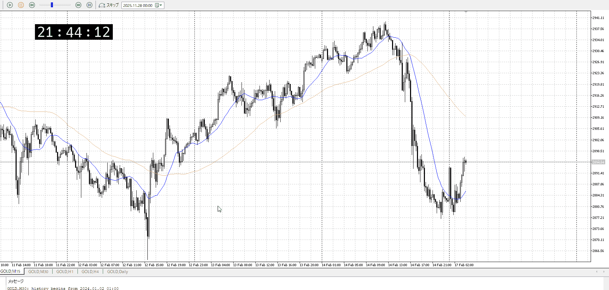
15m
1hでもさっきの上髭抜き、オバシュ扱いにしてももう少し押しを待ちたい

> [!note]
> ○○扱い、は他のものと概念を混ぜようとしてる
> 後からごっちゃになって思い出せなくなる危険性があり、危ないので止める
> 基本を覚え直すべきサイン

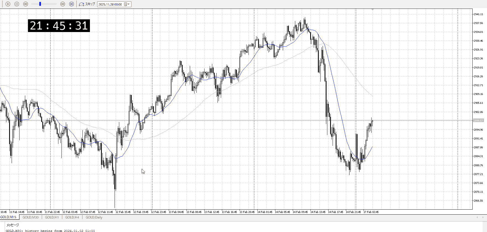

が、下髭が多く落ちなさそう
なら買えるか？

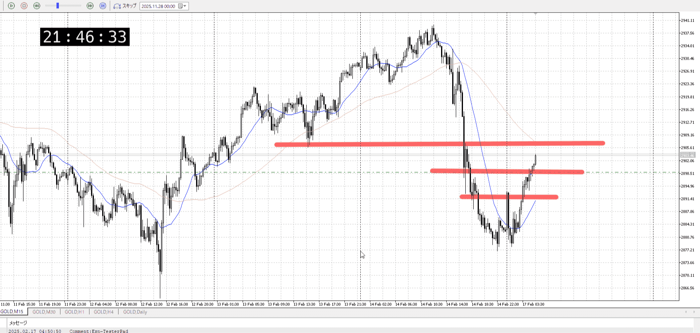
持てて落ちの半分程度か
損切が分からないのがちょっと辛い

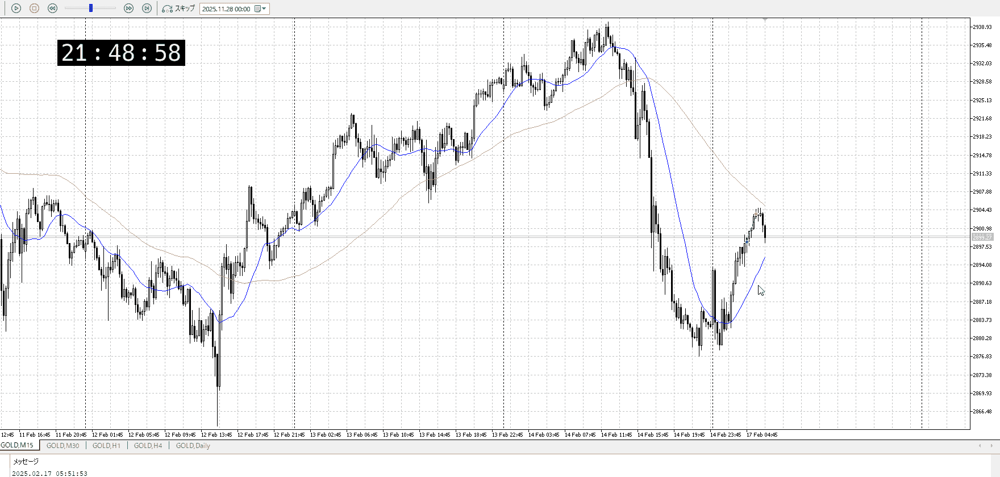

これが精々ではないか
15mとしては持ちにくい調整中の入りだろうし、入らなくてもいいかなというところ

![[../After_Entry/Aen20260212T094945]]

この後
抜きした部分で押し買いが起きるか否かのとこ
この半値からの落ちを見て抜くかどうかを見て

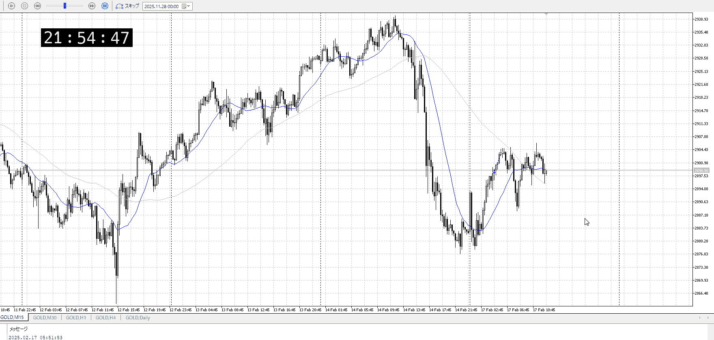

迷いが酷い

上昇して落ちないという形ではある、これを上抜ければuuuで買える
でもどっちも辛いなといったとこ

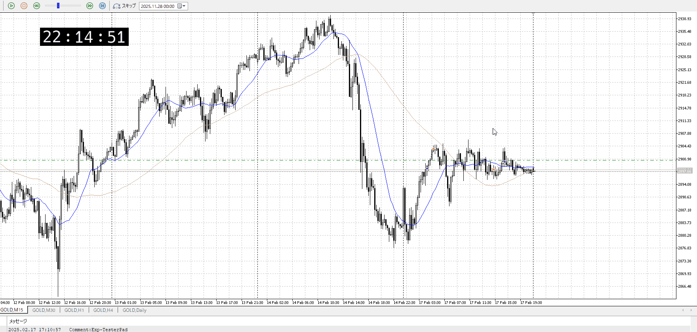

![[../After_Entry/Aen20260212T101501]]

# [ld2025-02-18](../Link_Daily/ld2025-02-18.md)

夢中になって飛ばしてた、非常に良くない

![[../After_Entry/Aen20260212T102219]]

![[../After_Entry/Aen20260212T102454]]

![[../After_Entry/Aen20260212T102655]]

![[../After_Entry/Aen20260212T103320]]

---

再検証
レンジと深夜で狩られまくってる
レンジでやるな、やるなら上下ギリギリの損切ほぼ無しで
深夜はシンプルにやめろ、抜き否定で止まり確認とかでも損切ほぼ無しじゃないと無理

