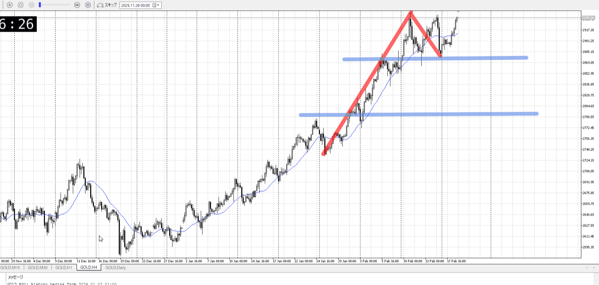
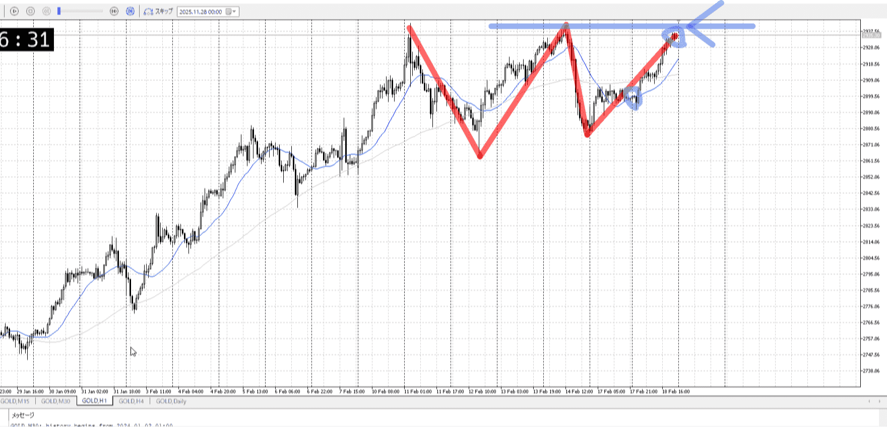
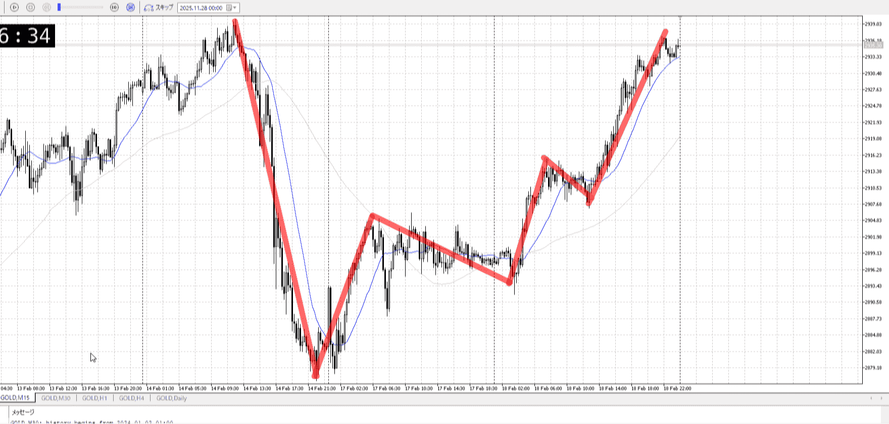
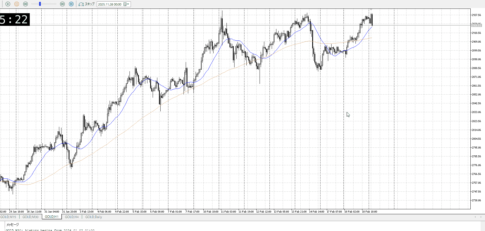
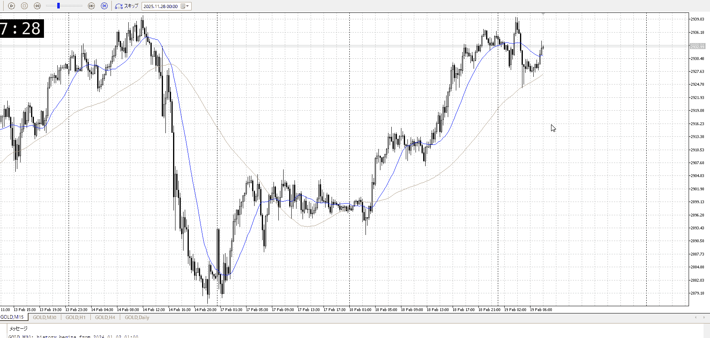
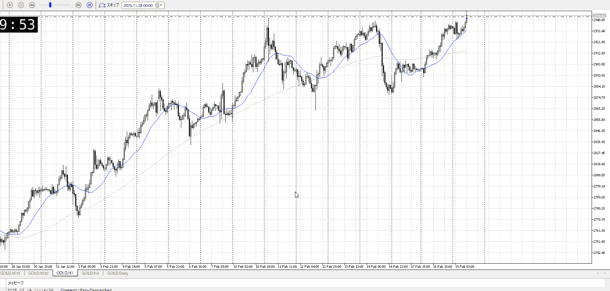
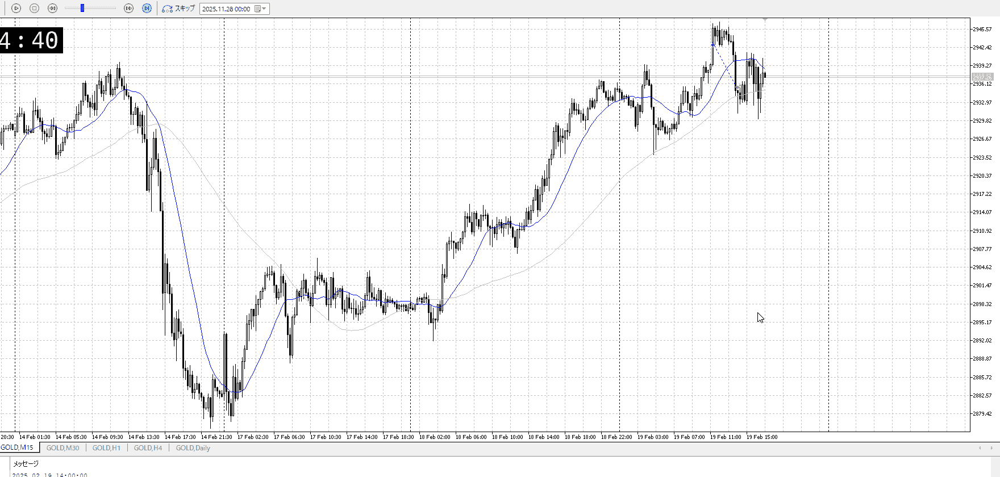
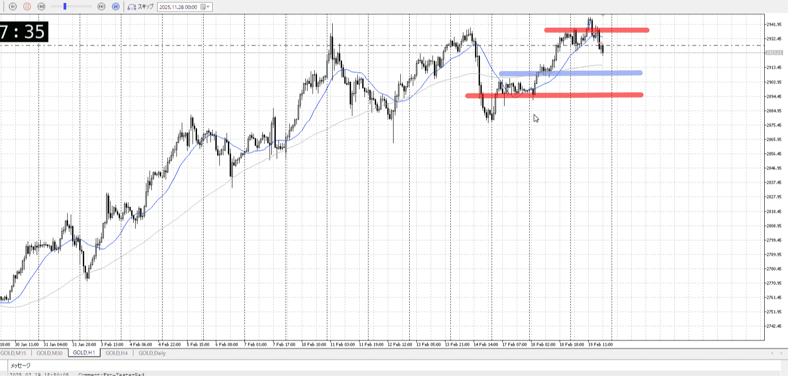
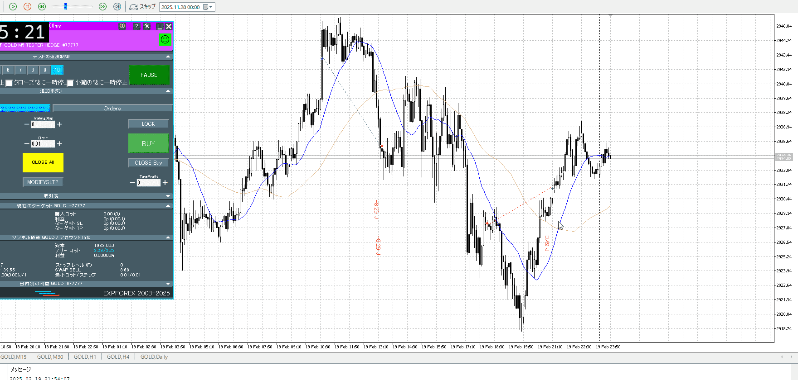

# [ld2025-02-19](../Link_Daily/ld2025-02-19.md)
> [!note]
>- +1万 事前認識 **開始5分**

- [x] [my](my.md)(見ないと増える)
- [x] 指標
    - 差し込まれる可能性有り、毎日

## 4h

＜ここに目線画像＞

- [x] トレーディングレンジ
    - u

方向：u

## 1h

＜ここに目線画像＞ ^4bb92f

方向：u

## 15m

＜ここに目線画像＞

方向：d

全方向：uud
^1d4903

- [x] 使用足全ての目線確認

## シナリオ

b:1h底
s:1h天井
- [x] 時間足ぶつかり

レンジ
売りの方を想定してるが、1h目線は上なので一応抜けも
- [x] 1hシナリオ
    - [x] 明確か ? 続行 : 確定後考え直し

上昇
- [x] 日出日入、週出週入

下降に対して倍かけて登ってる
一つ前より明らか売りが強いが、どう止まるか
- [x] 傾き比率

4.4k
- [x] 前移動値

6.3k
- [x] 前回上昇・下降値

## 位置

- [ ] 推進
- [ ] 調整
- [x] レンジ
## 方針
目線・シナリオ・強弱・調整
横幅・PA後・平均線方向・波
**ひきつけ**・軸時間・傾き比率

レンジ内
レンジなので上から売りたい気持ち、1h目線は買い

- [x] 買いたいなら
    - 抜け
    - それにしても振りが無いと、いきなりは入りにくい
- [x] 売りたいなら
    - 上昇をしっかり同じくらいのレンジなどで受け止め、下抜けなど

OK!
Exchage Start.

---

## メモ

これを抜いて売りを確定してからで十分では

振り入れて上行って、天井で跳ね返し
それをさらに下髭複数で止め

元々売り多めの中、すばやく1h天井抜けていった
ならついていけるのかもと
確定待ちは、どうだろう

抜けにしては遅いというところをみるべきだった
抜けはスピード

上をちょっと抜けたようで押してきて、伸びるかと思いきや下髭出しながら落ち
抜けにしては難しいので、下へ行き戻りを売りを考える

レンジ下まで売るのが限界範囲だが、1huの中でそれやるのは
だから八割の下赤まで持ちたいが、一頭高値を更新した以上絶対青で押し目買い引っかかると予想

一応赤で見ておく

オーバーシュートした
上昇の抑え込みに上昇と同じくらいと考えると、もっともっと後だったか

![[../Entry/en20260216T100727.md]]

![[../Entry/en20260216T101103.md]]

---

再検証
明確さが出る前に入ってしまっている
最初のは押しを待つべきで、次のやつも抜きの確定、あるいは戻りを待つべき

上がるのは1huなので想定内、下がるのもレンジ天井で想定内
最近のチャートみたいに長いレンジからいきなり一気に明確に落ちて重要な箇所を抜いたわけではない、重要箇所と明確抜きを意識し、基本押し戻り待ち

前日動いて伸びにくい中、抜けは攻めすぎだったか