# [ld2025-02-20](../Link_Daily/ld2025-02-20.md)
> [!note]
>- +1万 事前認識 **開始5分**

- [x] [my](my.md)(見ないと増える)
- [x] 指標
    - 差し込まれる可能性有り、毎日

## 4h
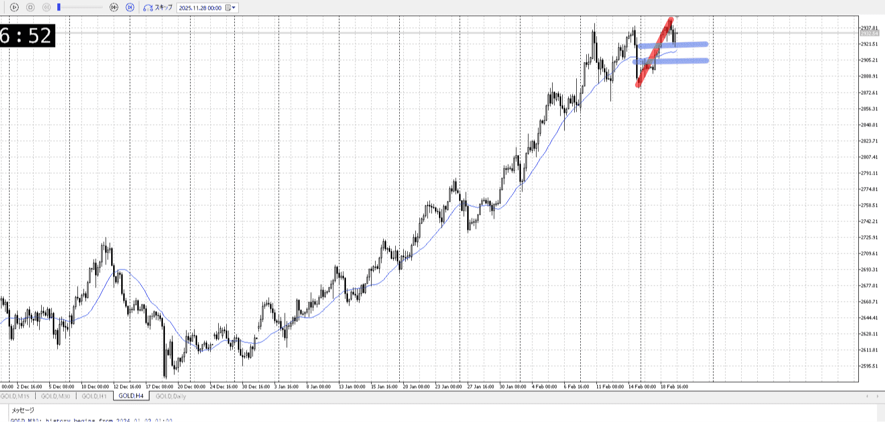
＜ここに目線画像＞

- [x] トレーディングレンジ
    - u

方向：u

## 1h
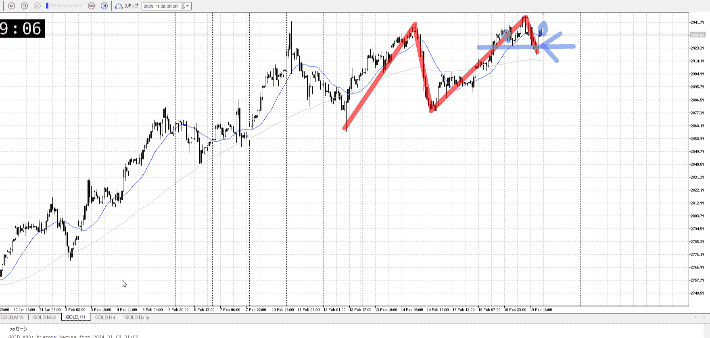
＜ここに目線画像＞ ^4bb92f

方向：u

## 15m
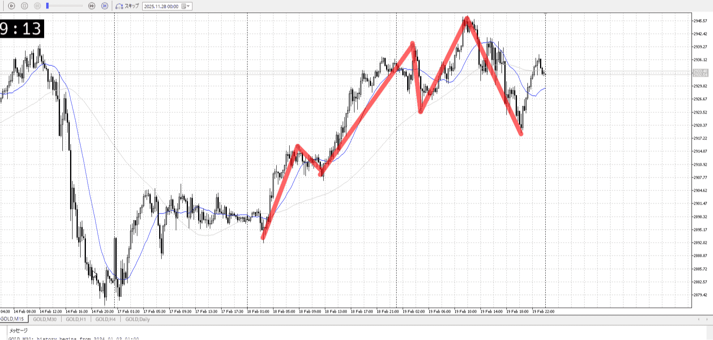
＜ここに目線画像＞

方向：d

全方向：uud
^1d4903

- [ ] 使用足全ての目線確認

## シナリオ

b:1hレンジ下
s:1hレンジ上
- [x] 時間足ぶつかり

買いなので上がってほしいが、レンジなので下がりも考える
- [x] 1hシナリオ
    - [x] 明確か ? 続行 : 確定後考え直し

同値ちょい上昇
- [x] 日出日入、週出週入

緩やか上昇
- [x] 傾き比率

2.8k
- [x] 前移動値

6.8k
- [x] 前回上昇・下降値

## 位置

- [ ] 推進
- [x] 調整

## 方針
目線・シナリオ・強弱・調整
横幅・PA後・平均線方向・波
**ひきつけ**・軸時間・傾き比率

調整終わり入り場所に備え波
調整終わりの方向性に備え明確な環境足抜け
方向性に対する疑いに備えローソクに対する上位足根拠、これはエントリー前後で両方該当
早めの押し戻りに備え入りたい場所と髭
ついでに新情報に備え落ち着いて考え直し

現在調整内
調整終わりまでひきつけて買いたい
1hAを巻き込みぐだり始めてる、ここで1hが上下どっちか抜けば明確な抜けとして扱えるはず

調整が天井で止まり、ぐだるとこ
小さくレンジ作りどっち行くのか見る

- [x] 1hで買いたいなら
    - レンジ上抜け押し
- [x] 1hで売りたいなら
    - レンジ下抜け

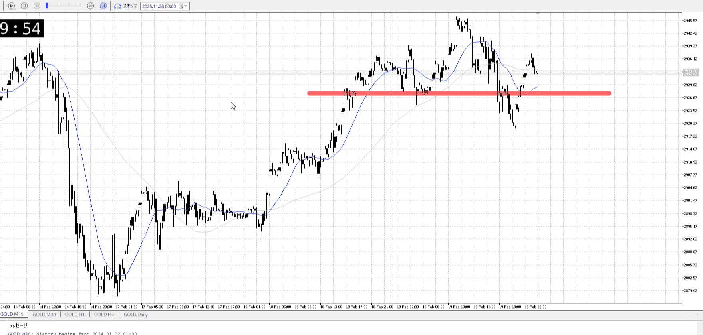

15m
落ちて上がってるが、特にこの高さに1hの目印は無く15mであることに注意
万一明確に落ちた時ここで下髭出してもあまり意味はないということ

OK!
Exchage Start.

---

## メモ
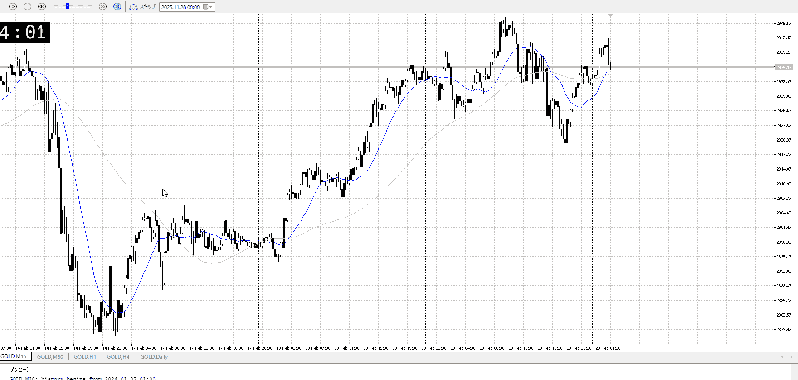
1hで明確なものはレンジ上下くらい
15mで気にするのは途中のレンジとか直近安値とか

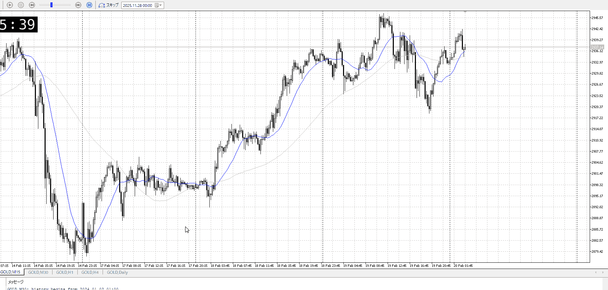

これで買いますかについて
もともと1hは迷っているため、こうした買いそうなものがあっても買いにくい

やはり明確に何か必要

改めてみると、1hがuなので積極的に買っていくべきでないかと
明確に出ないと崩れとしてやりにくいが、直前の落ちの一本は抜いてる
下髭はちゃんと待て

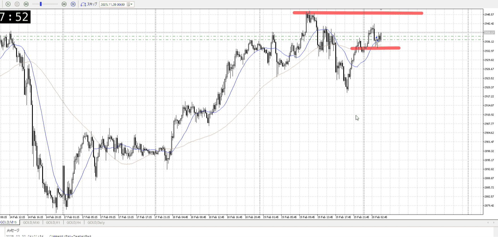

ちゃんと待て
上の時間足の天井があるので、天井付近は警戒
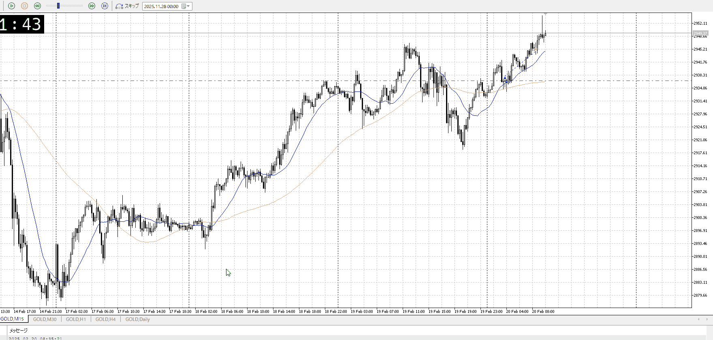
1hでも上髭
出ても上位足でもおかしくない位置、警戒

波的には？
上位の推進に乗った形ではあるが、15mは売り
売りの中での上位足と重なる買いトレンドを掴んだ短期、4h1hの後押しで自信をもって買う
ただ15mが売りな以上、これは5m買いが妥当
せめて直近高値が妥当で、その後伸びていくことは予期しにくいのでは

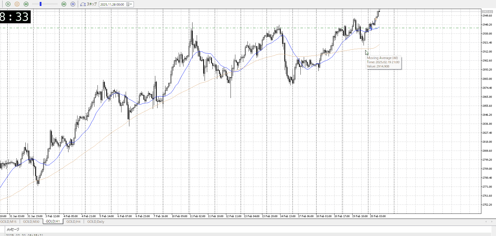

1hの買い崩れの売り崩れ
売り崩れではあるが明確に1hで意識されていた場所ではない、15mならというとこ

4h1hに従って、15mの売り崩れを狙った、5mの買い
上まで掴んでいくには見ている必要がある
見てるならここで利確するのはやっぱり早い、ちょっと下だろうと待つべき
**これを入る前に意識する**

で、どこまで伸びるかだが
前回伸びの7割、2964くらいまでいきたい
![[../Entry/en20260218T105644.md]]
![[../Entry/en20260218T105849.md]]

ここからは深夜

---

再検証
何足で入りかを把握、それに沿った動きをする

# [ld2025-02-21](../Link_Daily/ld2025-02-21.md)
> [!note]
>- +1万 事前認識 **開始5分**

- [x] [my](my.md)(見ないと増える)
- [x] 指標
    - 差し込まれる可能性有り、毎日

## 4h
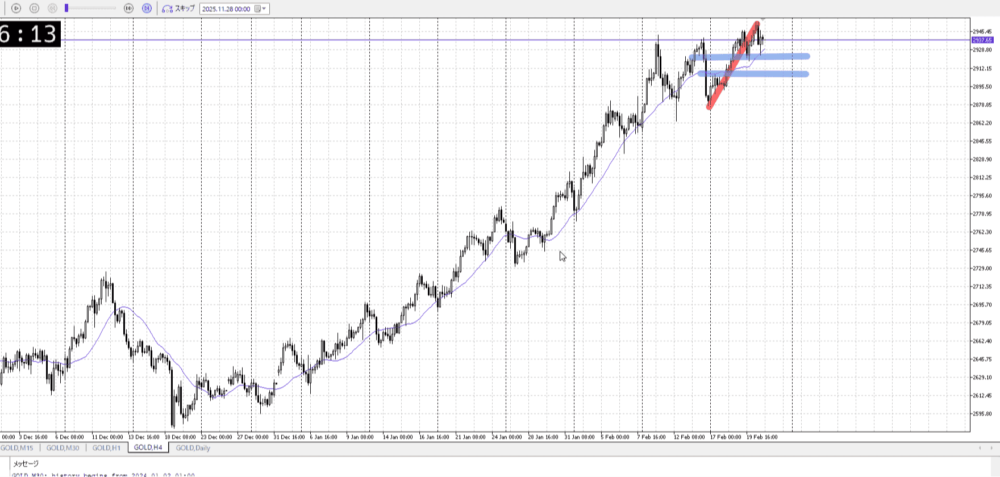
＜ここに目線画像＞

- [x] トレーディングレンジ
    - u

方向：u

## 1h
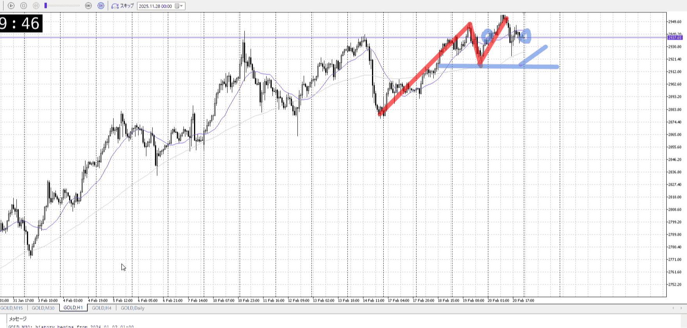
＜ここに目線画像＞ ^4bb92f

方向：u

## 15m
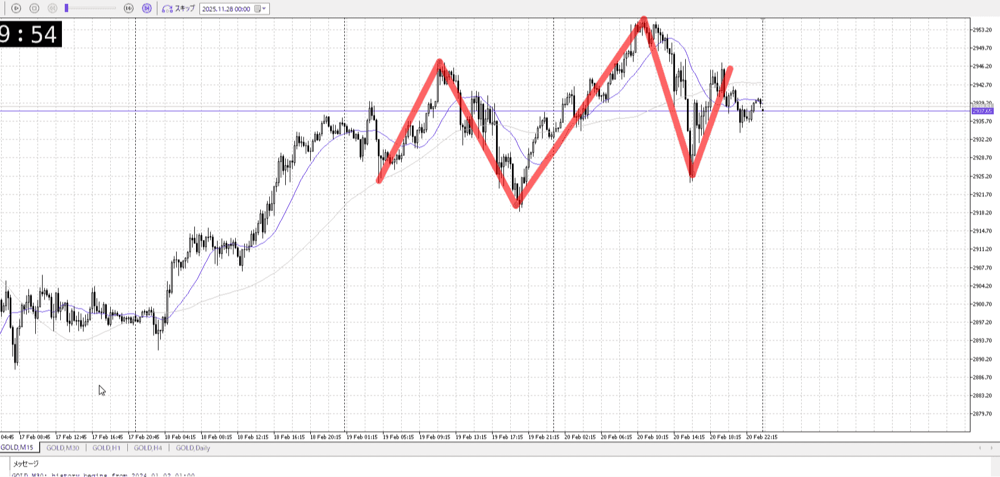
＜ここに目線画像＞

方向：u

全方向：uuu
^1d4903

- [x] 使用足全ての目線確認

## シナリオ

b:1h安値
s:1h天井
- [x] 時間足ぶつかり

上を一応割ったものの、天井で返されてる感じ
安値で買いたいがその前に深押し可能性もある、第二第三で短期押しの場所を考慮
- [x] 1hシナリオ
    - [x] 明確か ? 続行 : 確定後考え直し

同値
- [x] 日出日入、週出週入

売りに対し高値抜き
買い優勢
- [x] 傾き比率

3.1k
- [x] 前移動値

6.8k
- [x] 前回上昇・下降値

## 位置

- [ ] 推進
- [x] 調整

## 方針
目線・シナリオ・強弱・調整
横幅・PA後・平均線方向・波
**ひきつけ**・軸時間・傾き比率

買いたい
天井で返されてるっぽさがある、これによる調整を終えたら買い

1h安値からか、それまでで短期買いか
短期の場合1hのサポートが無くなるので自信なし

- [x] 買いたいなら
    - 1h安値調整終わり
- [x] 売りたいなら
    - 1h安値抜き

OK!
Exchage Start.

---

## メモ
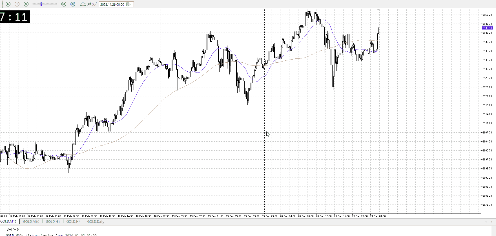

切り上げから上昇
前にあった上昇で買いたい奴は、下振りがあって元々買いたい中での確信

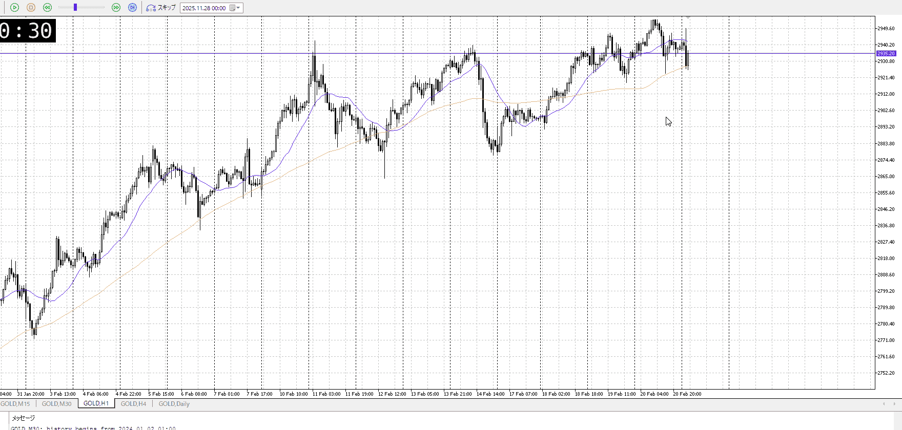
1hでの上髭
一回戻ってきた中でのこれ、売りは安値抜けるまで考えない
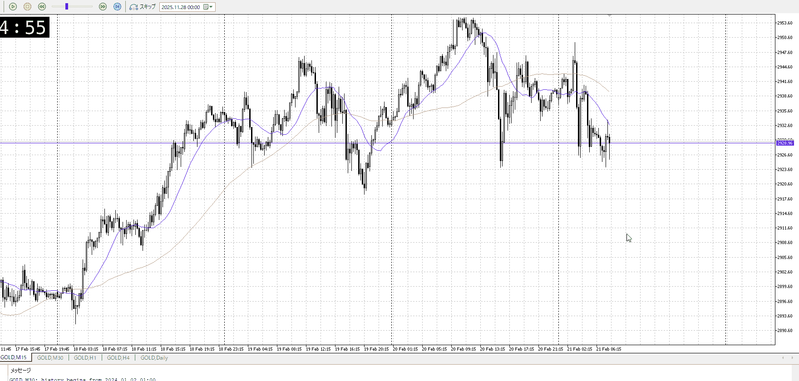
短期では
やはり安値を抜けてないのでなし
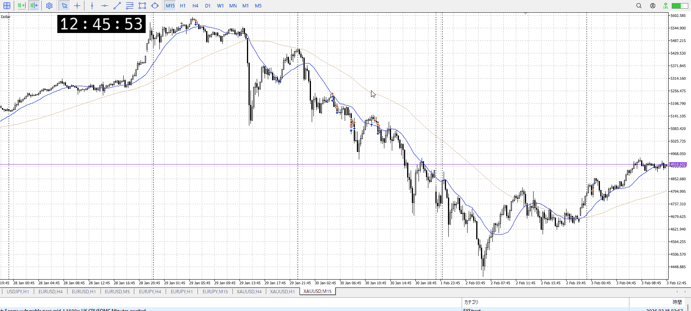
前のこれは直前で安値抜いてる

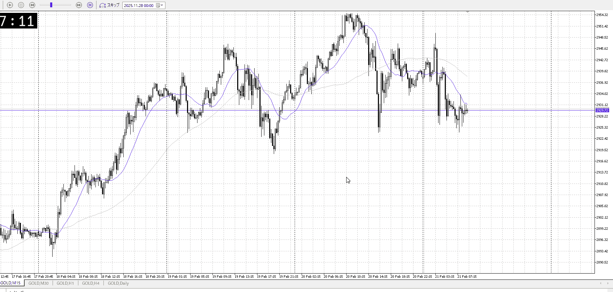

むしろ買いたいんだけど、それはそれで結局この下降を一回止めなきゃならない
15m下降止まり待ち

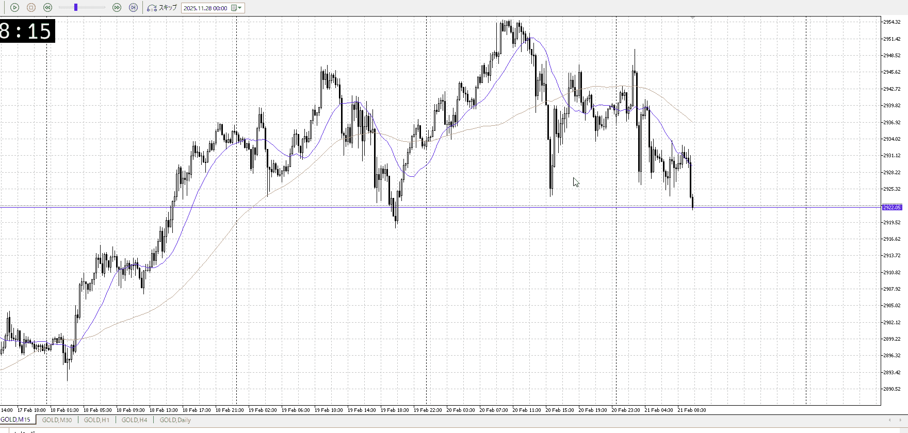

予想外の下
これで明確に抜くようなら下抜き売りしたい

二つずつ纏めて
![[../Entry/en20260218T125325.md]]

![[../Entry/en20260218T125703.md]]

---

再検証

