# [ld2025-02-24](../Link_Daily/ld2025-02-24.md)
> [!note]
>- +1万 事前認識 **開始5分**

- [x] [my](my.md)(見ないと増える)
- [x] 指標
    - 差し込まれる可能性有り、毎日

## 1d
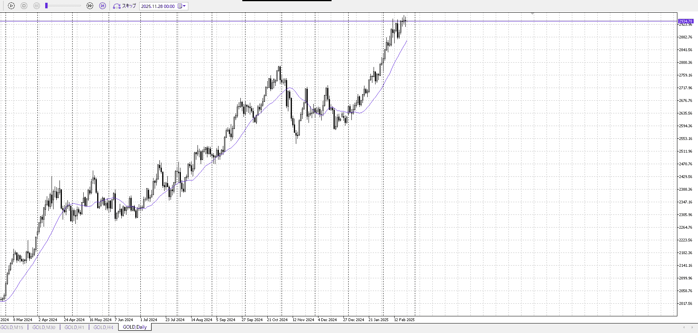
上
三日止まっており、溜めている

## 4h
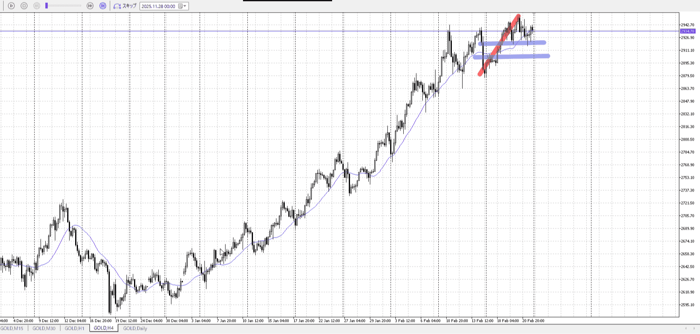
＜ここに目線画像＞

- [x] トレーディングレンジ
    - u

方向：u

## 1h
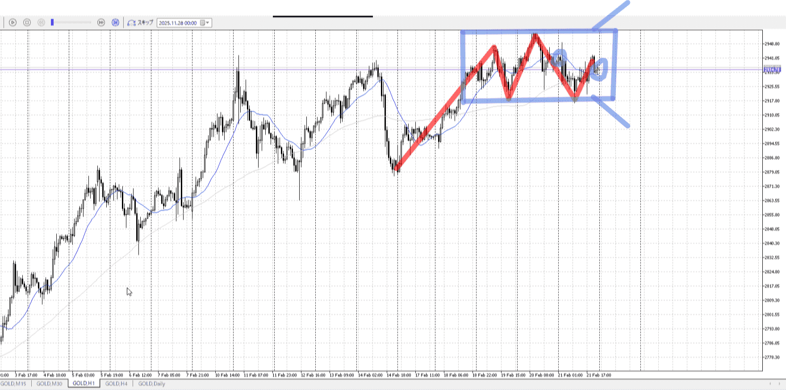
＜ここに目線画像＞ ^4bb92f

方向：u

## 15m
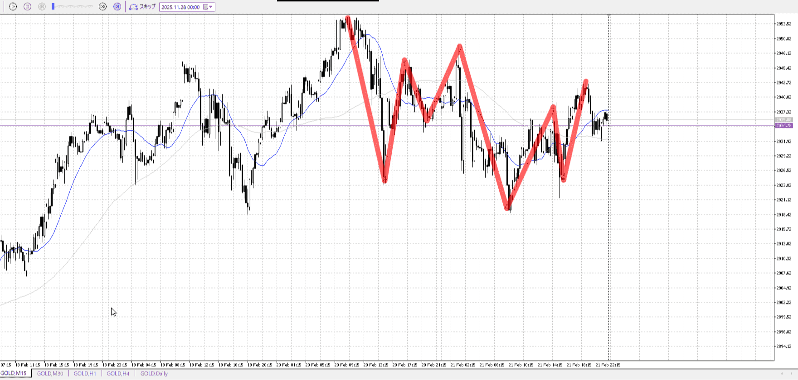
＜ここに目線画像＞

方向：d

全方向：uud
^1d4903

- [x] 使用足全ての目線確認

## シナリオ

b:1h押し目買い
s:4h天井
- [x] 時間足ぶつかり

1hが一回勝って、弾かれて落ちていかない
買いがまだいる
- [x] 1hシナリオ
    - [x] 明確か ? 続行 : 確定後考え直し

ちょっと落ち
- [x] 日出日入、週出週入

上昇に対して下降が緩やかになりつつある
- [x] 傾き比率

31k
- [x] 前移動値

37k
- [x] 前回上昇・下降値

## 位置

- [ ] 推進
- [x] 調整

## 方針
目線・シナリオ・強弱・調整
横幅・PA後・平均線方向・波
**ひきつけ**・軸時間・傾き比率

推進に当たるが、レンジ内なのに注意
短期で買ってレンジ内で様子見しつつ、あわよくば上抜き狙い

- [x] 買いたいなら
    - レンジ下引きつけ買い
- [x] 売りたいなら
    - レンジ上で短期目線変わり短期売り

OK!
Exchage Start.

---

## メモ
![[../Entry/en20260222T021242.md]]

この後下から買うにしたいが、ちょっと落ち方がキツイので落ち着くまで待ってから
15mのレンジは下が綺麗に揃ってるわけではないので買いにくい

![[../Entry/en20260222T022413.md]]

1hサポが受けられるのはあるので、下髭で買えたかも。

この後はレンジ作ってそれを抜く動きで買っていきたい。
現時点した抜きして上髭つけてるが、1h的に売るのは無理。
1hとしては経緯はともかく調整終了しそう

![[../Entry/en20260222T023301.md]]

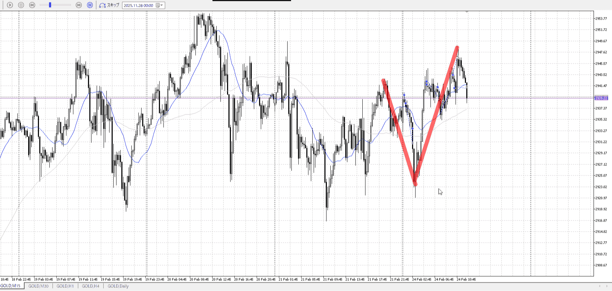
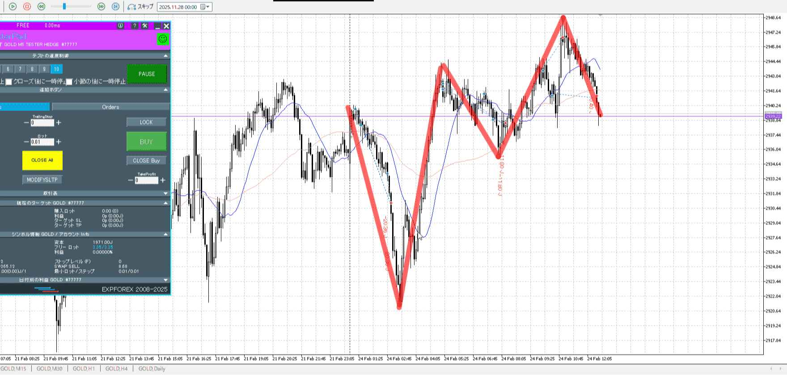
経緯はともかく上昇
買っていけるのはそう

![[../Entry/en20260222T023942.md]]

適当に買って後から理由付けるのやめろ
last_entryを活用しろ

時間帯が深夜なので見送り

---

再検証
動きに対してベストポジションより早すぎ、流れに対してベストポジションより遅すぎ
朝は警戒足りてない
利確が変なのは、どこで溜まってるかを見ておく
    受け止めと引きつけに抵触
# [ld2025-02-25](../Link_Daily/ld2025-02-25.md)
> [!note]
>- +1万 事前認識 **開始5分**

- [x] [my](my.md)(見ないと増える)
- [x] 指標
    - 差し込まれる可能性有り、毎日

## 4h
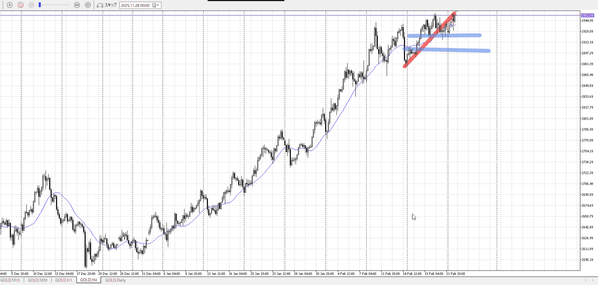
＜ここに目線画像＞

- [x] トレーディングレンジ
    - u

方向：u

## 1h
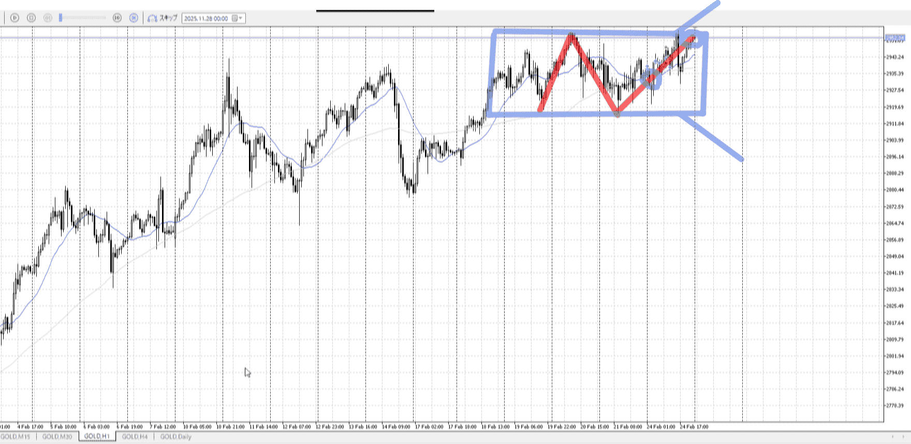
＜ここに目線画像＞ ^4bb92f

方向：u

## 15m
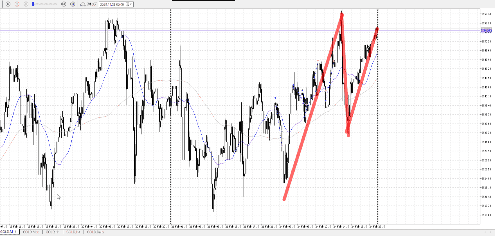
＜ここに目線画像＞

方向：u

全方向：uuu
^1d4903

- [x] 使用足全ての目線確認

## シナリオ

b:1h押し目
s:4h天井
- [x] 時間足ぶつかり

レンジどっち抜けるか
- [x] 1hシナリオ
    - [x] 明確か ? 続行 : 確定後考え直し

上昇天井
- [x] 日出日入、週出週入

買いが緩くなり始めてる
- [x] 傾き比率

34k
- [x] 前移動値

36k
- [x] 前回上昇・下降値

## 位置

- [x] 推進
- [ ] 調整

## 方針
目線・シナリオ・強弱・調整
横幅・PA後・平均線方向・波
**ひきつけ**・軸時間・傾き比率

推進ではあるが、売りに比べて緩やか
15mでは直前の売りに対しても緩やか、これで4h天井に勝つのは難しそう
レンジ底がちょっと上に来たので、底まで待って買いがまだよさそう
1dとしては全返しだから買いたい

万一4h天井に勝つ場合、さすがに抜けの気持ちで行きたいが
しかし緩やかなので押しも待ちたい
どっちか分からないならレンジ待て、そして買い場所より遅くも早くもいけない
試さずに検証する

- [ ] 買いたいなら
    - レンジ底待ち
    - 上抜け押し
    - 下振り
- [ ] 売りたいなら
    - ここでレンジやって下抜け売り
        - 底まで

OK!
Exchage Start.

---

## メモ
![[../Entry/en20260222T031557.md]]
![[../Entry/en20260222T032108.md]]

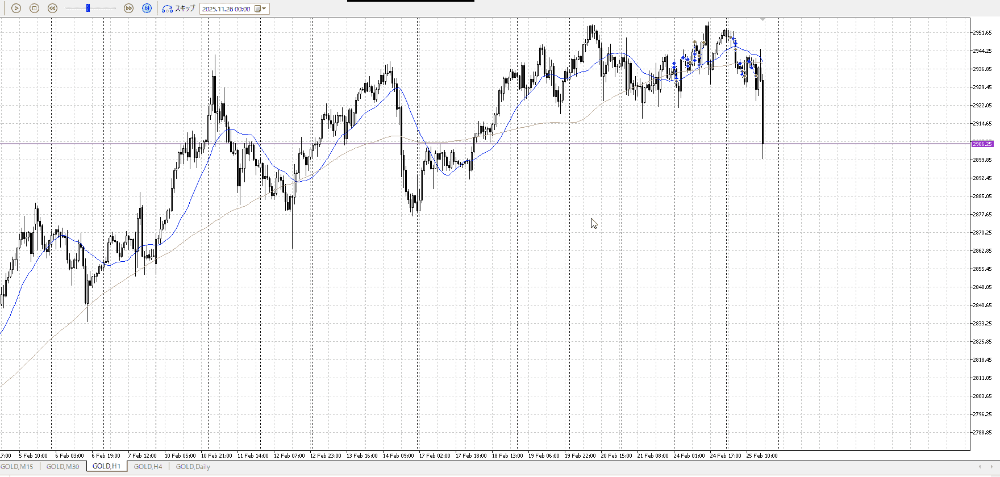

ああそうだ。短期の目線が変わった分、短期で売ることができる。

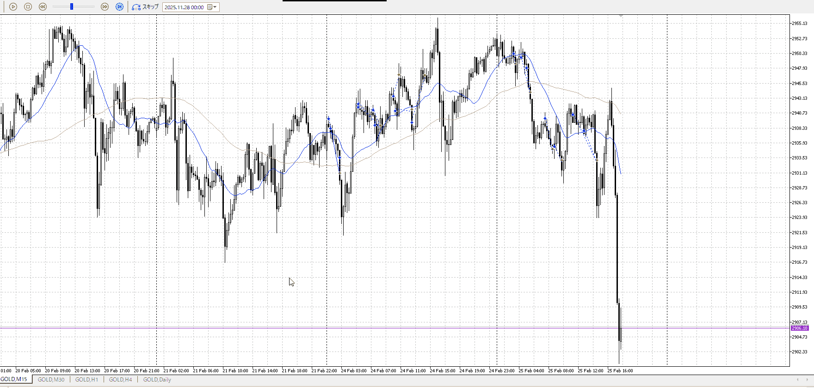

それなら完全に勢い売り

---

再検証
推進は終わった。次を待て。
もしくは短期で売れ。
    基本事項、調整から推進波に移るとこを狙う に抵触
# [ld2025-02-26](../Link_Daily/ld2025-02-26.md)
> [!note]
>- +1万 事前認識 **開始5分**

- [x] [my](my.md)(見ないと増える)
- [x] 指標
    - 差し込まれる可能性有り、毎日

## 4h
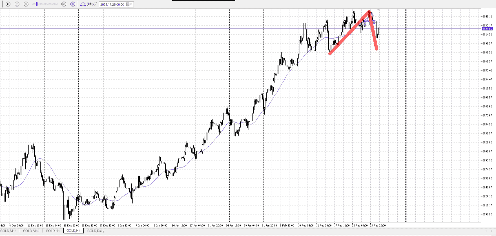
＜ここに目線画像＞

- [x] トレーディングレンジ
    - d

方向：u

## 1h
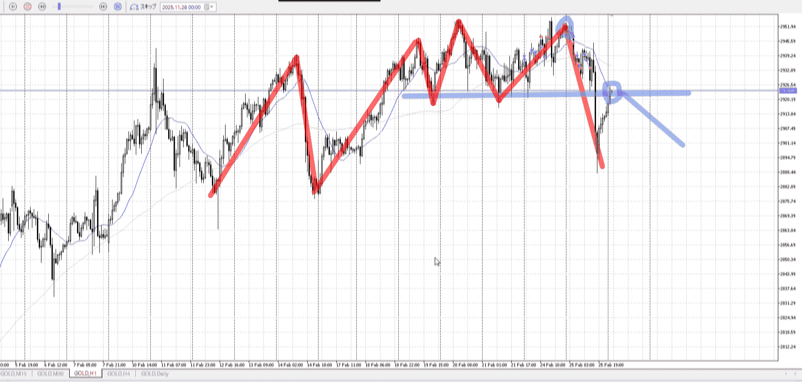
＜ここに目線画像＞ ^4bb92f

方向：d

## 15m
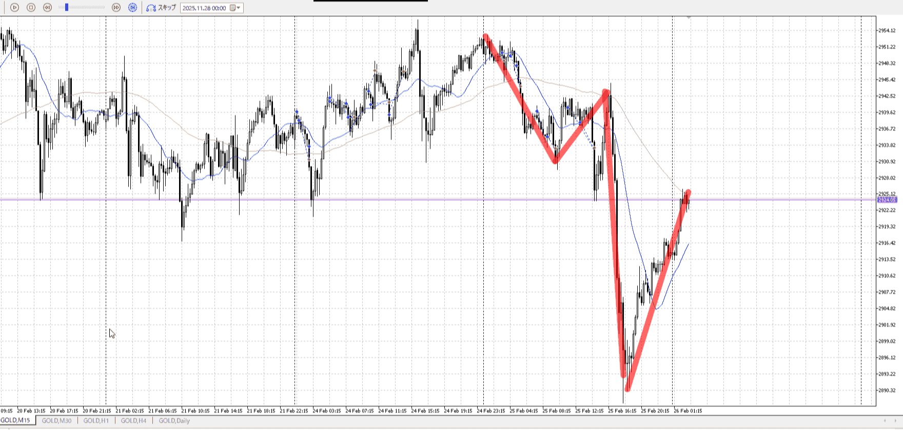
＜ここに目線画像＞

方向：d

全方向：udd
^1d4903

- [x] 使用足全ての目線確認

## シナリオ

b:4h底
s:1h前回レンジ
- [x] 時間足ぶつかり

落ちてすぐだし売りを考える
- [x] 1hシナリオ
    - [x] 明確か ? 続行 : 確定後考え直し

落ち、戻し
- [x] 日出日入、週出週入

4hとしてはかなり急降下
1hとしても急な落ち
15mは二倍以上かけて半分
- [x] 傾き比率

63k
- [ ] 前移動値

63k
- [ ] 前回上昇・下降値

## 位置

- [ ] 推進
- [x] 調整

## 方針
目線・シナリオ・強弱・調整
横幅・PA後・平均線方向・波
**ひきつけ**・軸時間・傾き比率

調整の始めも始め
レンジは待ちたい
売りは4h底まで

- [x] 買いたいなら
    - 4h底待ち
- [x] 売りたいなら
    - 1hレンジ底から小レンジ下抜き
    - 上振り

OK!
Exchage Start.

---

## メモ
![[../Last_Entry/len20260222T034031.md]]

![[../Entry/en20260222T034348.md]]

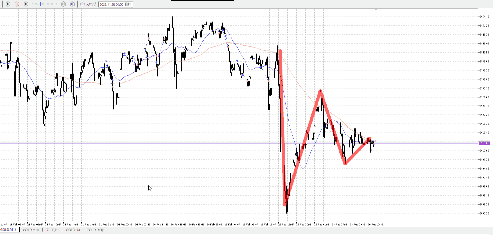

のんびりしてる
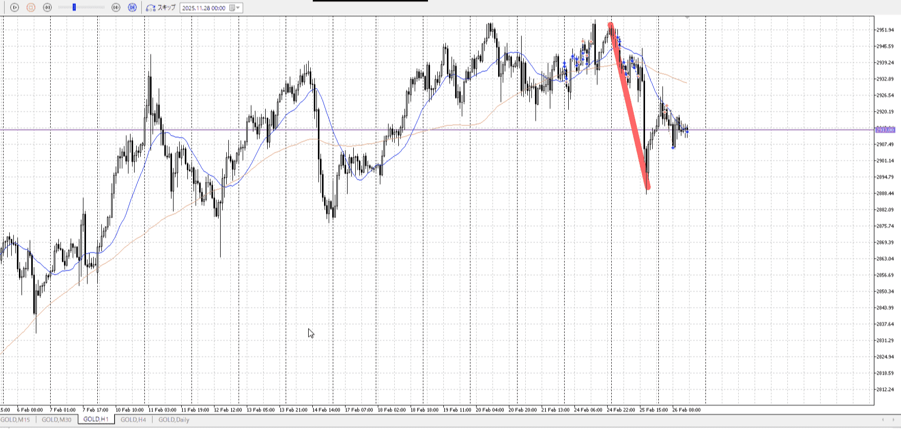
1hとしては売りがまだ続いてる認識なので、早かった？

調整をどうみるのっと
再度上がるなど調整らしくなってきて、それの終わりを待ちたい
いずれにせよ深夜になるので、もうないな

---

再検証
1日目はlastentryを使えてない、横幅取れてないし取れた後の動きを予測してない
    受け止め後のPA
2日目は落ちを考えられてない
3日目はマシだがまだ早い

