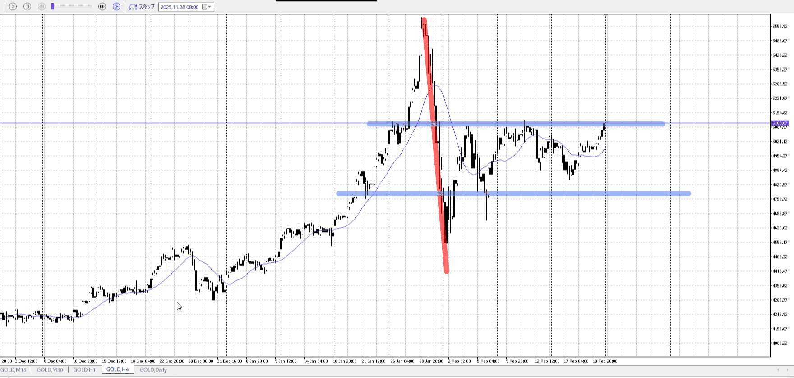
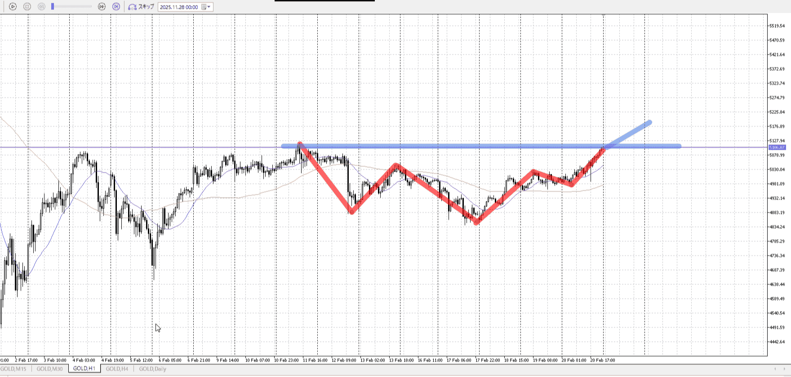
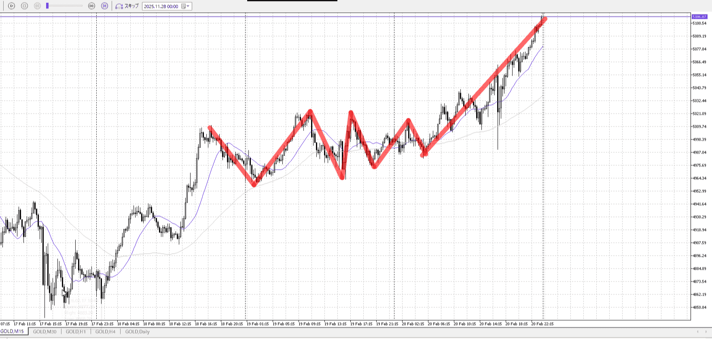
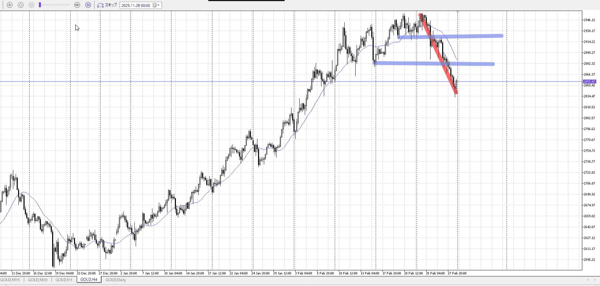
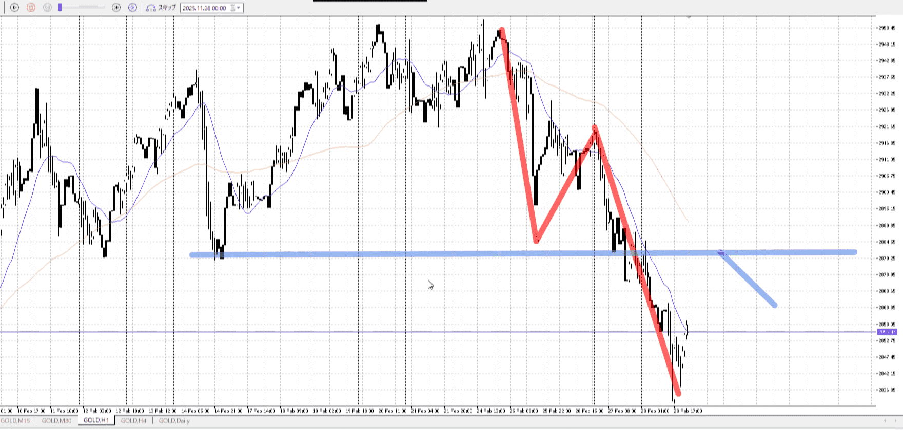
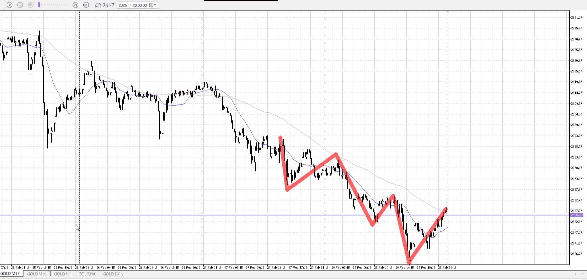

髭につられない、それは話が違うとなるような下髭は予想した物だけ考える
上位足で意味ある髭を
上位足見る

先に完全ネタバレ状態で、自分はちゃんと入れるかテスト

# [ld2026-02-23](../Link_Daily/ld2026-02-23.md)
> [!note]
>- +1万 事前認識 **開始5分**

- [ ] [my](my.md)(見ないと増える)
- [ ] 指標
    - 差し込まれる可能性有り、毎日

## 4h

＜ここに目線画像＞

- [x] トレーディングレンジ
    - m

方向：dR

## 1h

＜ここに目線画像＞ ^4bb92c

方向：u

## 15m

＜ここに目線画像＞

方向：u

全方向：uuu
^1d4903

- [x] 使用足全ての目線確認

## シナリオ


b:
s:
- [ ] 時間足ぶつかり


- [ ] 1hシナリオ
    - [ ] 明確か ? 続行 : 確定後考え直し


- [ ] 日出日入、週出週入


- [ ] 傾き比率


- [ ] 前移動値


- [ ] 前回上昇・下降値

## 位置

- [ ] 推進
- [ ] 調整

## 方針
目線・シナリオ・強弱・調整
横幅・PA後・平均線方向・波
**ひきつけ**・軸時間・傾き比率


- [ ] 買いたいなら
    - 
- [ ] 売りたいなら
    - 


```meta-bind-button
style: default
label: Send
actions:
  - type: "replaceSelf"
    replacement: "\n\nOK!\nExchage Start."
```

## メモ


---

再検証


# [ld2025-03-02](../Link_Daily/ld2025-03-02.md)
> [!note]
>- +1万 事前認識 **開始5分**

- [x] [my](my.md)(見ないと増える)
- [x] 指標
    - 差し込まれる可能性有り、毎日

## 4h

＜ここに目線画像＞

- [x] トレーディングレンジ
    - d

方向：

## 1h

＜ここに目線画像＞ ^4bb92f

方向：

## 15m

＜ここに目線画像＞

方向：

全方向：
^1d4903

- [ ] 使用足全ての目線確認

## シナリオ


b:
s:
- [ ] 時間足ぶつかり


- [ ] 1hシナリオ
    - [ ] 明確か ? 続行 : 確定後考え直し


- [ ] 日出日入、週出週入


- [ ] 傾き比率


- [ ] 前移動値


- [ ] 前回上昇・下降値

## 位置

- [ ] 推進
- [ ] 調整

## 方針
目線・シナリオ・強弱・調整
横幅・PA後・平均線方向・波
**ひきつけ**・軸時間・傾き比率


- [ ] 買いたいなら
    - 
- [ ] 売りたいなら
    - 


```meta-bind-button
style: default
label: Send
actions:
  - type: "replaceSelf"
    replacement: "\n\nOK!\nExchage Start."
```

## メモ


---

再検証

