髭につられない、それは話が違うとなるような下髭は予想した物だけ考える
上位足で意味ある髭を
上位足見る

# [ld2025-03-03](../Link_Daily/ld2025-03-03.md)
> [!note]
>- +1万 事前認識 **開始5分**

- [x] [my](my.md)(見ないと増える)
- [x] 指標
    - 差し込まれる可能性有り、毎日

## 4h

＜ここに目線画像＞

- [x] トレーディングレンジ
    - d

方向：d

## 1h

＜ここに目線画像＞ ^4bb92f

方向：d

## 15m

＜ここに目線画像＞

方向：d

全方向：ddd
^1d4903

- [x] 使用足全ての目線確認

## シナリオ

b:?
s:1h前回安値
- [x] 時間足ぶつかり

1hでは映らない遠さに何かありそうだが、見えてる範囲で
- [x] 1hシナリオ
    - [x] 明確か ? 続行 : 確定後考え直し

下降
- [x] 日出日入、週出週入

1h15m両方比率は売り優勢
ただし波はだんだん小さくなっている
- [x] 傾き比率

52k
- [x] 前移動値

31k
- [x] 前回上昇・下降値

## 位置

- [ ] 推進
- [x] 調整

## 方針
目線・シナリオ・強弱・調整
横幅・PA後・平均線方向・波
**ひきつけ**・軸時間・傾き比率

下がりたいんだけど、売りが弱くなってきてる
買いが横幅取りつつ上がってきてる

1hはガッツリ下がってる

15mでの短期買いを考え始める
目線の変更後

- [x] 買いたいなら
    - 15m目線変更後、押し目
- [x] 売りたいなら
    - 目線変更失敗、下抜き戻り

それまでやらない

OK!
Exchage Start.

## メモ
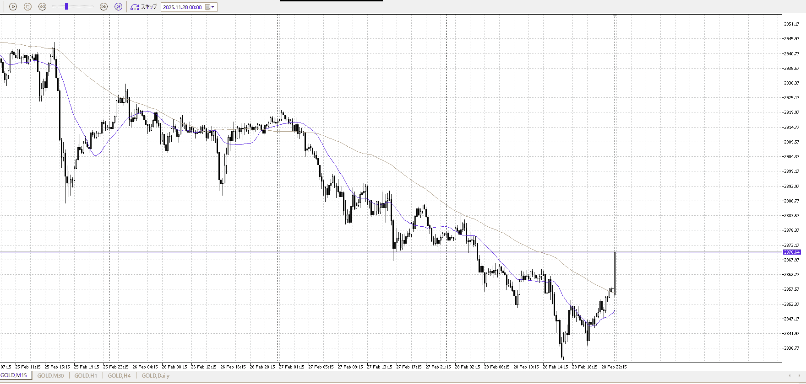

はい
この時点で短期は買いに変更
押し待って買い

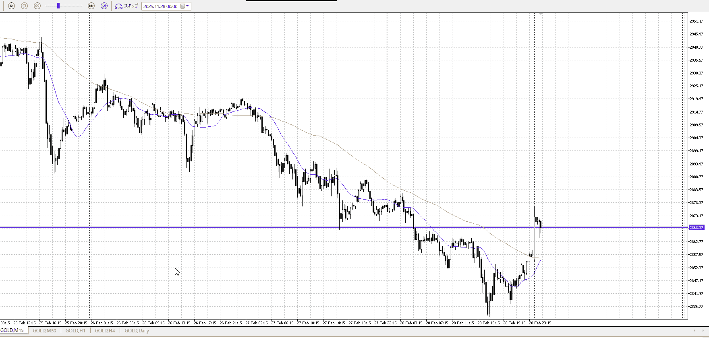

こういうタイミングで焦って毎回買って死んでる
今回は見送り、15m平均追いつくまで待ち

しっかり待ち、下がらない
買ってみる

![[../Before_and_Mid_Entry/BaMen20260226T051142]]

![[../After_Entry/Aen20260226T052038]]

![[../Before_and_Mid_Entry/BaMen20260226T054621]]

![[../After_Entry/Aen20260226T055841]]

---

再検証

t
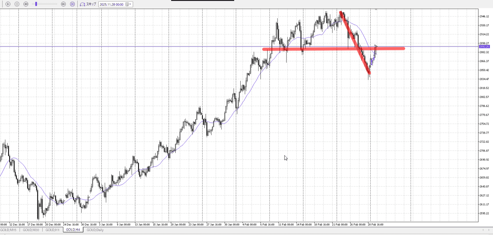
4h
これが売り

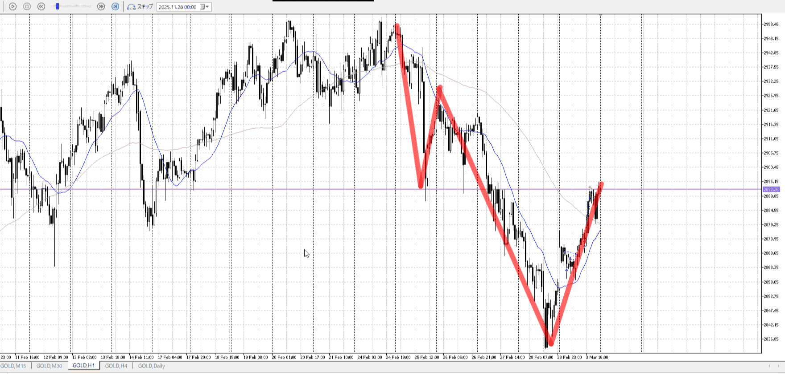
1h
これも売り

なので売りを考えるべき
それまでの買いは手出ししないのが正解
もちろん売りもない、それは調整が終わっての推進で取る

調整を取りに行かない
推進を取りに行く

どうしても買いたいなら、せめて売りが止まったと1hでわかるような動きが出てから

1h
4h天井からの売り、その三波が伸びない
左安値は抜いてるが、4hでは抜いたと言いにくい

止まったと言える
まだ環境足が目線下だが、二つ三つ妙な点が見つかるなら、下位足の買いを自信持てる

m
そもそもシナリオに反してるし、そりゃそうか

# [ld2025-03-04](../Link_Daily/ld2025-03-04.md)
> [!note]
>- +1万 事前認識 **開始5分**

- [x] [my](my.md)(見ないと増える)
- [x] 指標
    - 差し込まれる可能性有り、毎日

## 4h
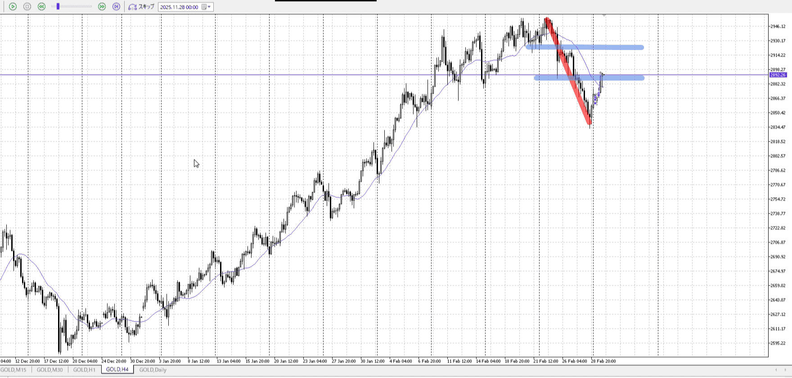
＜ここに目線画像＞

- [x] トレーディングレンジ
    - d

方向：d

## 1h
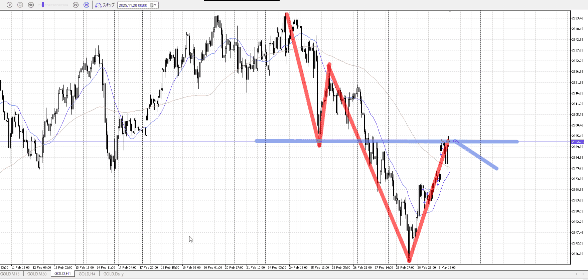
＜ここに目線画像＞ ^cto2rs

方向：d

## 15m
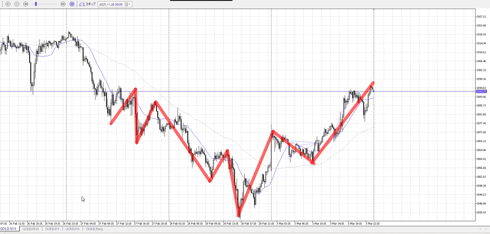
＜ここに目線画像＞

方向：u

全方向：ddu
^dse2z0

- [x] 使用足全ての目線確認

## シナリオ

b:？
s:1h前回安値
- [x] 時間足ぶつかり

1h売り目線のまま、売りを考える
- [x] 1hシナリオ
    - [x] 明確か ? 続行 : 確定後考え直し

上昇
- [x] 日出日入、週出週入

同じ時間で半分程度
下降として十分
- [x] 傾き比率

35k
- [x] 前移動値

d86k
- [x] 前回上昇・下降値

## 位置

- [ ] 推進
- [x] 調整

## 方針
目線・シナリオ・強弱・調整
横幅・PA後・平均線方向・波
**ひきつけ**・軸時間・傾き比率

1h売りたい中で、15mだけ上昇してる
これを折れば売れる場面

下降と同じ時間かけて半分
横は売りたい

1hレンジ下にいて、縦も売りたい場所
ここでレンジして下抜きして戻り売り、がひとつ
上振って下落ちがひとつ

いずれにせよ、この上昇を一旦受け止めないと損切決まらず話にならない
15mが高値更新を失敗してから

- [x] 買いたいなら
    - 1hによる下降を高値更新などで弾いてから
- [x] 売りたいなら
    - レンジ作って下抜け戻り

OK!
Exchage Start.

## メモ
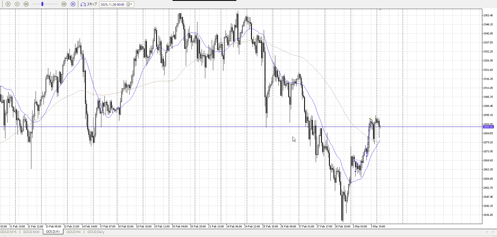
売りたい場所で出るものか？
まあ一本じゃ決まらんが

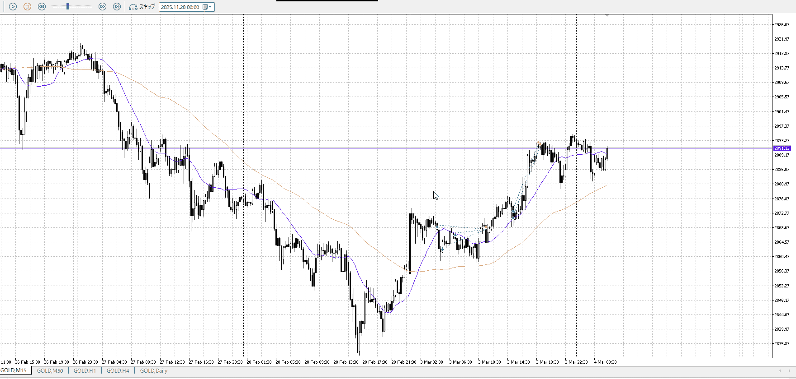

この上昇の根にあまり根拠が無いので、買うなら上抜け押しまで待ちたい

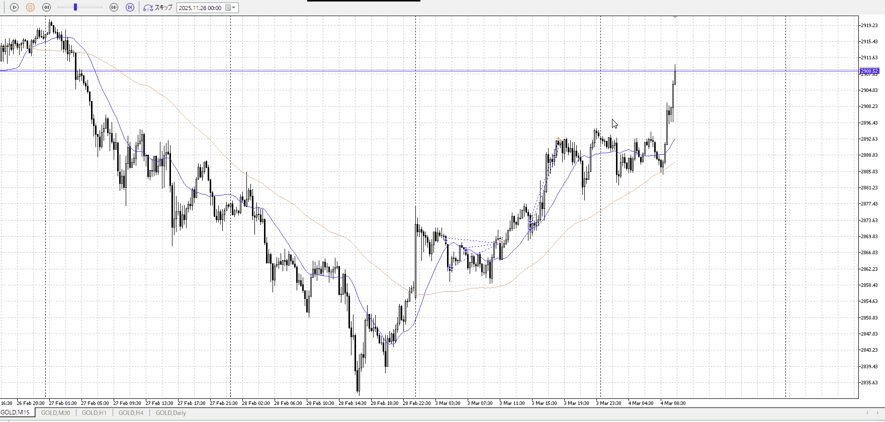

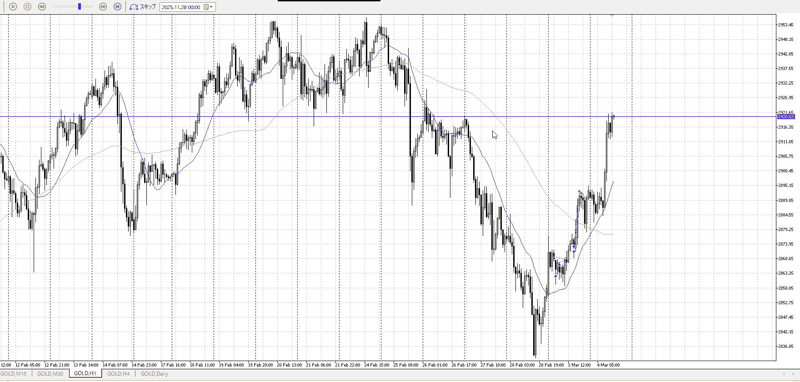

高値の更新場の方が溜まってるだろうし、抜け買いするならこっちでは

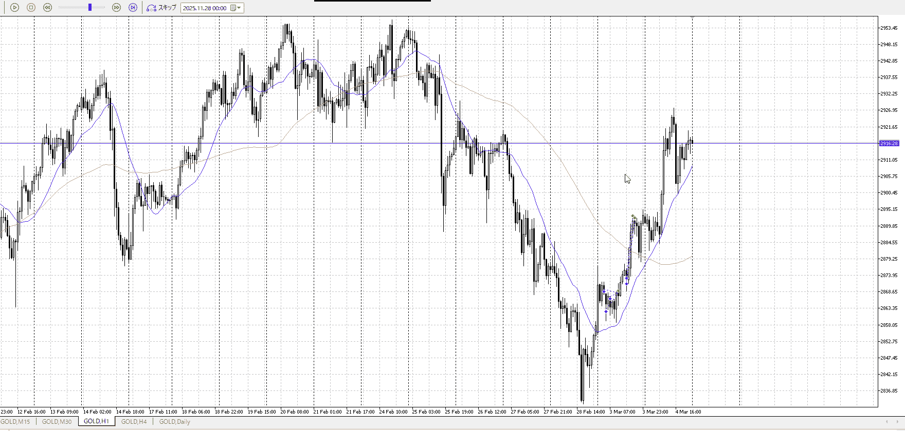

たったこんだけの振りで1hに勝てるとは思えないし、やっぱり入りにくいだろう。

---

再検証

# [ld2025-03-05](../Link_Daily/ld2025-03-05.md)
> [!note]
>- +1万 事前認識 **開始5分**

- [x] [my](my.md)(見ないと増える)
- [x] 指標
    - 差し込まれる可能性有り、毎日

## 4h
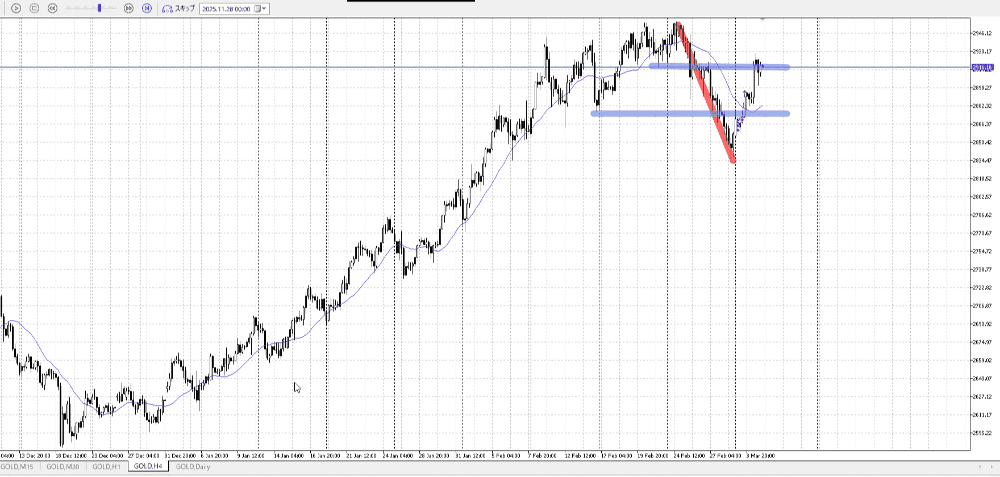
＜ここに目線画像＞

- [x] トレーディングレンジ
    - m

方向：d

## 1h
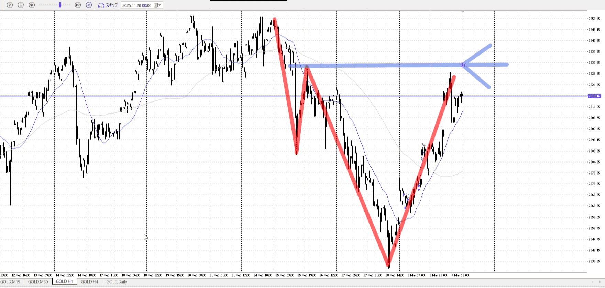
＜ここに目線画像＞ ^0zrgh5

方向：d

## 15m
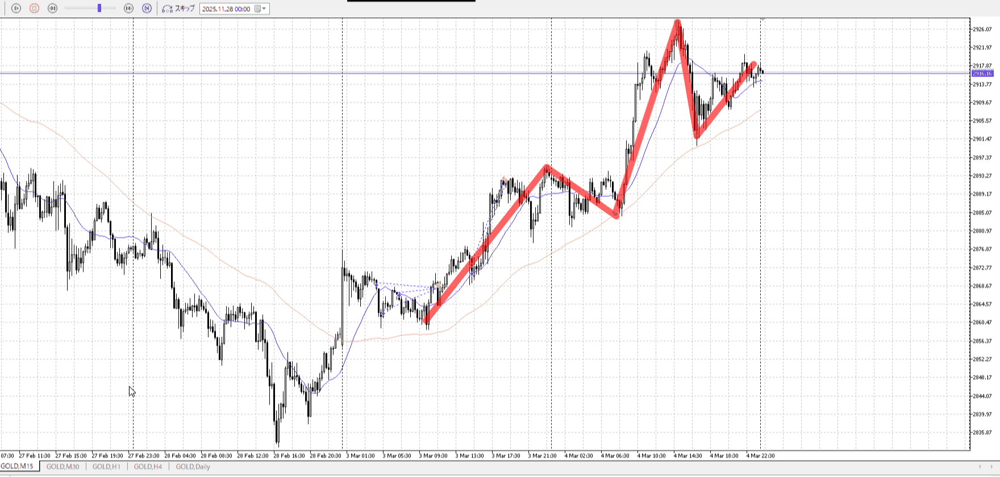
＜ここに目線画像＞

方向：u

全方向：ddu
^8p3gme

- [x] 使用足全ての目線確認

## シナリオ

b:?
s:1h前回高値
- [x] 時間足ぶつかり

ここ抜けると目線変わる
- [x] 1hシナリオ
    - [x] 明確か ? 続行 : 確定後考え直し

上昇
- [x] 日出日入、週出週入

同じ時間かけて同等
つまり拮抗
- [x] 傾き比率

43k
- [x] 前移動値

d86k
- [x] 前回上昇・下降値

## 位置

- [ ] 推進
- [x] 調整

## 方針
目線・シナリオ・強弱・調整
横幅・PA後・平均線方向・波
**ひきつけ**・軸時間・傾き比率

もうこれ日足の早押しじゃないか
ともかく、1hの売りと15mの買いがぶつかる

前と同じく、調整が過ぎるまでレンジ作ってそれから

- [x] 買いたいなら
    - レンジ抜き
    - 目線変わるので抜きも可能
- [x] 売りたいなら
    - レンジ抜き戻り

それまでやらない

OK!
Exchage Start.

## メモ
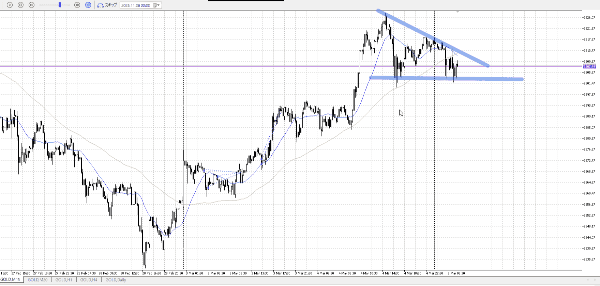
15m
下固めつつ切り下げ

下を抜けば一気にいけそう
逆に上昇掴むのも気を張る

ともかくついに上昇を止めた
ここから

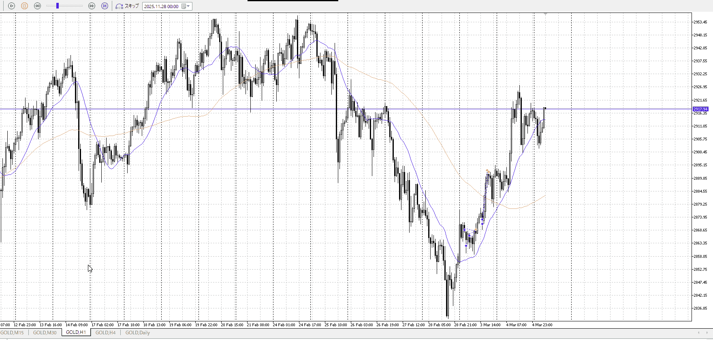
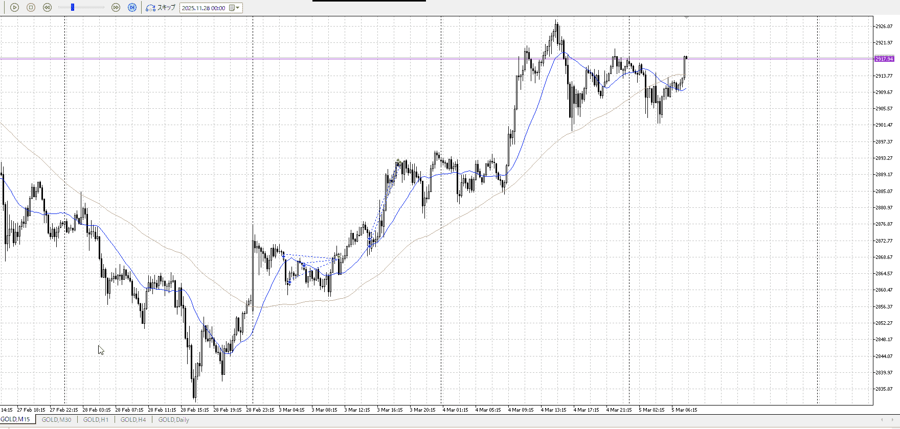
怪しい上昇

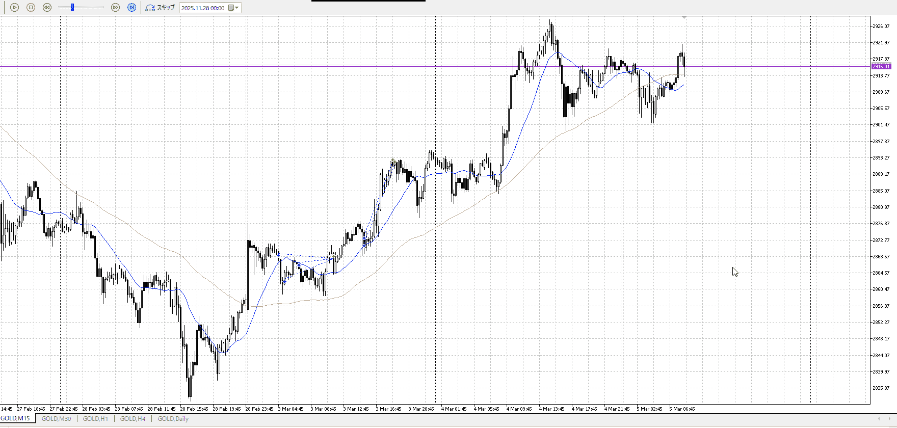

これを買うかどうか
上位足ではなんでもないとこで止まり、押し

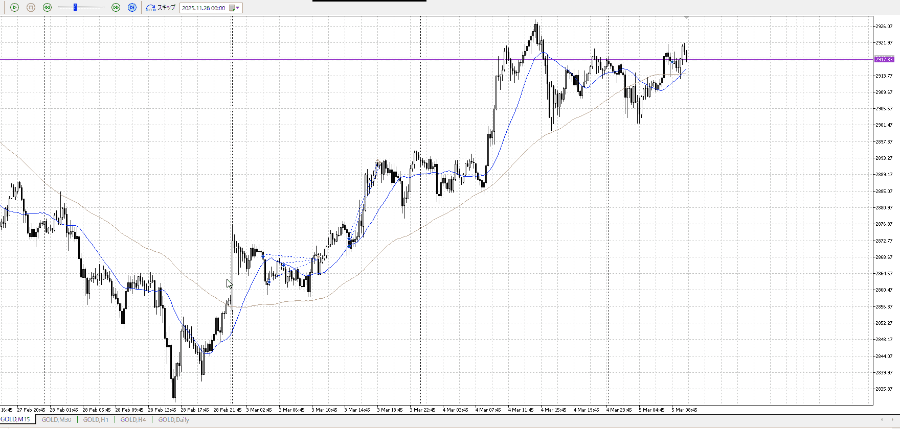
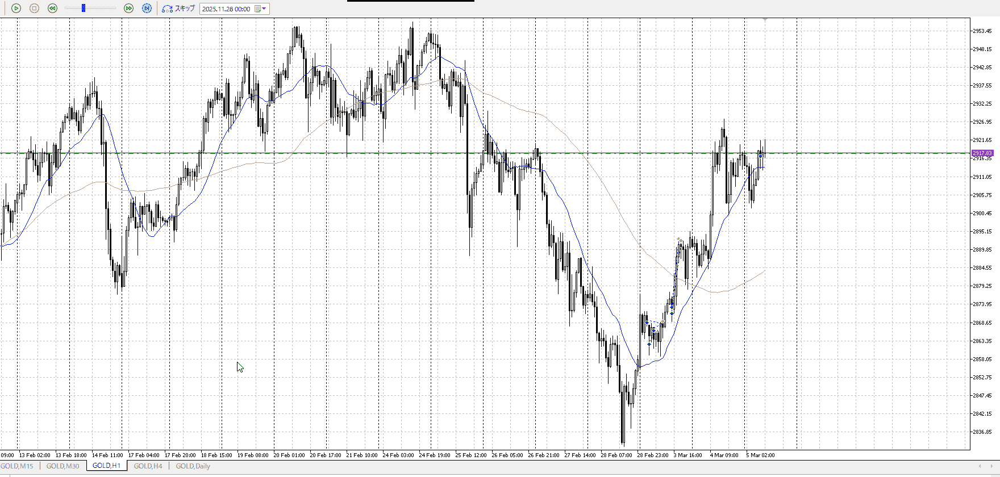
いつも通りの感覚で買ったけど、1hと敵対してるんだ
明確な抜けでないと厳しくないか？

![[../Entry/Aen20260226T101917.md]]

# 2025-03-06
また夢中で抜けてた

![[../Last_Entry/BaMen20260226T102832.md]]

![[../Entry/Aen20260226T104232.md]]
![[../Entry/Aen20260226T105758.md]]

---

再検証
t
そもそも上位足に方向感がない
高値を抜いたとも言いにくいので売ってもおかしくない

その迷いが出てるっぽさがあるレンジ
最善策は触らず方向感が出るまで、この後下振りから上張り付きがあるのでそれの上抜けを狙っていくこと