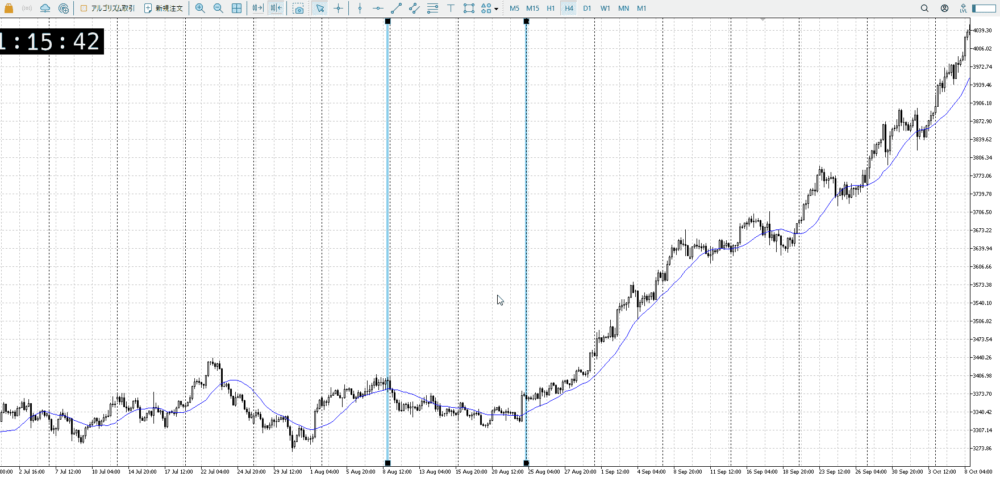
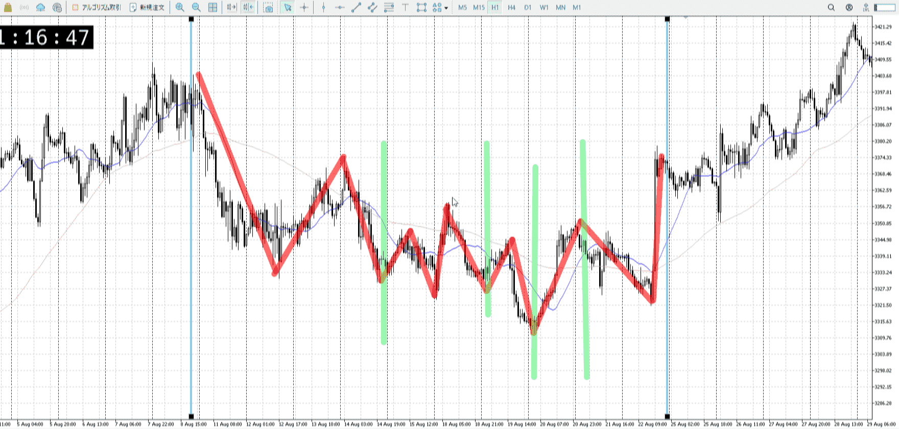
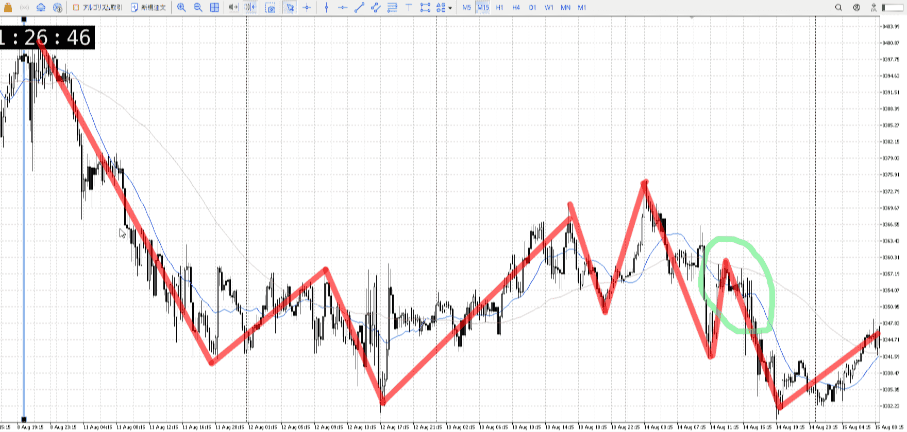
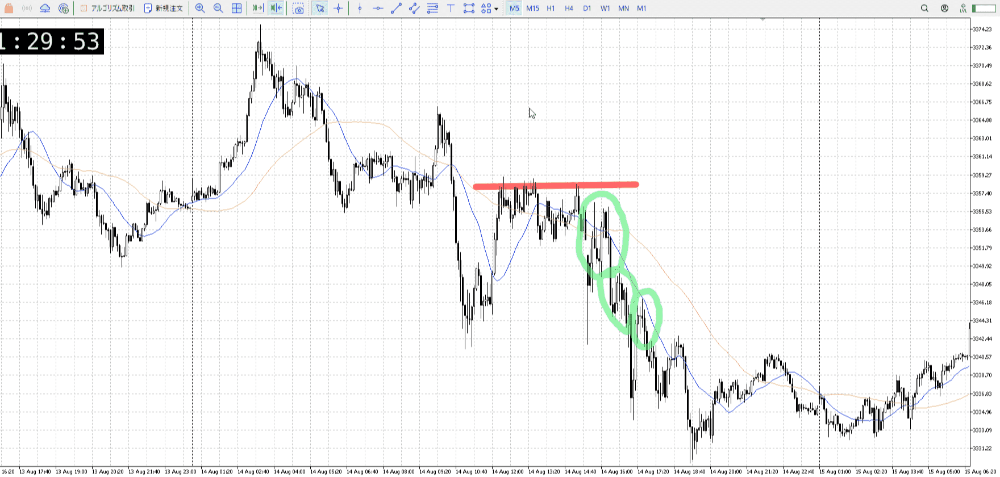

8月のドレンジを観に行く回

## 4h

区画はここ
ゆるやかd

## 1h

1. 落ち多めから同横半分
2. 同等下がりに底付けて上昇ミス
3. 底で止まるも高値更新を失敗しそのまま底割
4. ゆるゆる上昇で高値更新
5. 少し緩やかな下降から急上昇

## 15m

1
落ち多めから上昇し売り
落ちからなら上昇は調整なので手を付けないのが吉
その後調整の終わりを掴みたいんだけど、ネック割りの戻り緑丸

5m
一つ目の緑丸、レンジ下抜き見て上髭に引きつけて売りたい
上昇と下髭は確かにきつめだが、重要なとこは抜いてないのでまだ売り
その中で上髭出したなら引きつけ売り、そもそも売りたかった前のレンジの下への戻り売りの高さでもあり有力
それも5mだけど

