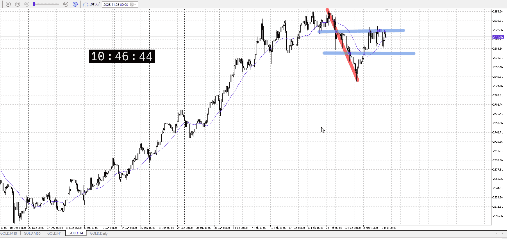
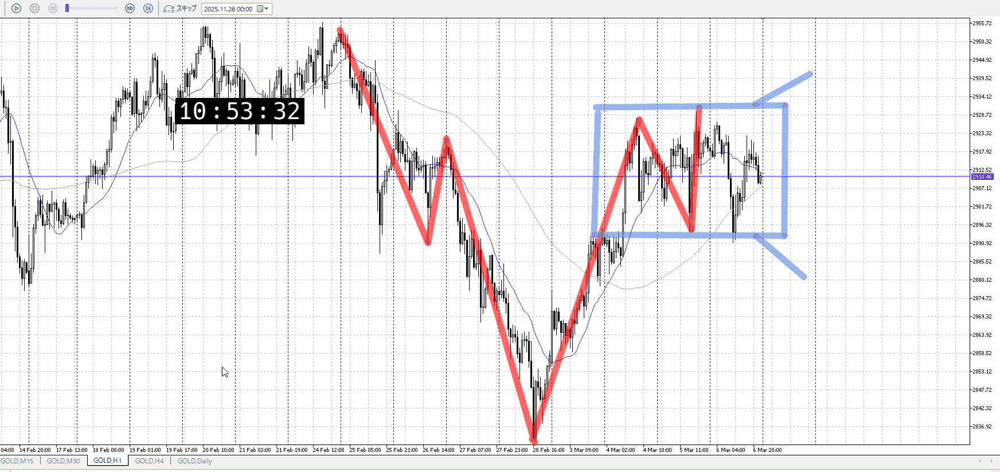
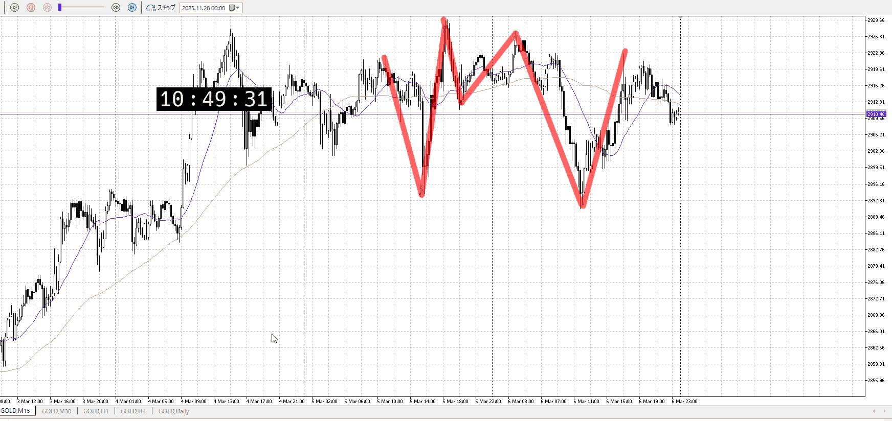
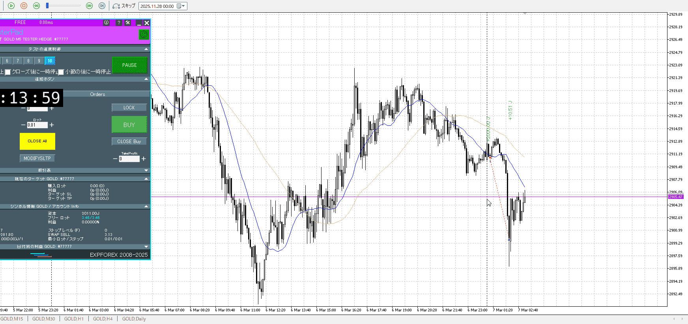
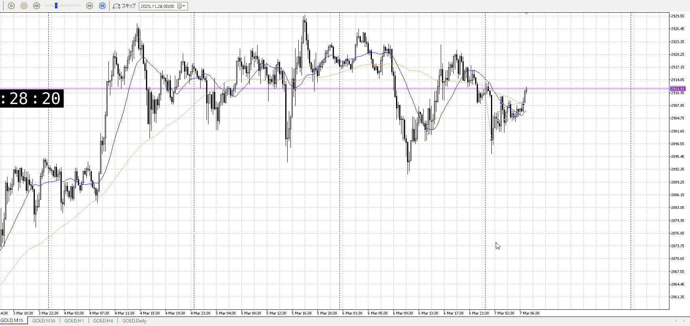
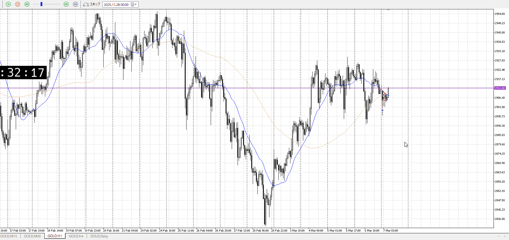
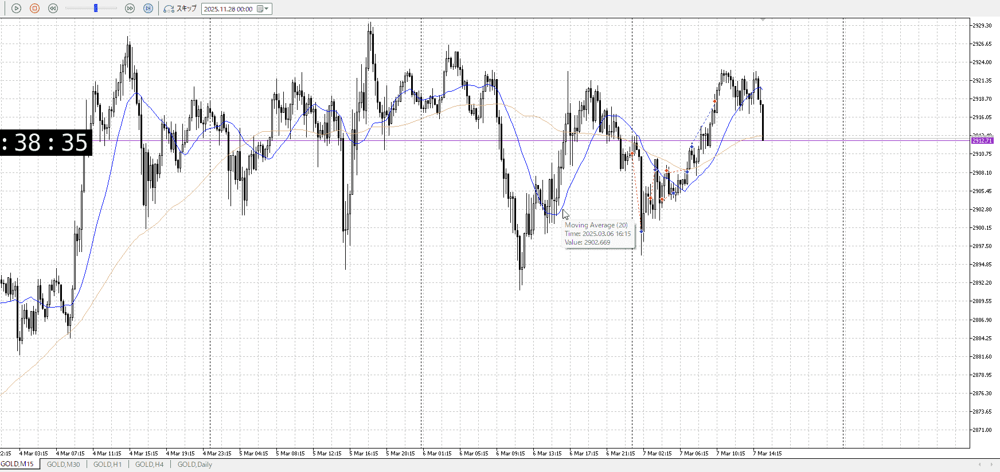

# [ld2025-03-09](../Link_Daily/ld2025-03-09.md)
> [!note]
>- +1万 事前認識 **開始5分**

- [x] [my](my.md)(見ないと増える)
- [x] 指標
    - 差し込まれる可能性有り、毎日

## 4h

＜ここに目線画像＞

- [x] トレーディングレンジ
    - m

方向：d

## 1h

＜ここに目線画像＞ ^vk0x1o

方向：u?

## 15m

＜ここに目線画像＞

方向：R

全方向：du?R
^lc78gg

- [x] 使用足全ての目線確認

## シナリオ

b:1h安値
s:1h高値
- [x] 時間足ぶつかり

レンジがあるので、どっちにいくか
特に買いは天井抜かれると目線が完全に変わる
- [x] 1hシナリオ
    - [x] 明確か ? 続行 : 確定後考え直し

レンジ内
2日分
- [x] 日出日入、週出週入

わかりにくい
- [x] 傾き比率

36k
- [x] 前移動値

93k
- [x] 前回上昇・下降値

## 位置

- [ ] 推進
- [x] 調整

## 方針
目線・シナリオ・強弱・調整
横幅・PA後・平均線方向・波
**ひきつけ**・軸時間・傾き比率

一応買う方向で話を進める
2日分あるので十分なレンジ

傾きが分かりにくい
売りに対して買いがちょっと遅いかなくらい

流れは上張り付きから落ち、底っぽいところからそのまま上昇して100戻し
買いはこの上昇に押しを当てたい、売りは前のレンジで戻り売りたい

1hで上髭が集まっており、戻り売りが行われているようではある

1hは売りが押し込まれて、買いになりそうなところだった
その買いは短期がやってるはず

そのまま短期絵前回高値を抜けて買っていきたいのだが、直前で止められて急落して上昇も上髭
なら落ちそう

- [x] 買いたいなら
    - レンジからPA
- [x] 売りたいなら
    - レンジからPA

OK!
Exchage Start.

> [!Info]
>- +1万 簡易テスト **開始5分**

> [!Tip]
>- Minecraftは3hまで
## メモ
![[../After_Entry/Aen20260308T020156.md]]

この後
急激な下降が起きてるが、レンジ内
戻り売りでついていきたい

何処から戻り売るかが分からない
平均がついて来たくらいで

高さが足りんが
昼頃だろうし伸ばすのは難しい
![[../After_Entry/Aen20260308T021833.md]]

戻り売りがしたいのは変わらないはず
この高さで戻り売りがある証拠、売りが勝った証拠があれば入れる

買いは底からの買い
![[../After_Entry/Aen20260308T022305.md]]

上へ伸びたが、大きな損切ではない

1hが上で止まり、レンジ抜きと戻り売りを試して駄目だった
なら買いでは？

だとしても、たったこんだけの幅には売りは固まってないはず

でも1hの下髭キツイな
買いはありかも

![[../After_Entry/Aen20260308T023418.md]]

環境認識に対してエントリーが雑。

売りに対して一気に伸ばした、押し目買いを指したい
ただそれにしては1hの買いが近い、これとのレンジでどっち勝つかを見ておきたい

これについていくのは、ちょっとレンジのやり方過ぎないか
横幅は前の上昇に対して取ってないので無理っぽい

![[../After_Entry/Aen20260308T024233.md]]
![[../After_Entry/Aen20260308T024455.md]]

---

再検証
環境認識は時間かければ可能
エントリーに時間かけてない、雑
特に上位足との絡み、本来待っていた高さ付近での印など

環境認識も油断はしないように
やればできるからしっかりやれ
