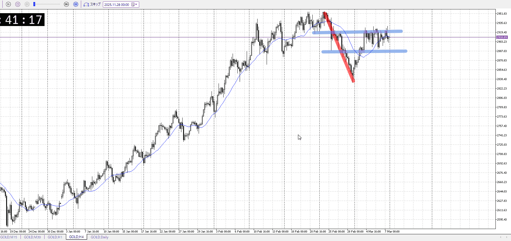
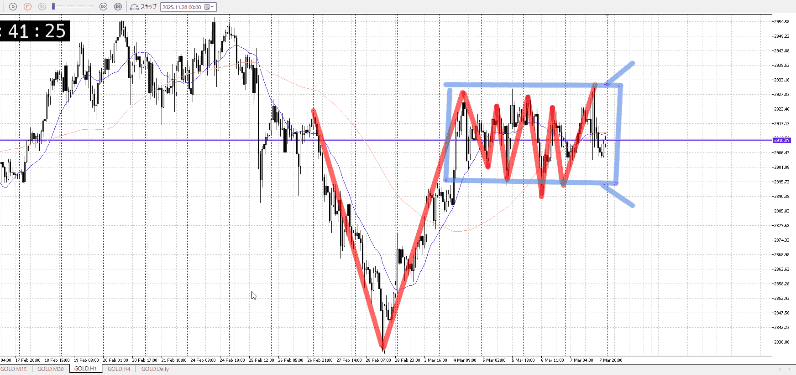
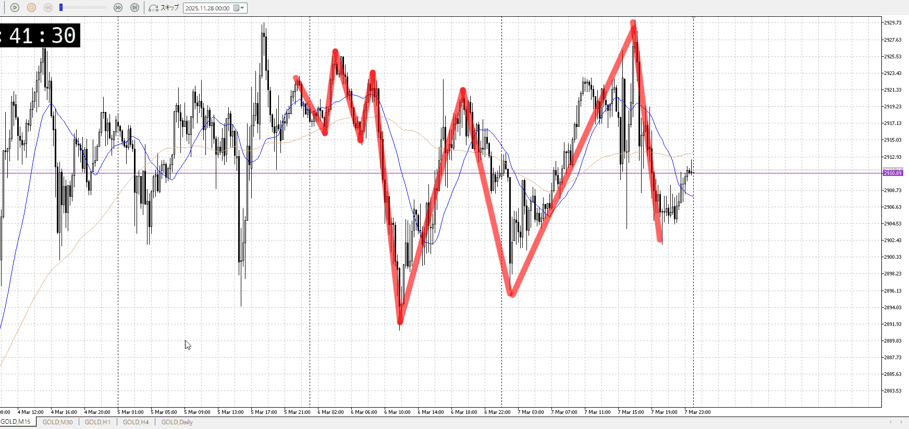

# [ld2026-03-18](../Link_Daily/ld2026-03-18.md)
> [!note]
>- +1万 事前認識 **開始5分**

- [x] [my](my.md)(見ないと増える)
- [x] 指標
    - 差し込まれる可能性有り、毎日

## 4h

＜ここに目線画像＞

- [x] トレーディングレンジ
    - m

方向：d

## 1h

＜ここに目線画像＞ ^q63vru

方向：uR

## 15m

＜ここに目線画像＞

方向：u

全方向：duRu
^k1lm6s

- [x] 使用足全ての目線確認

## シナリオ

b:1h床
s:1h目線
- [x] 時間足ぶつかり

4h売りとして、1h目線から売られてるっぽさ
それと1h床がぶつかってる
だからどっちかに抜けてからが明確
だが、溜めた力がこわい
- [x] 1hシナリオ
    - [x] 明確か ? 続行 : 確定後考え直し

同値
- [x] 日出日入、週出週入

買いが若干強いが返ってきた
- [x] 傾き比率

## 位置

- [ ] 推進
- [x] 調整

## 方針
目線・シナリオ・強弱・調整
横幅・PA後・平均線方向・波
**ひきつけ**・軸時間・傾き比率・流れ

4h売りがあるので1h床付近からは買いつつ、1h目線で何もしない
売りは1hが下に抜いてからでもいいか

直近では上への流れを作っている
大きく落ちたが抜けきってはない、なので買いを指したい

- [x] 買いたい勢
    - 1h床から1h目線まで
- [x] 売りたい勢
    - 1h目線から4hと一緒に売り

OK!
Exchage Start.

> [!Info]
>- +1万 簡易テスト **開始5分**

> [!Tip]
>- Minecraftは3hまで
## メモ
![[../After_Entry/Aen20260318T123941.md]]

---

再検証

