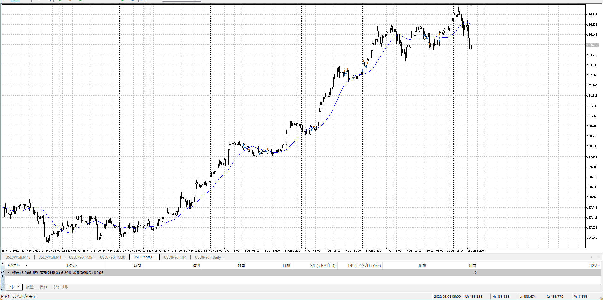
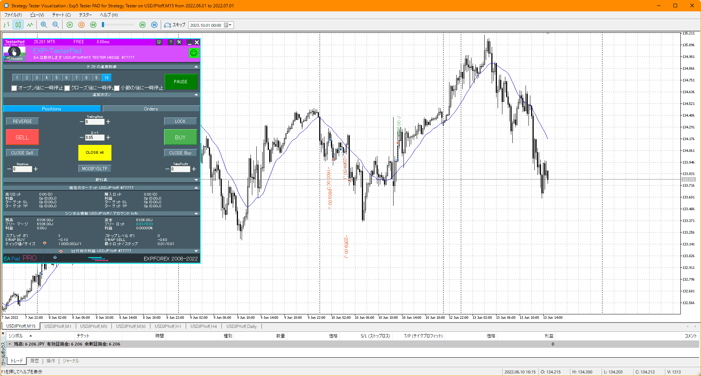
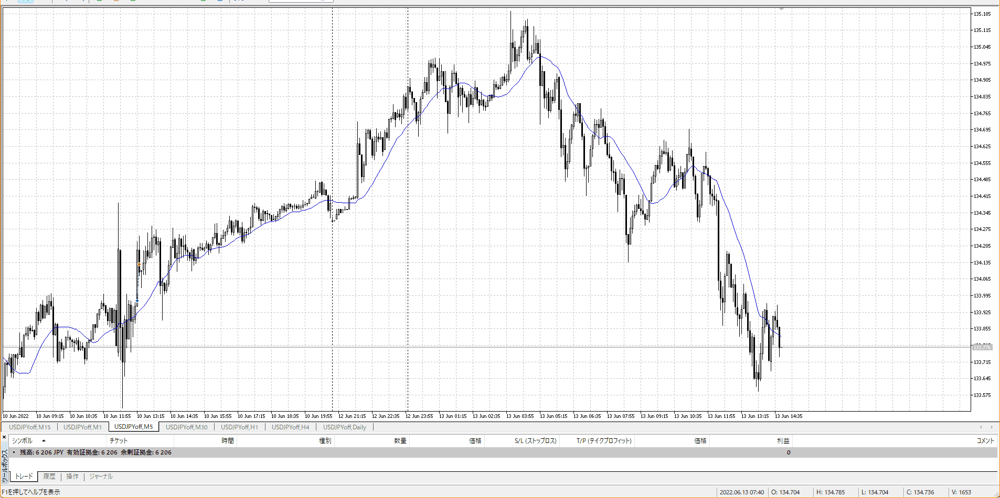
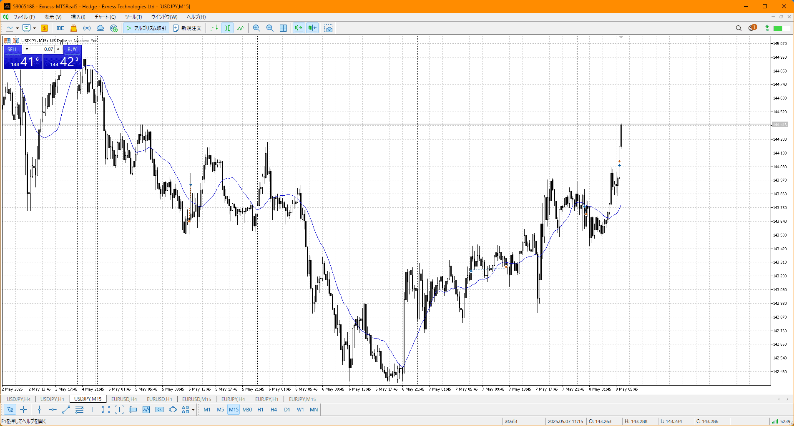
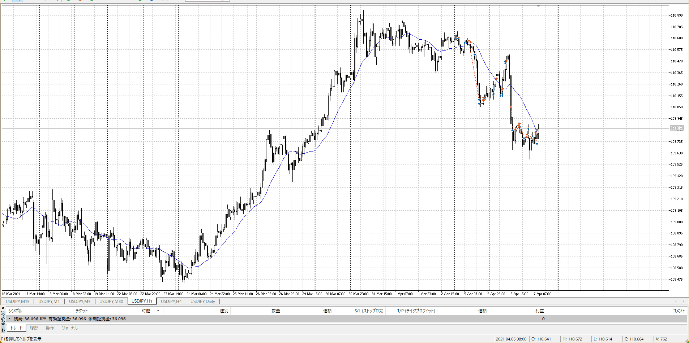
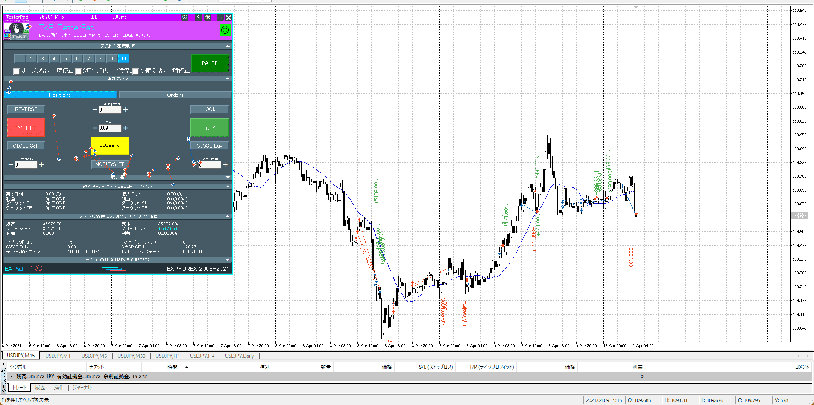
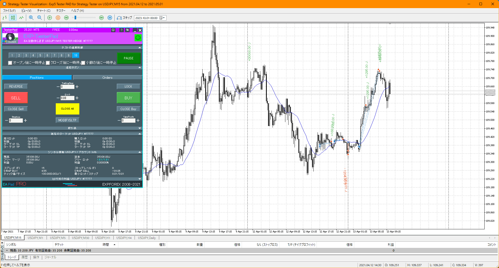
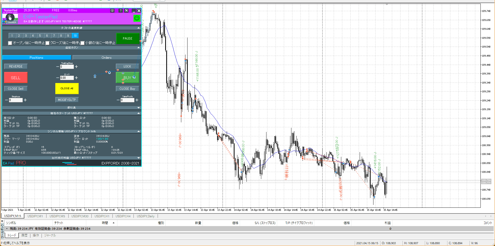
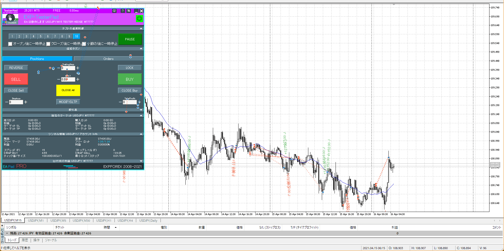

xレンジ抜けの下滞留破り
抜けが確認できた時点で即売りだけど、応用
本来損切を巻き込んだ押し目買いが成立するところ、それで出なかったので逆に行く
レンジ内上張り付きも同じ理論？

逆パターン

戻りが出ない場合の可能性
戻り決済用のポイントが見つからない
3

戻りを待つのも入り方としてあり
実際に起きたことに対しての説明用として

押し目抜き、切り上げで上
二押しから上昇

勢いよく降下、レンジからさらに降下
しかし4h半値で止められレンジ破って上昇→上の力が強い

ここで上に届かず途中でレンジとるなら、上の反発でも下に勝てないということで売ってもいい

実際はこう
この時点で4hと1hの殴り合い
4h半値反発がしっかりレンジにまで戻している、つまり拮抗
よってしばらくレンジ

これが分かるまでに金をつぎ込みがち

大きなレンジに戻っていった
4hレンジ上の反発が強く、上の方でレンジ
VS15ｍ半値、7時急上昇からのレンジ上値踏み上昇

さらにレンジ上まで上昇
この時点で殴り合いに戻ってる
下降から下張り付き、売りの流れ

前回の押し合い部分を抜いてもないのに何で買ってるんですか。
レンジ上などを抜いて上を主張、改めて抜く

切り上げで上に行きそうだが、直近と反する
大きな足だと反発を喰らってるので証拠充分

いきなり反発はV字になるので予測不可、証拠待ち
今回は勢いよく下に行こうとして途中で止められた、なので元の上予想と合わせて買える

完全に上にはいかず切り下げ
1h反発

この長さで売るならせめて証拠か下部分の切り下げ起きてからに

集中ぶっ切れてる
4h最終との殴り合い、あまり長く望んではいけない

[myimg2](./myimg2.md)