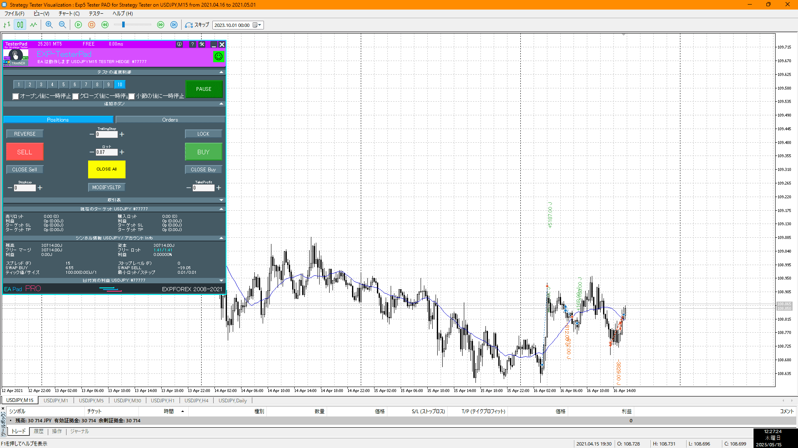
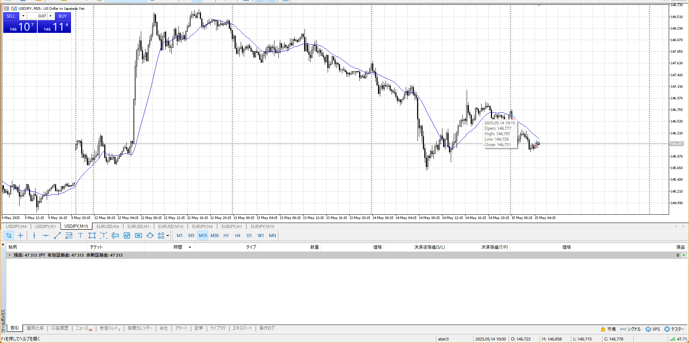
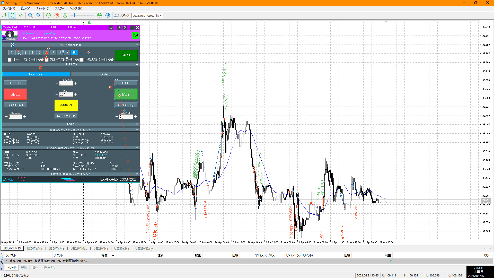
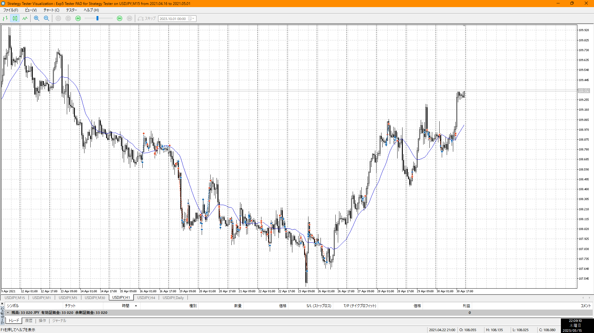
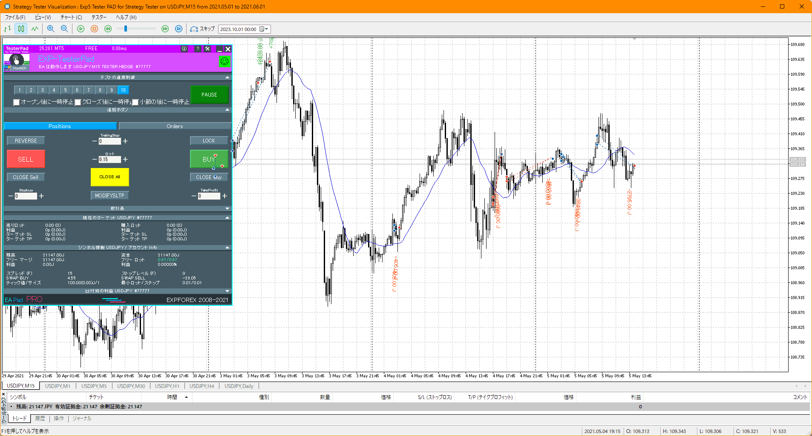

[myimg](./myimg.md)

直近流れが上
抜きのエントリーは勢い鳴ければアウト、大幅に切り上げ上髭は結構値する

レンジブロックは見やすくなるが、半値の存在を忘れない

1hと対立するので、早めに入り抜きしたい
最初が結構早い時間で入りにくく、次で入った
この時点で結構遅く、RRはよくない

いつも言う場面以降は、旨味が少ないので言及されない
ちゃんと1hの押し目まで売るという意識があるなら、よい

マトモなレンジが全然ないところに突っ込むな
取れるとこはちゃんと取ってるので、マイナスを減らすほうが早い

何処でレンジを察知するか
やっぱり高値更新を失敗したこの時点だろう