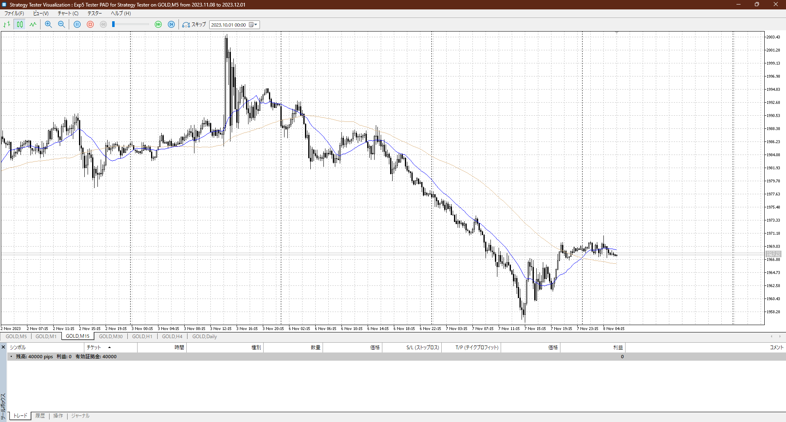
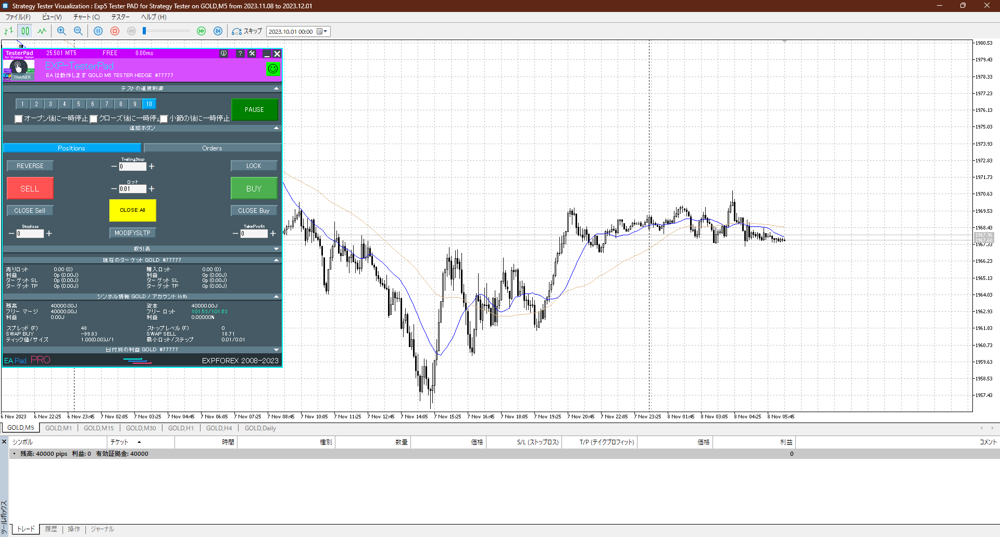
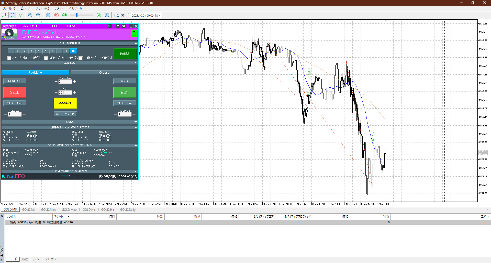
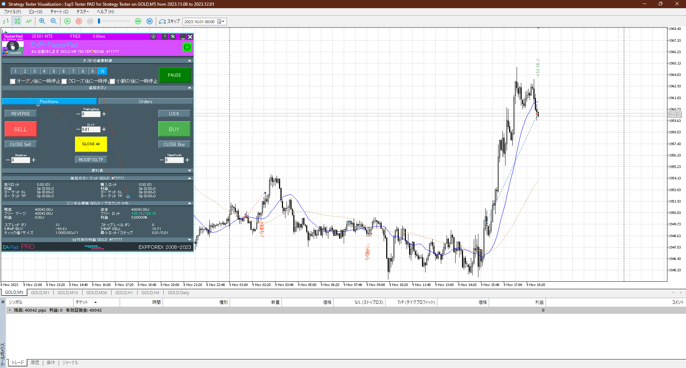
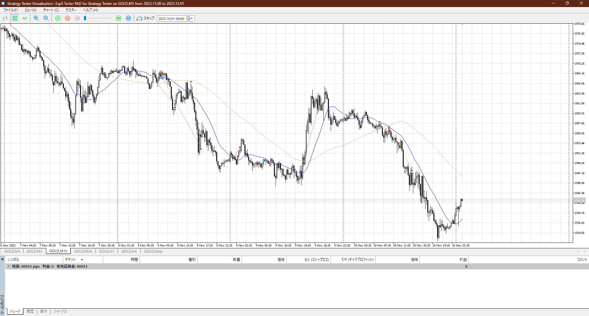
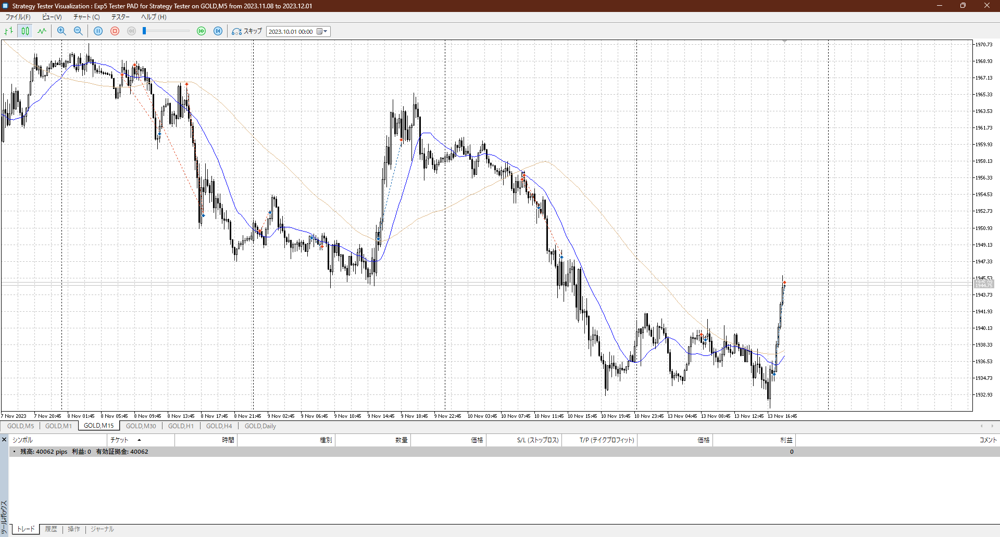
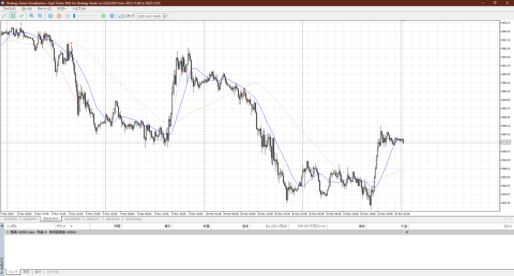

あまりにもクソなので二週目やって復習
丁度集中も切れた

曲聞くならdepression

## 2023-11-08
4h

＜ここに目線画像＞

1h

＜ここに目線画像＞

15m

＜ここに目線画像＞

5m

＜ここに目線画像＞

- [x] 前日確認
- [x] 使用足全ての目線確認
- [x] 方向決定
- [x] 両視点整理

基本売り

買うなら15mでレンジ上から、なのでこれを崩せば一気
手前でも崩せる

ここに落ちてくるとほんのりM
戻りだと確実

レンジ内下張り付き

一つ目は早すぎ
二つ目はV反転があるん雄で、それを失くす大き目の陰線が出た後の戻りを使える
他に一回下に出た後の下戻り等も
3つ目、戻りを待つが、それは触れた後の一つ小さい足の確定を待つとより確実

## 2023-11-09
4h

＜ここに目線画像＞

1h

＜ここに目線画像＞

15m

＜ここに目線画像＞

5m

＜ここに目線画像＞

- [x] 前日確認
- [x] 使用足全ての目線確認
- [x] 方向決定
- [x] 両視点整理

完全に下目
利確が4hなど頼りになることに注意、戻りを狙ってたら降りる分が無くなるなどあり得る

止まった売りを1本待って上行く

一つ目売りは15m戻り、しゃあない
二つ目買いは早すぎ、まだ下張り付きレンジ

二つ目の後に落ち、それが思ったより落ちずに100戻しフルレンジ
この時点で売りと買いが拮抗してる
この後に上髭が付きまくって落ちてそれを戻し

3つ目は売り落ちからピンバー確定で入れるか
そのほうが安全
あと切るのもちょっと遅いか、売り流れ中なのを忘れず

この買いの100戻し一個では下圧力がないというシグナルにしかならないのに注意
そもそも売り場なので迂闊に買えない、ちゃんと明確な一本を待つ

## 2023-11-10
4h

＜ここに目線画像＞

1h

＜ここに目線画像＞

15m

＜ここに目線画像＞

5m

＜ここに目線画像＞

- [x] 前日確認
- [x] 使用足全ての目線確認
- [x] 方向決定
- [x] 両視点整理

上に届き切らずに落ち始め
全部下ではある

意味を考える一本が多すぎるのでは？
流れと目立つ一本なら？

抜けた一本を上に戻す、その途中の15mと1hA
後は下まで

1h平均を抜けるシーンがあるが、これはローソクを見るとしたレンジと上髭があるので抜ける算段があった

差し戻されるシーンがあるがこれも上からもってレ🄱冷静に見られる
結果的に全部下

## 2023-11-13
4h

＜ここに目線画像＞

1h

＜ここに目線画像＞

15m

＜ここに目線画像＞

5m

＜ここに目線画像＞

- [ ] 前日確認
- [ ] 使用足全ての目線確認
- [ ] 方向決定
- [ ] 両視点整理

下
基本的には8日とあまり変わらないはず

買いの一本を待って買い
ピンバーを待って買い

15mの前回安値で止まり

実際にはクッソ朝なので出来ないが、これ
