## [ld2024-12-03](<./Link_Daily/ld2024-12-03.md>)

4h

＜ここに目線画像＞

1h
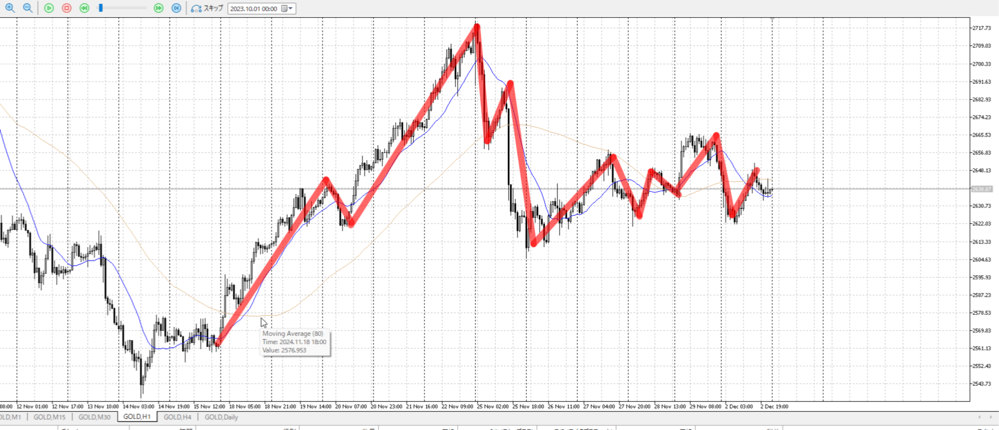
＜ここに目線画像＞

15m
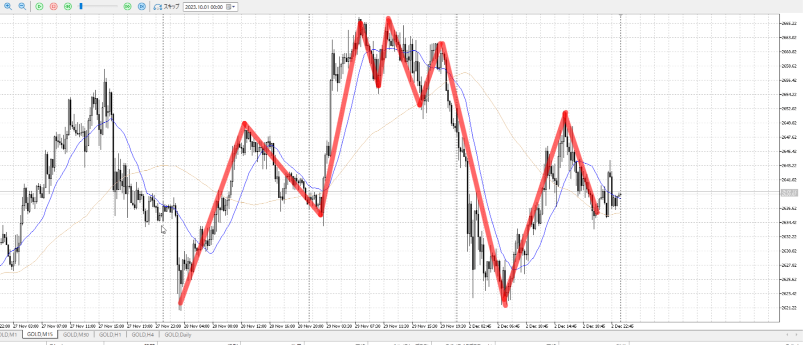
＜ここに目線画像＞

5m

＜ここに目線画像＞

平均描く

- [ ] 前日確認
- [ ] 使用足全ての目線確認
- [ ] 方向決定
- [ ] 両視点整理

横軸、大きく、何を待つ

15m安値を割ったが、1h安値ですぐさま戻り15mネックへ。そして再び下降。
1hとしては上に届かず落ちてる形。下の力が強い。
一応15m前回安値で止まってるが、それほど強力な場所じゃない。

買い
下げ止まり位置、15m安値

売り
15m直近高値

足流れ的に今どっちが強い
上に届かず落ちてるので売り。直近はちょっとだけ買いが居るので注意。

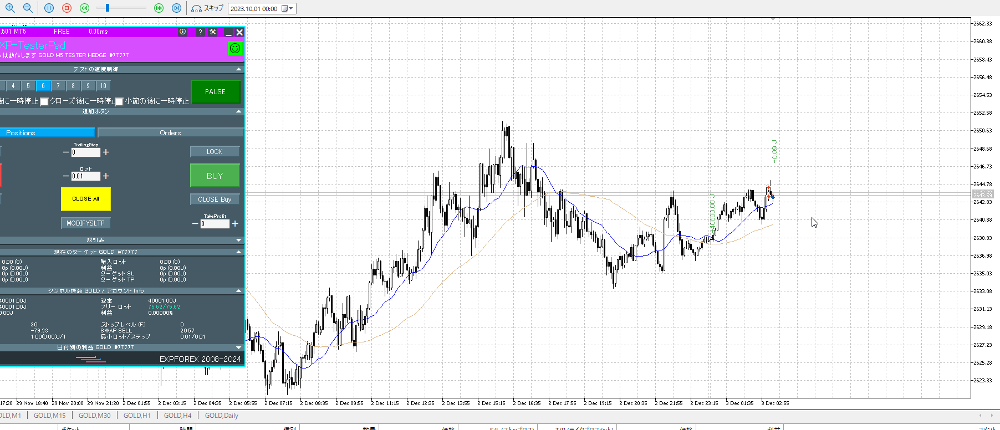

売るかと思ったが、時間帯がちょっとむずかしめだった。
大きい陽線も15m側で確定したので、これを否定するか上まで行ってからを待つ。

4h

＜ここに目線画像＞

1h
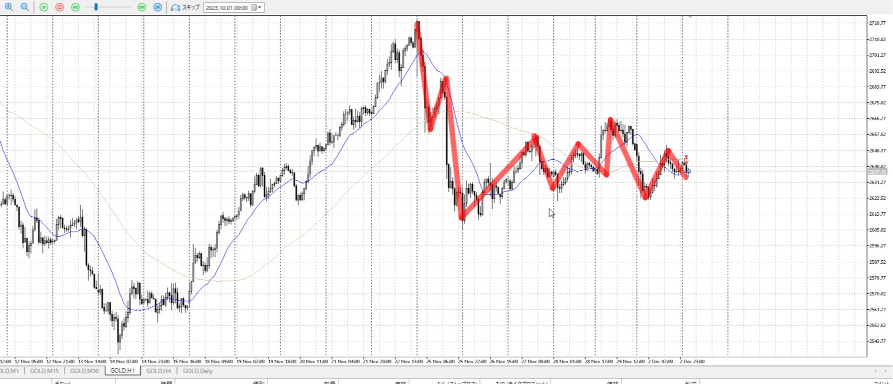
＜ここに目線画像＞

15m
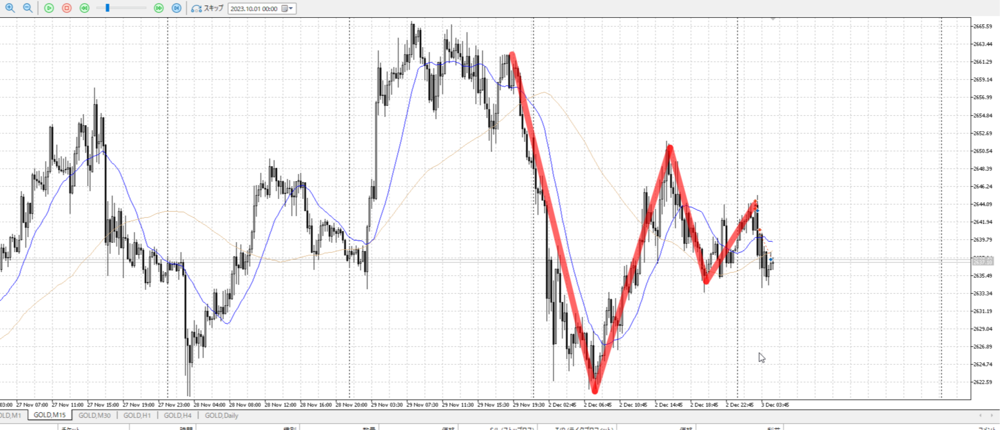
＜ここに目線画像＞

5m

＜ここに目線画像＞

平均描く

- [ ] 前日確認
- [ ] 使用足全ての目線確認
- [ ] 方向決定
- [ ] 両視点整理

そのままネックを抜けてほしかったが、止まり気味だったので。二個持ってれば持ちっぱにした。
結果的にはやっぱり落ちていきそう。

買い
15m安値

売り
15m高値

足流れ的に今どっちが強い
売りが止められぎみだが、それは細かな視点
客観的には止まらないわけないという感じだが？

上がってきた。これなら少し買えるか。
しかし15mと1hの平均がこの辺にいる。ここから深め戻りとして売られるのもあり得る。
いずれにせよ、**逆を抑える動きまで待つ**。

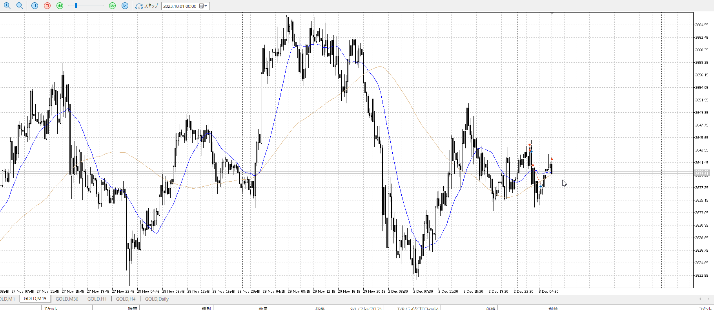

登って行ったので売り。
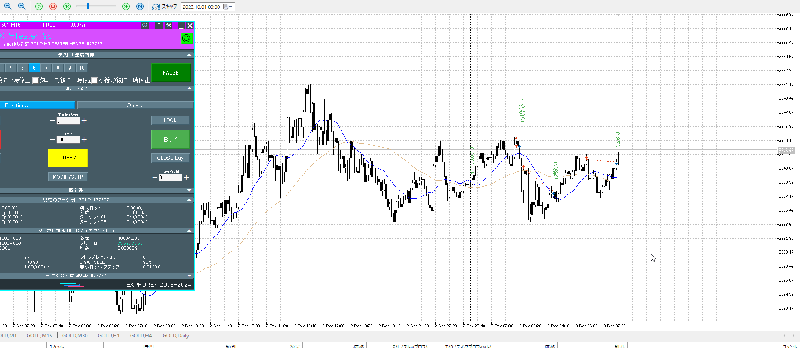

思ったより上がった。
そもそも下まで狙いだったとはいえ、戻るのが早い。

底面固定切り下げはむしろ上昇フラグ。

載せられて買ってみる。
いや全体上昇なんだけども。

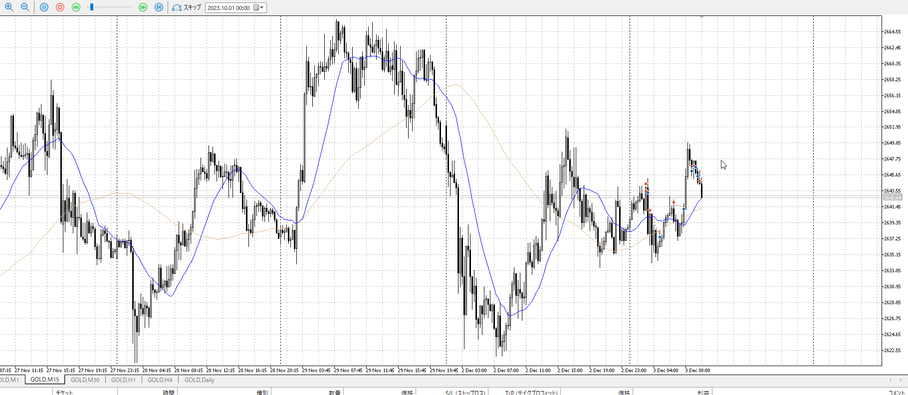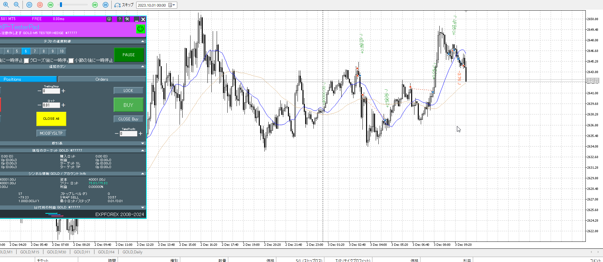

じりじり落ちた。
こうなった時にダメージを軽減するために下から入る、戻りで切る。
というか1hは上昇でも上まで届いてないから下なんだった。

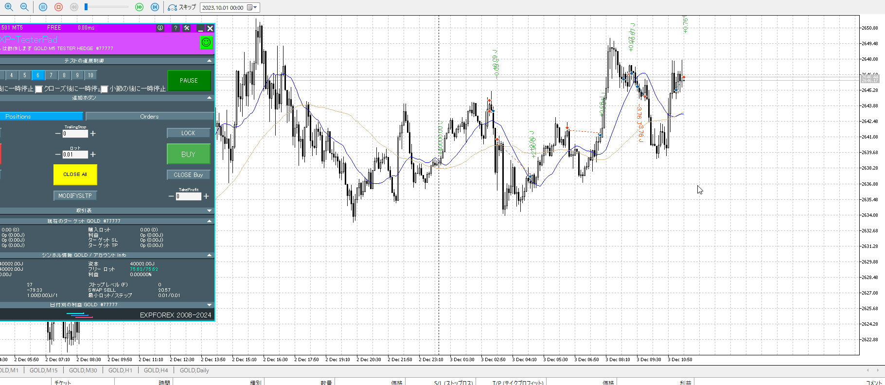

上昇に対し高速で下触れ入り。
やはり上で止められる。

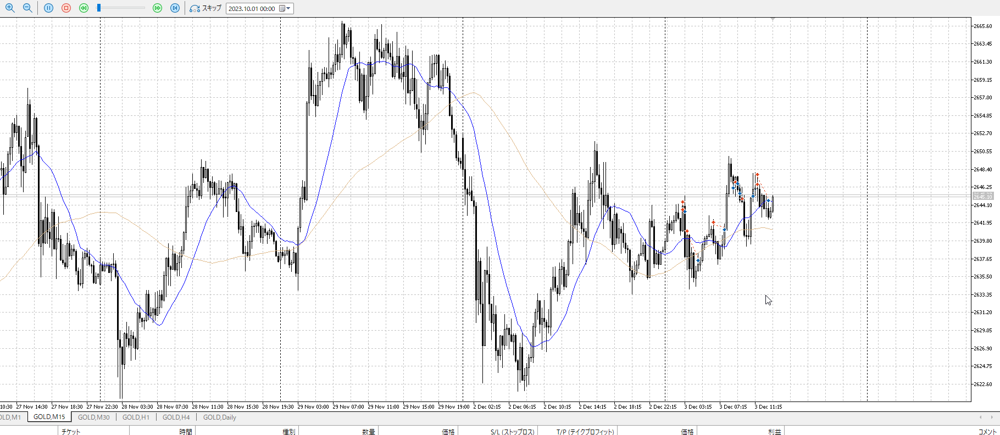

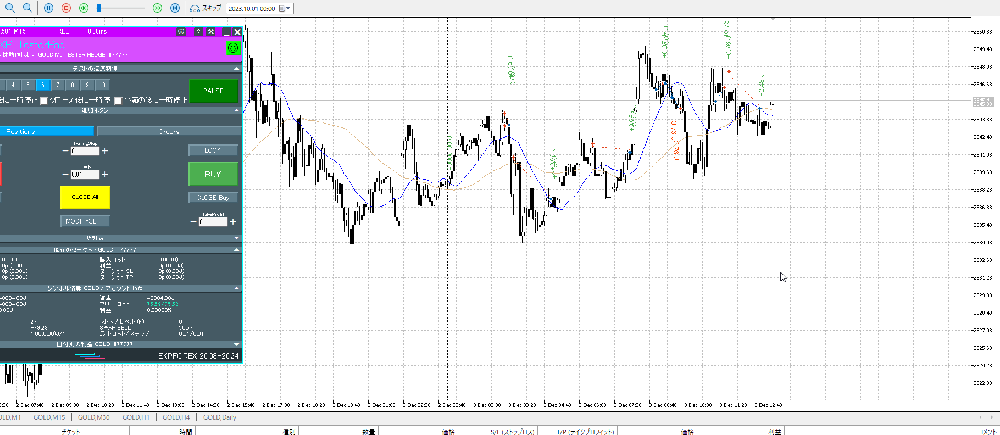

上値から売って落ちを狙うが、やたら止められた。
仕方なく手放し。

下が切り上がりはじめ、上への力が高まっている。

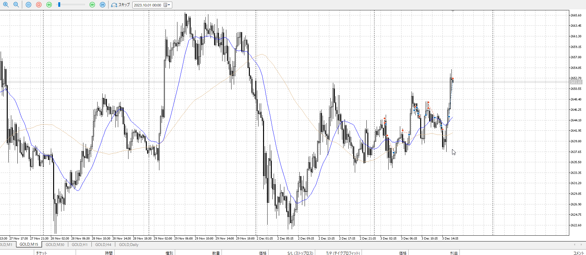

切り上げの否定の否定。
吹き上がりを期待し押しを買ったが、止まり出したのと時間がアレすぎるので切る。

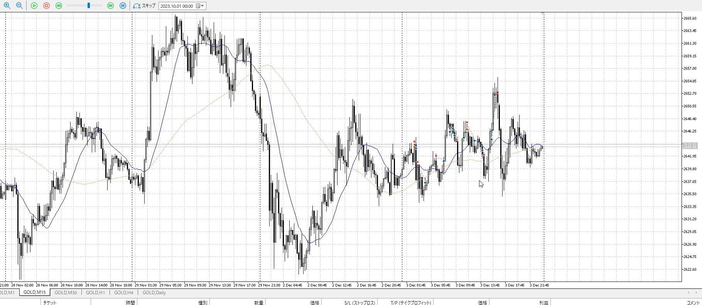

その後。
正解。

基本前日で上止まりなのを見て売りをしつつ、否定の否定で買いを入れる。
それらしい感じではあったと思う。ガチガチレンジの戦いだったが。

冷静になって逆止めまで待ちが遅すぎるのはそう。
コンビニ行ってようやく冷静になった。

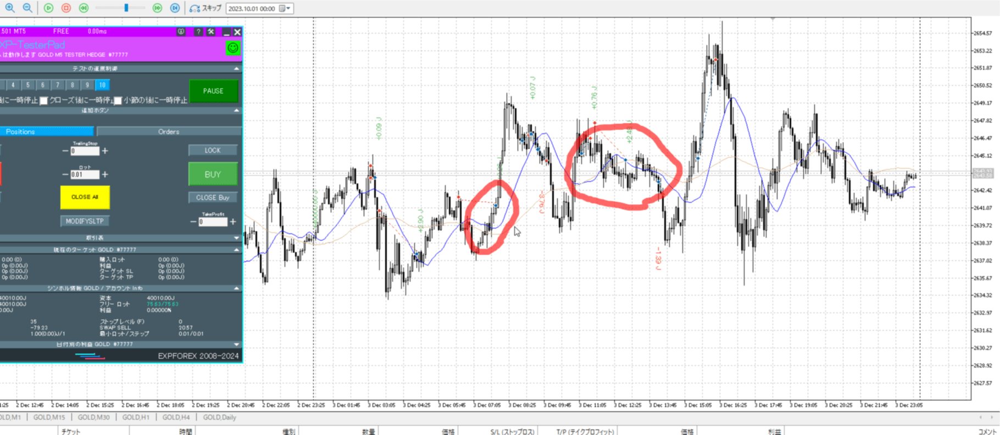
甘かったとこ。
否定の否定でというのがあったが、最初のネック割り否定から届かず落ち、からの早めの押しも否定の否定。
買えるタイミングも5mに一応ある。

下張り付き目のとこからの落ち。……いや売る眼はあんまないか？
いやあるだろ、15m安値まで見られるんだから。何にせよここで買うのはない。

たまたまプラスだが、精度の甘さが随所に見える。
というか休息入れ倒してこれ。一応可能の目は見えるけど。
これをそれなり休息入れられるようにしつつ戦わないと。

ちな今回はチョコレートとジャズ。

## [ld2024-12-04](<./Link_Daily/ld2024-12-04.md>)
4h

＜ここに目線画像＞

1h
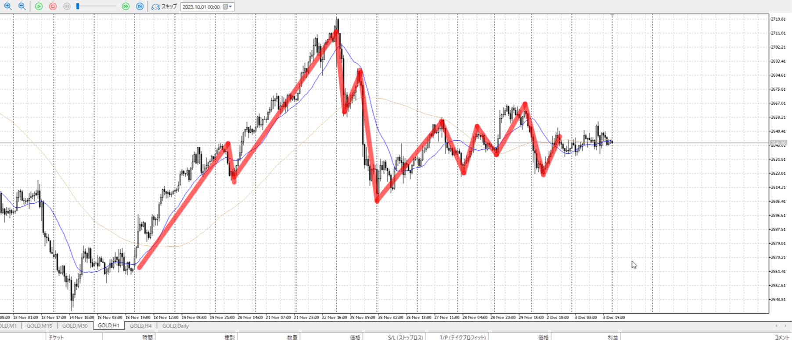
＜ここに目線画像＞

15m
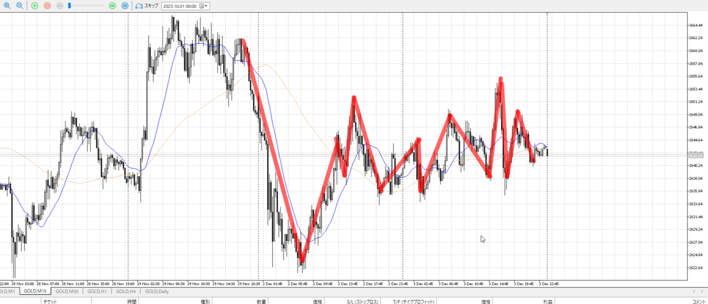
＜ここに目線画像＞

5m

＜ここに目線画像＞

平均描く

- [ ] 前日確認
- [ ] 使用足全ての目線確認
- [ ] 方向決定
- [ ] 両視点整理

どちゃくそレンジ
15mの高値安値、及びレンジ上下がキモ

上がりたかったが上が足りない、下がりたかったが止められてるは双方同じ

一応1hや4h的に優勢は売り
1dは買いだがどうでもいい
上がったら売りを意識する

買い
15mレンジ下

売り
15mレンジ上

足流れ的に今どっちが強い
直近で平均線にも見えるレンジ内上昇を止められてしまった
なので売り
ただ15mレンジ下が近づいてるので買いを警戒しておくこと

下張り付きっぽくなってもいるので抜け警戒

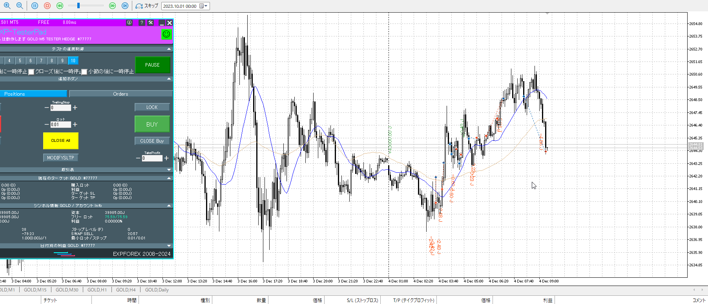

ちゃんとしないとこうなるよの惨状にしかなってない。

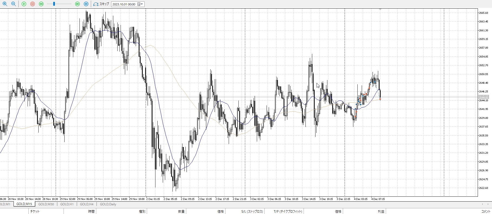

とりあえず15mから。
バチバチレンジなのは知っての通り。最初のガッツリ上髭から損はちゃんとひきつけろ。

その次のひきつけ買いはある程度成功。

その後の売りが通らないのは15mを見てれば分かる。

その後かいが通らない。上に来れば売られるよな。

ひきつけと落ち着きと、15mの確認。
レンジ内で取引してるというか、売り場買い場を意識しながらやらないといけない。

改めてやると、まず売りをとりあえずやる。
元々売りを優勢で考えていたはず。

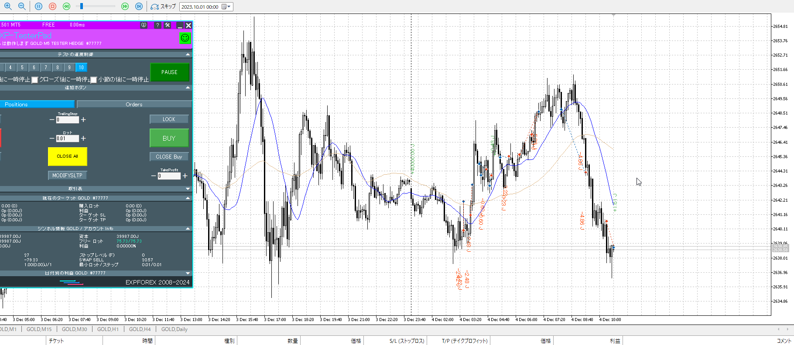

抜け待ち売り。
全然抜けなかったが。

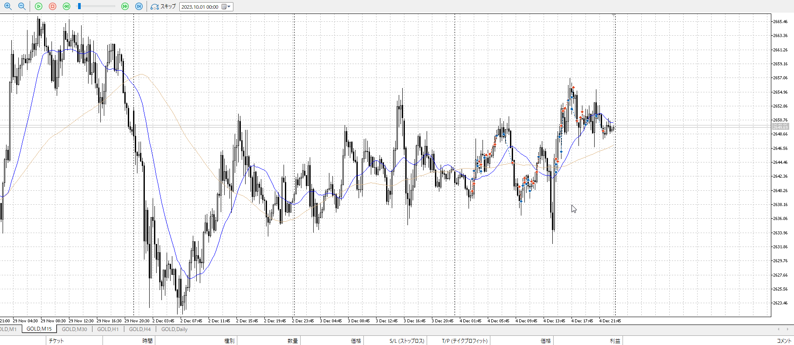

高速取引。ボロボロ。
1つずつ見ていくと、レンジ内から買いと抜け押し買いくらいか。
高速はこれが良くない。これを学習してしまうのも良くない。
というわけでやり直し。

## [ld2024-12-04](<./Link_Daily/ld2024-12-04.md>)-2

1h

＜ここに目線画像＞

15m

＜ここに目線画像＞

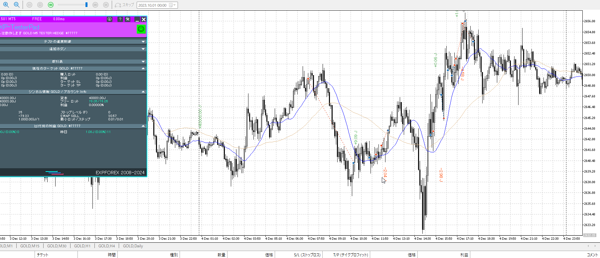

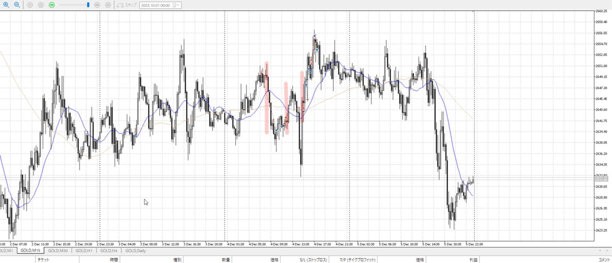

分かっても全然回避できてない
これ出来るのこの3か所くらいじゃないか

真ん中もかなり厳しいからやっぱり二箇所か

このきつみが出てる理由
まず上下でレンジになってる
上が届き切らず売り場感が大きく見ても強くなってる

## [ld2024-12-04](<./Link_Daily/ld2024-12-04.md>)-3

全体にそもそも1hを見なさすぎ

## [ld2024-12-05](<./Link_Daily/ld2024-12-05.md>)
4h

＜ここに目線画像＞

1h
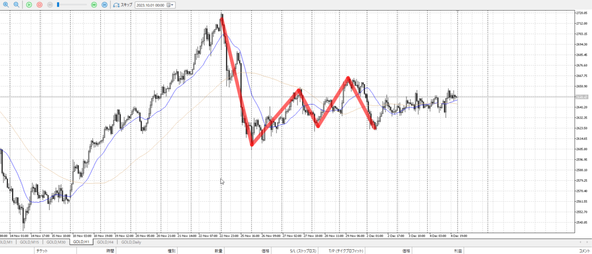
＜ここに目線画像＞

15m
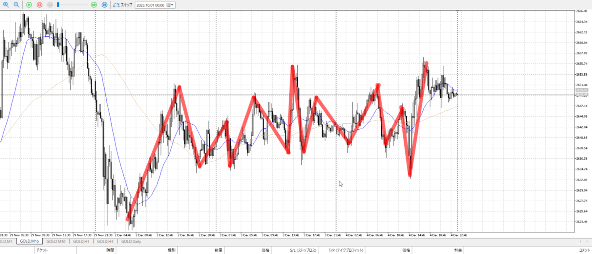
＜ここに目線画像＞

5m

＜ここに目線画像＞

平均描く

- [ ] 前日確認
- [ ] 使用足全ての目線確認
- [ ] 方向決定
- [ ] 両視点整理

1hメインでやろうと思ったけど、これ何も触れなくね？
精々上来たら売るくらいしかないぞ。

まあ一応やる。1hd15mdなのでとりあえず売り。

買い
15mレンジ下

売り
1hレンジ上

足流れ的に今どっちが強い
レンジ
上に留まっているので上

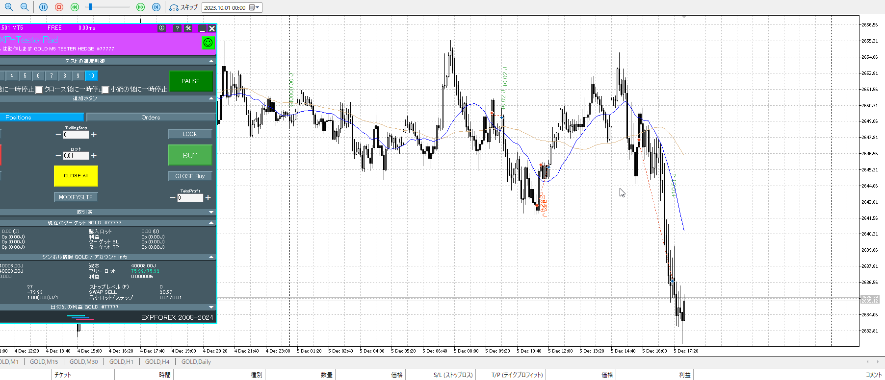

上にいたので売りを試している。
にしてもぜんぜんひきつけられてないが。

真ん中の売り失敗は抜け狙いだった。
そんなレベルではスピードが全然なかった。1hで見えない。

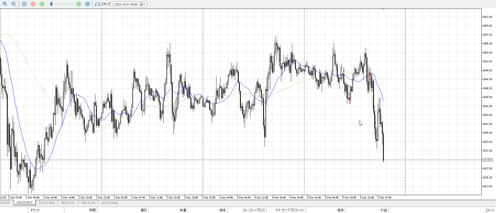

上にいた分の戻り売り。
実際は朝7時とかで難しいが、見てれば入れる。

## [ld2025-10-30](<./Link_Daily/ld2025-10-30.md>)
4h
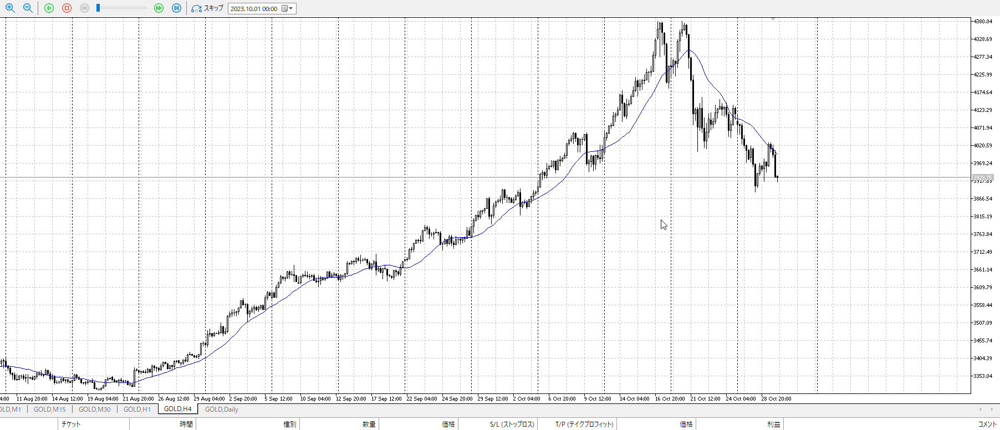
＜ここに目線画像＞

1h
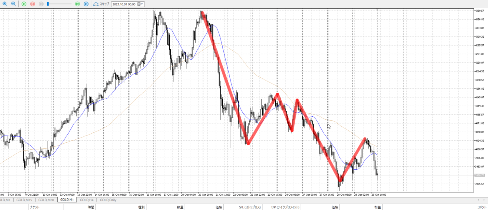
＜ここに目線画像＞

15m
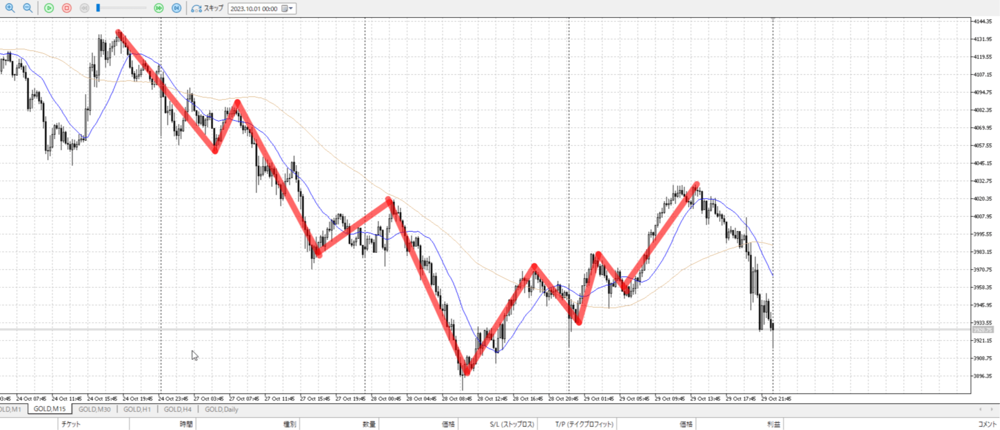
＜ここに目線画像＞

5m

＜ここに目線画像＞

平均描く

- [ ] 前日確認
- [ ] 使用足全ての目線確認
- [ ] 方向決定
- [ ] 両視点整理

買い

売り

足流れ的に今どっちが強い

