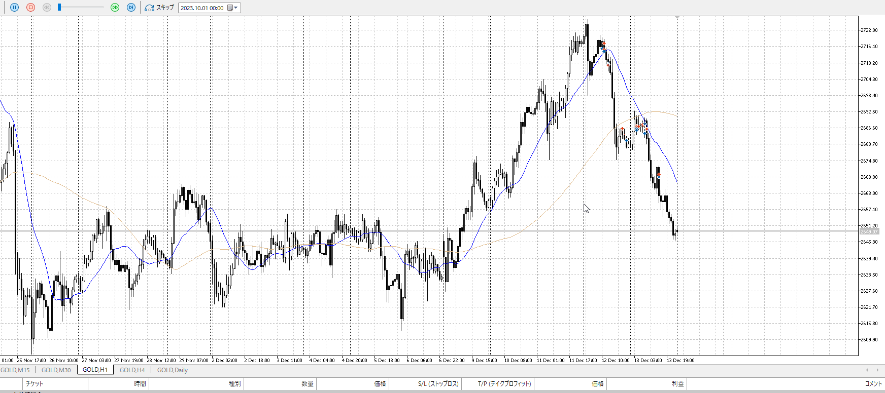
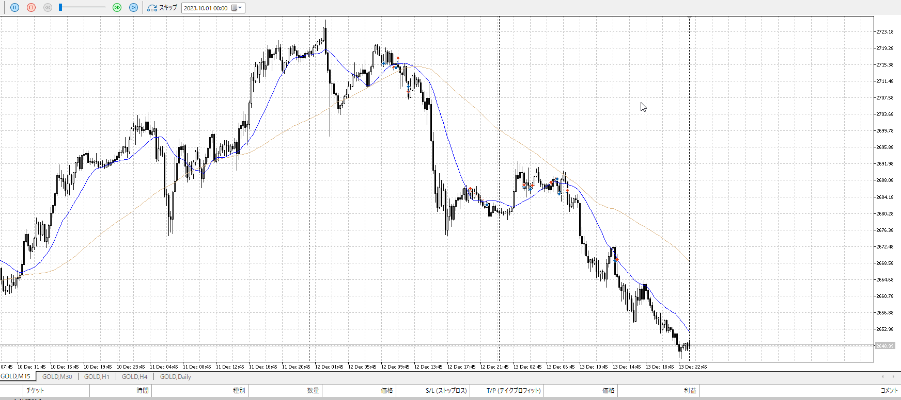
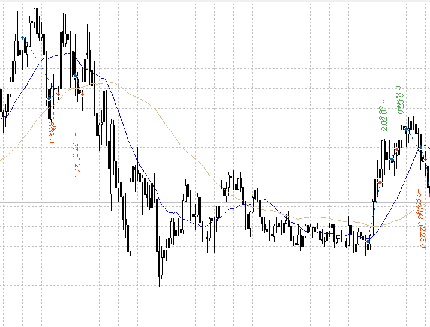

4h

＜ここに目線画像＞

1h

＜ここに目線画像＞

15m

＜ここに目線画像＞

5m

＜ここに目線画像＞

平均描く

- [ ] 前日確認
- [ ] 使用足全ての目線確認
- [ ] 方向決定
- [ ] 両視点整理

直近を無視するな。
1hでどこまでをどうするか、直近を使ってその入りを狙う。

こういう上昇が途中で止まり、切り下げっぽくなってから急降下を始める場面。
そもそも下降がある以上は売りでどこで売るかみたいな話。
止まりを狙ってそう難しくなく売りを狙える。

直近様子、方向決め。
上昇下降の止まり。だから方向が大事。

