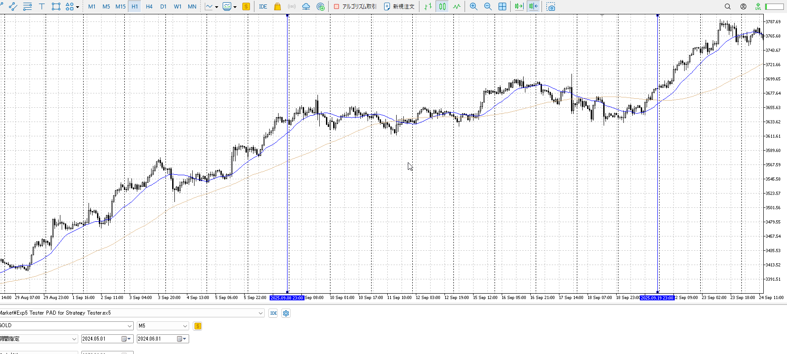
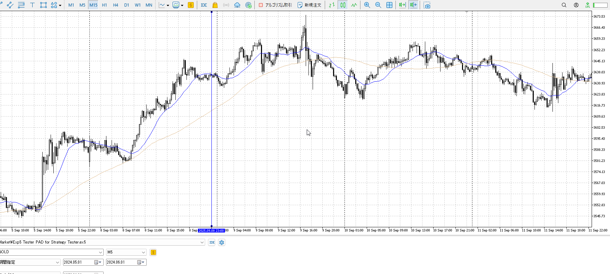
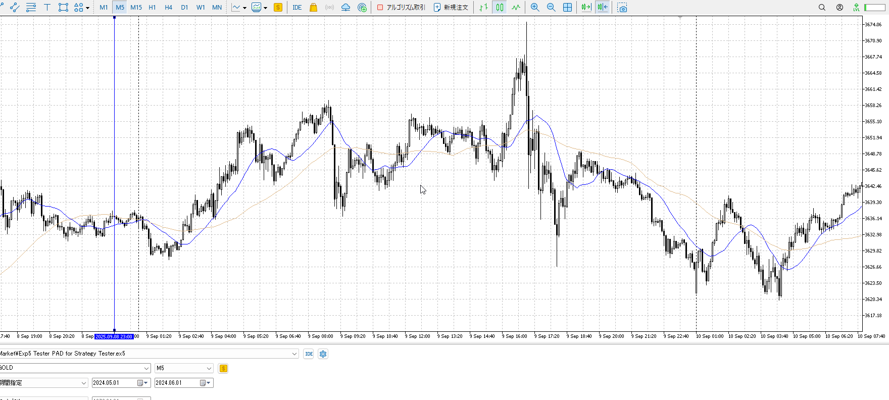
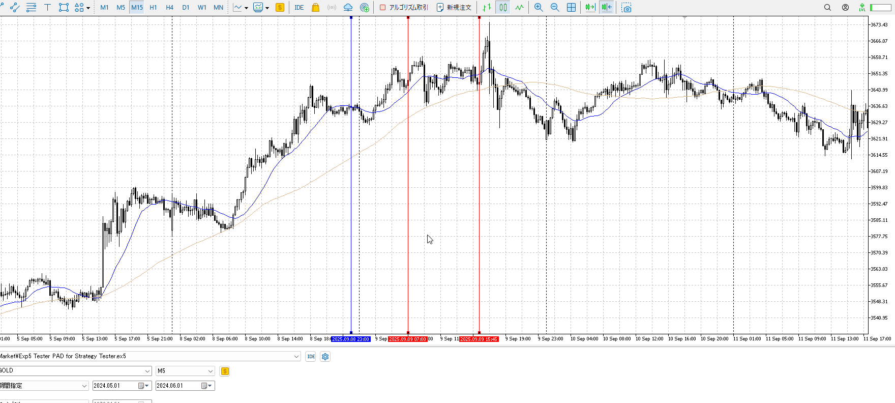
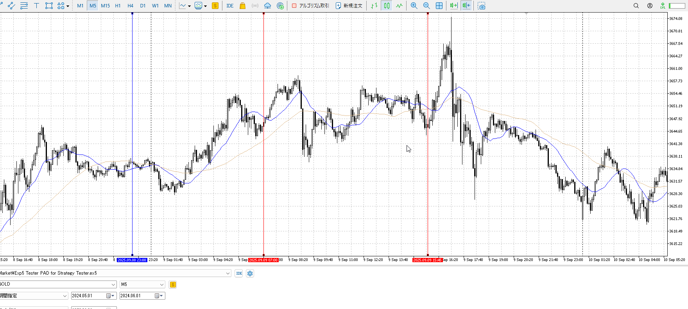
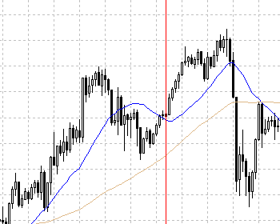
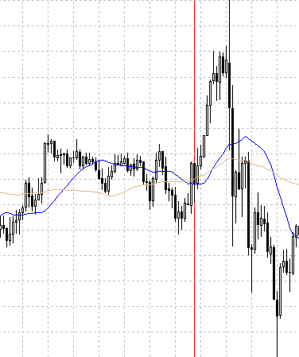
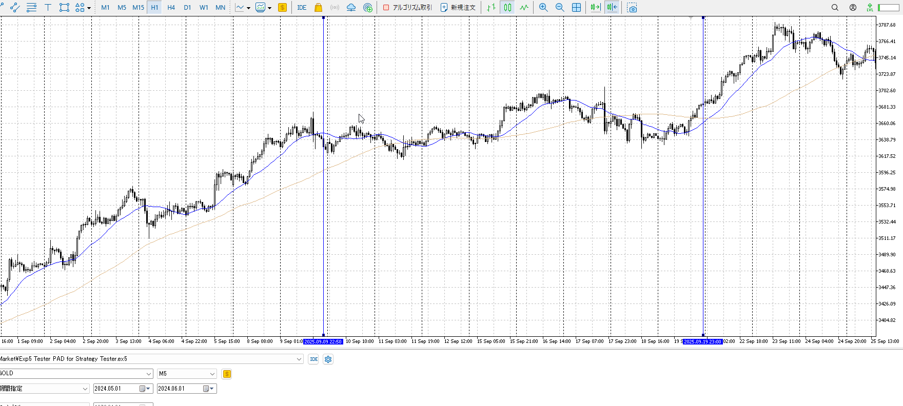
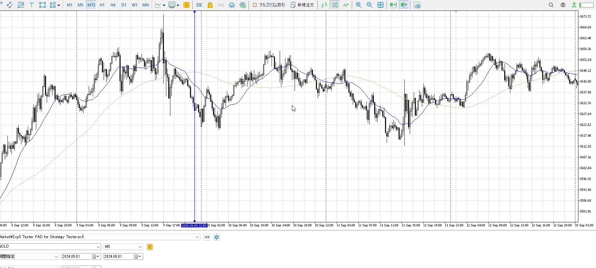
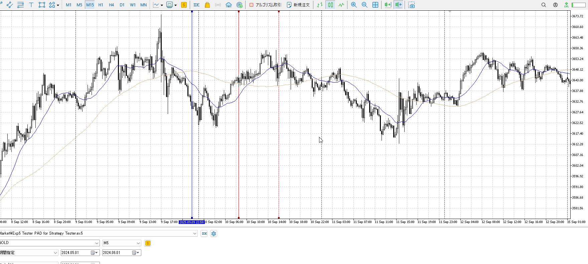

## [2025-09-09](<./Link_Daily/2025-09-09.md>)

最近レンジ気味なのでこの辺を見直す

4h

＜ここに目線画像＞

1h

＜ここに目線画像＞

15m

＜ここに目線画像＞

5m

＜ここに目線画像＞

平均描く

- [ ] 前日確認
- [ ] 使用足全ての目線確認
- [ ] 方向決定
- [ ] 両視点整理

この日はできてこのへんか。前回の高値につけるのと、下がらないとこからレンジ抜け。
ずっと上がってるのでとにかく買い。下がってから何かしら買う。

このあたりを5mで見るとこう。

下がりませんの髭に実体付けて触るが落ちず。
底からゆっくり上がってピンバー。

レンジが下に崩れるが支え。
大きい陽線を出してから買うための陰線。

こっちはちょっと難しいか。陽線が上まで届いてない。やめておいた方が無難。

## [2025-09-10](<./Link_Daily/2025-09-10.md>)

4h

＜ここに目線画像＞

1h

＜ここに目線画像＞

15m

＜ここに目線画像＞

5m

＜ここに目線画像＞

平均描く

- [ ] 前日確認
- [ ] 使用足全ての目線確認
- [ ] 方向決定
- [ ] 両視点整理

前日で安値を抜いている。
ネックを抜くまでは売りたいので最初は無理。

買い

売り

足流れ的に今どっちが強い

