## [ld2025-10-17](<../Info/Link_Daily/ld2025-10-17.md>)

> [!check]
> - [ ] +1万 事前認識 **開始5分**
> - [ ] +1万 5枚

4h
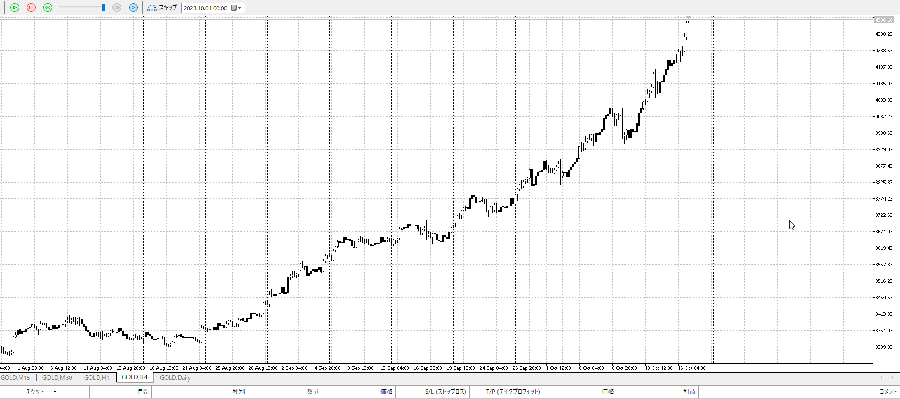
＜ここに目線画像＞

1h
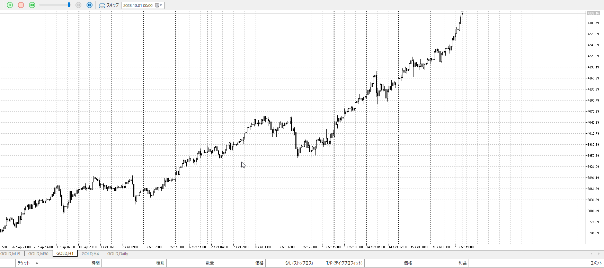
＜ここに目線画像＞

15m
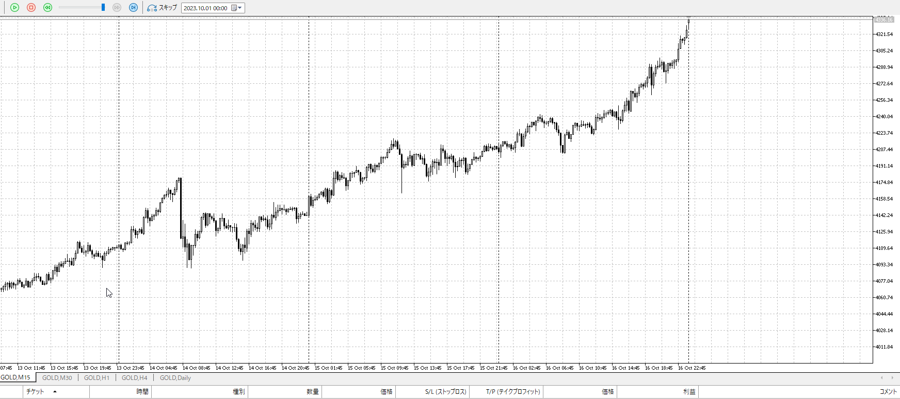
＜ここに目線画像＞

5m

＜ここに目線画像＞

平均描く

- [x] 前日確認
- [x] 使用足全ての目線確認
- [x] 方向決定
- [ ] 両視点整理
- [ ] 場確認

ぶつかり
ひきつけ

平均見るまでもなく上
15mプライスアクション出てから買い

買い
前回レンジ高値

売り

足流れ的にどっちが強い
買い

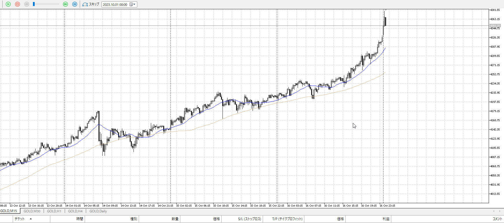

その意味だと、ちょっと遠すぎて何も買えない
抜き瞬間なら5m即買いが出来たが。

高すぎてどこで売られてもおかしくない、と言い出すとここで超えた時に売れるがやっぱ怖い。

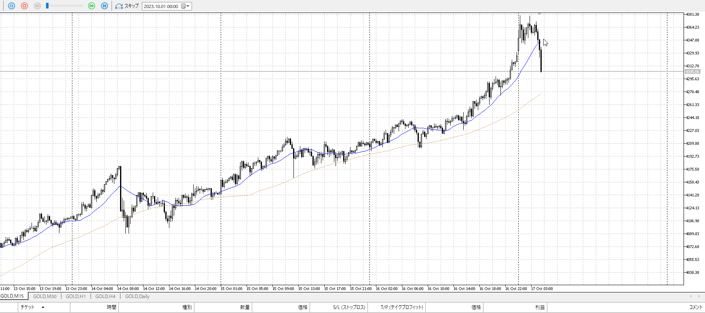
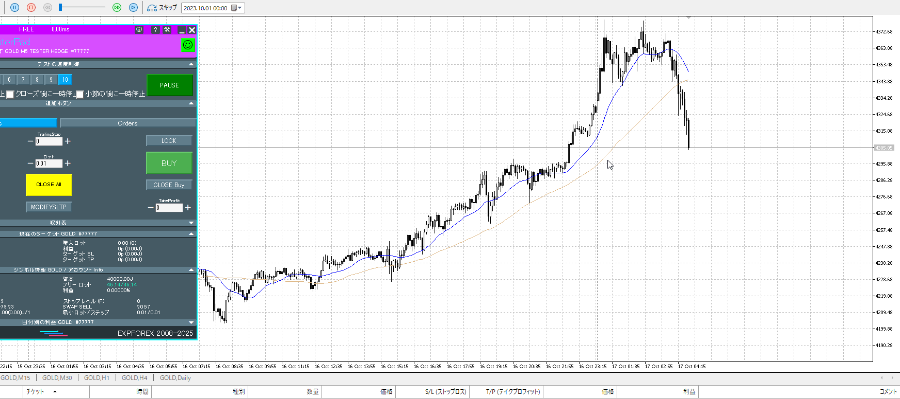

一本前でレンジを15mがした抜きしている。
なので5mで即売りが通じる、はず。

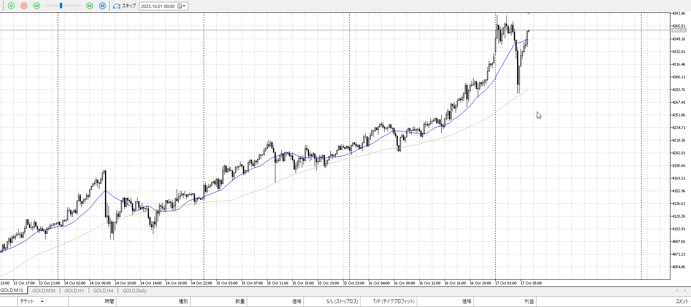

こっちの買いは流石に怖い。高すぎ。

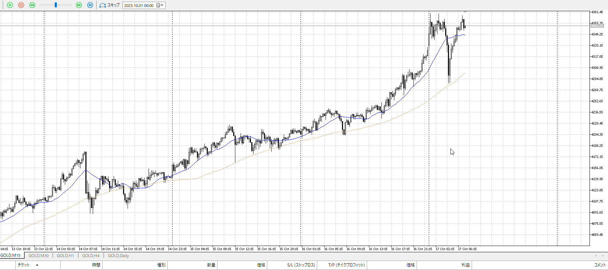

引っかかり無しの100戻し。
しかし高値更新せず。大きい目線では下髭を作る。
となると大きい目線としては、これに引き付けて買いたくなるはず。

15mAはついてきてるので、後はプライスアクション

![[../images/my2025-11-15 2025-11-15 22.24.38.excalidraw]]

ダブルトップを作りそう。平均には出てないが、さすがにこれだけ動いたら線を引かざるを得ない。
その場合売りはこの戻りを取りたい。

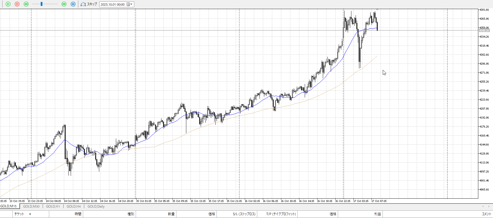
からの

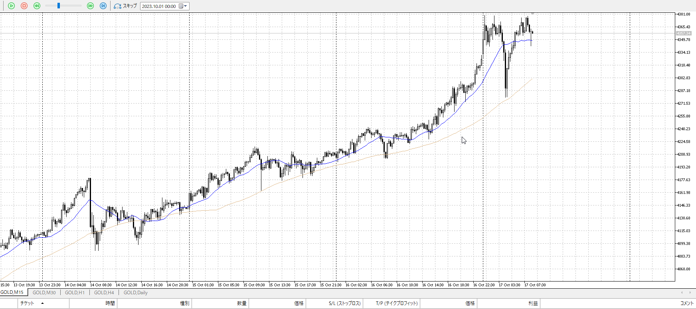

それで止められると買いたくなるんだが。

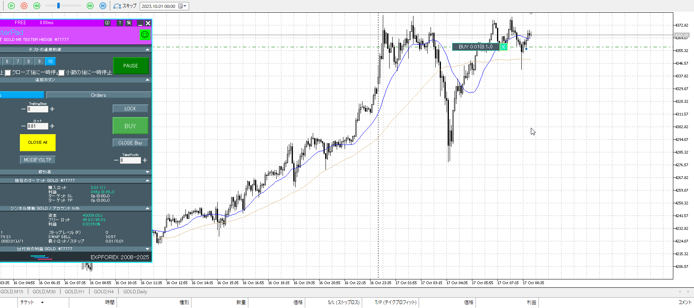

にしてはちょっと重い。ここで切る。
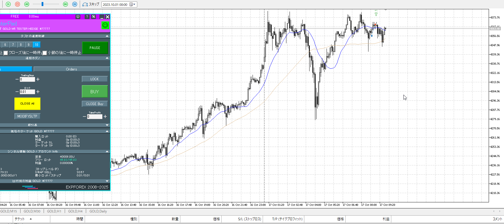

ひきつけ買いもありえるか。

にしてもやっぱり重い。
再度15m。

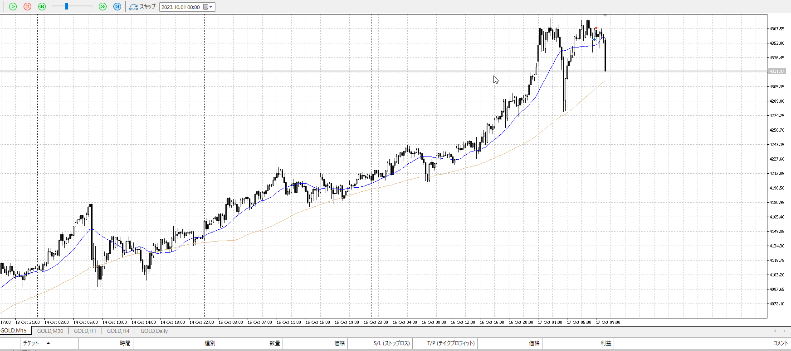

落ちすぎ。
全体全て買い目線の中、二度も買いを逃して上も重たいのがあるが。それで売るというのは訊いてないはずなのでこれを直接つかむのは難しめ。

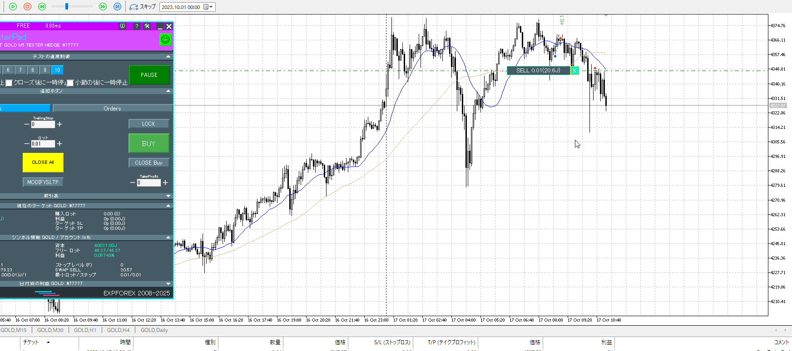

戻りを掴むならこんな感じ。
同値で切れそう感が凄い。ただ5m平均がついてきてそれで再度落ちてるところは注目。

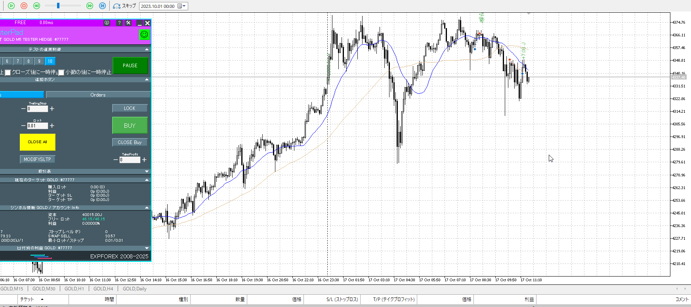

利確が難しい。かなり早めの戻り。

その戻りを元に反転買いは、ちょっと遅いか。

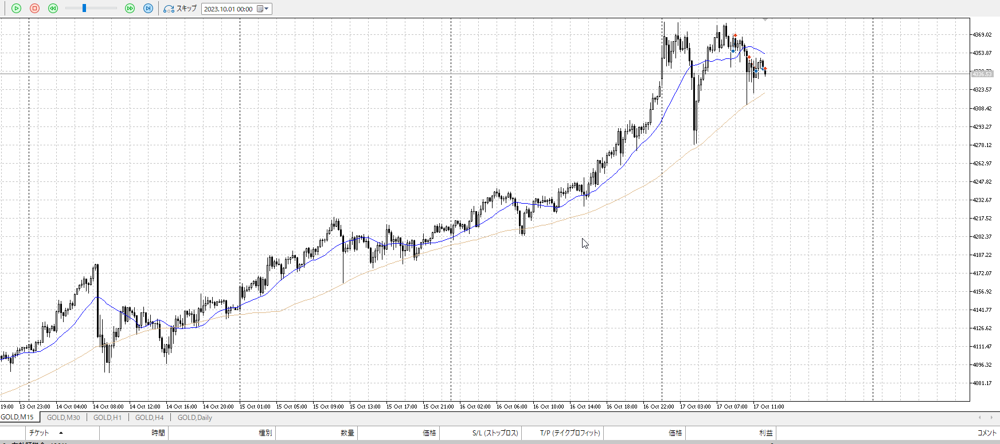

再度15m。反転を否定されたので売りたいところ。

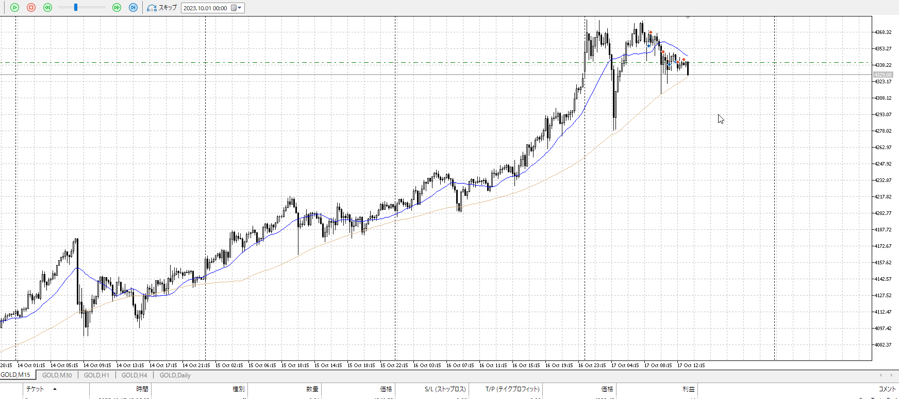

止まりまくったところを売り入れてみる。

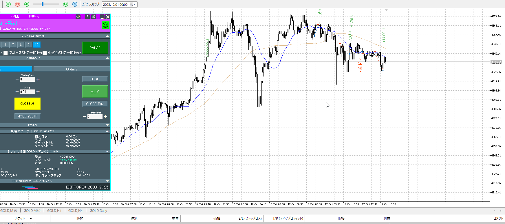

目線が下に切り替わってるわけでもない中なので、これだけ取れたら十分ではないか。

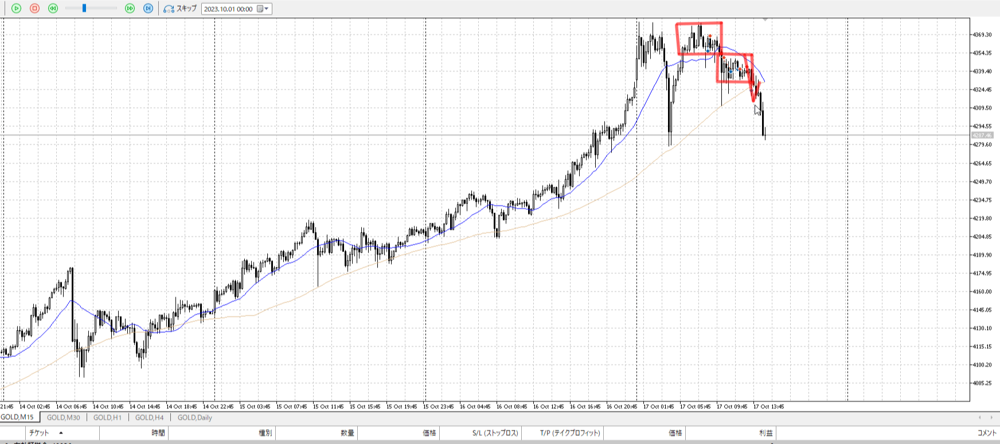

ここの戻りを5mで取る方法は一応ある。
ただまあ、結構な損切になる。この回り全部結構な損切だが。

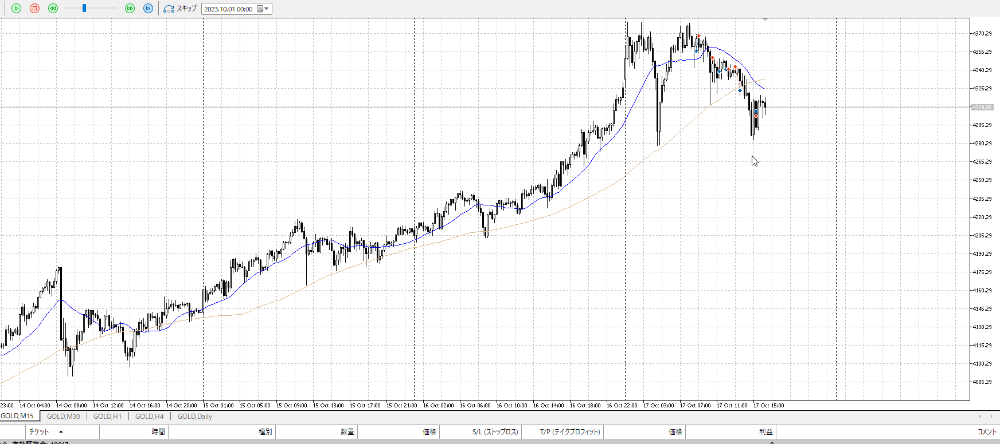

包み押しを取ろうとしたが、難しい。
というか時間的にやらない気がしないでもない。危ないところで反転は危ない。

やる前からどうなるかは見てるので、どこで入れたかの話だけ。
ちゃんと戻り待ってるので不可能ではないはず。

