高く売って、安く買う

## 基本
### レンジ抜け押し戻り
抜けた後、押しや戻りを待って入る
それに下髭などを合わせて自信をもって入るのがセオリー

ただ、レンジの抜けに大きな意味があるなら別
レンジを抜いたら目線が切り替わるなど、それなら大量の損切を巻き込めるのもあり抜けや下髭無し入りが考えられる
[ちょっと浮いてる](レンジ.md#ちょっと浮いてる)

他、1hの押し目内など上の時間足のサポートが受けられる位置だとか
それも抜けが可能、あくまでサポートが受けれられる範囲内で
不安があるなら押し戻りでやれ

### トレンド押し戻り

小さい足での異変であっても、大きい足の押し目であれば自信をもって入れる
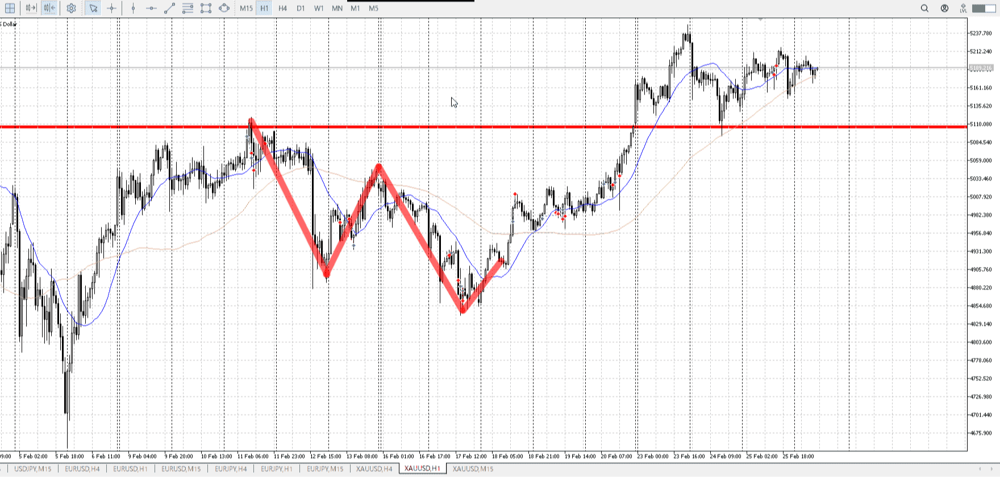
1h、4h売り戻りから売るも左安値を超えたか分からず
売りが止まったように見える

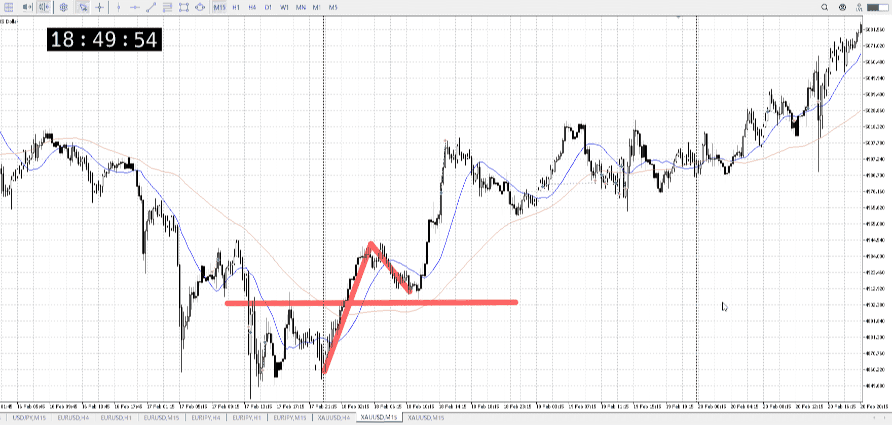
[2026-02-18](Daily_Note/2026-02-18.md)

からの15m押し目買い
精々15m一本上昇くらいしかないが、買える

## 横幅

レンジ上から押し買い、ダブルボトムのネック押し買いなどあるが、
それに触れた瞬間ではない。

下髭などで出来ている損切ラインに引き付けてなどあるが、
それに触れた瞬間ではない。

なんであっても上昇があるなら、**同じ時間かけて**下降するのが一番買いやすい。平均線も近づく。
その結果買い場に近ければ猶更。そこから下髭（[PA](プライスアクション.md)）などが確定したら、下髭を損切に買っていける

![[../images/エントリー 2025-11-17 20.54.59.excalidraw]]
[調整の横幅](./平均線.md#調整の横幅)

## 否定の否定と、不合理な場所の違い
横幅をちゃんと取れ。
->平均線折れるまで待て。

## ひきつけ

実際ひきつけて買うとき、どれくらい引き付けるか
＝シンプルに**どれくらい損切を許容できるか**

どこまでの損切なのかというのは、その買うと決心した根拠地を使う

赤縦で買うというとき、損切は青線の下に合わせる

こっちならこうだが

## 押し・戻りで入る
複数回髭確定がベスト

![[../images/エントリー 2025-11-20 18.01.10.excalidraw]]

途中はこうなるが、これで入るのは微妙
そのまま上に抜けていく可能性がある

![[../images/エントリー 2025-11-20 18.02.26.excalidraw]]

![[../images/エントリー 2025-11-20 18.04.16.excalidraw]]

一回目確定ではない。
焦らない。

上がると思わせてブチ切り一回というのもあるので、ケースバイケース。

これは大きい足（元からの売り場）の話

線で書かれているように、平均から線を書ける程度の横幅は必要

### レンジ内

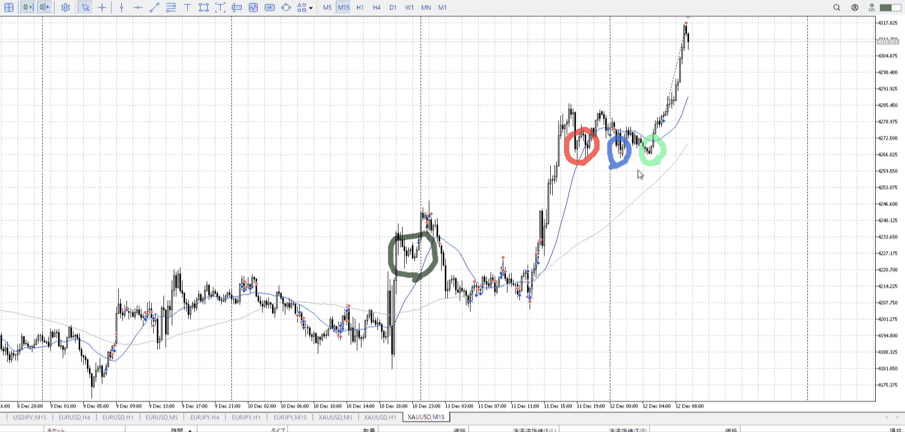

赤丸は平均が折れていない
灰丸で示した場所と同じく、これは押し目に数えない

青丸は平均折れ始め
ここで一回目に数える

なので緑丸で入れる、[二回目押し・戻し](#二回目押し・戻し)
[2025-12-12](./Daily_Note/2025-12-12.md)

#### 注意
よくどこまで押すのかがあいまいになりがち
線引いて確かめる

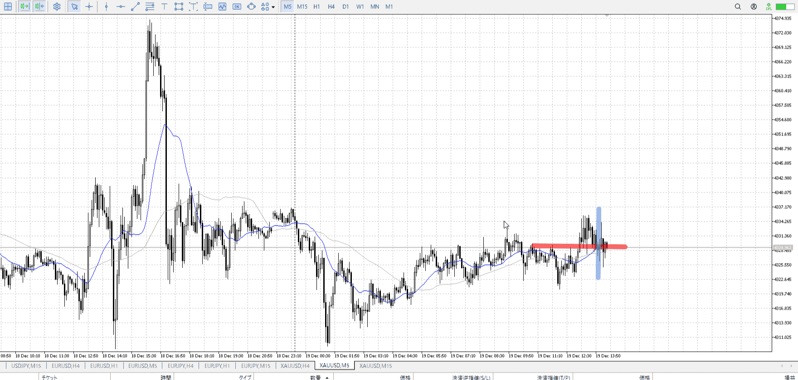

何を抜いていったのかがあいまいになりがち
その抜いた場所までしっかり持つことを意識していれば、逸ることはなくなるはず
[2025-12-19](./Daily_Note/2025-12-19.md)

### 二回目押し・戻し

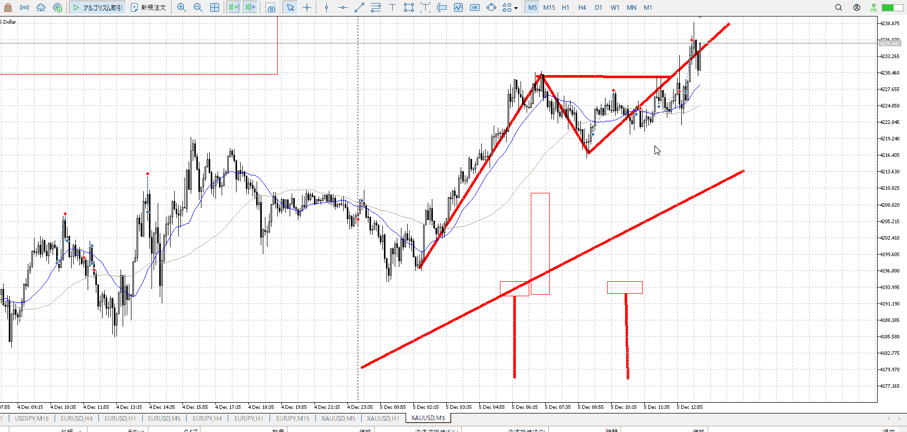

![[../images/2025-12-05 2025-12-05 22.54.14.excalidraw]]
実際に買う部分の話

![[../images/2025-12-05 2025-12-05 22.55.20.excalidraw]]
横幅とって、PA出して、その押し

横幅とってPA出した後なら、**その高さは全部買い続行**
大きく落ちて来た後なら受け止めの下髭は必要だが、その後**再度上昇を見る必要はない**

よって青で示したローソクは必要無く、下髭時点で買える
これは落ちてきた奴がこのPA高さをぶち抜いたりした場合は流石に適用外
[2025-12-05](./Daily_Note/2025-12-05.md)

レンジ内で底から入りたい場合はこれが使える。
[2025-12-24](./Daily_Note/2025-12-24.md)

### 例

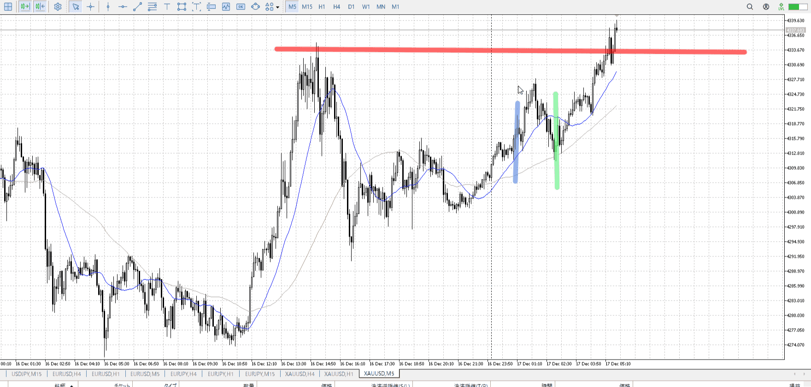

T
上についていない＝上がる余地がある中で、前回買った高さ、青まで下がってきた。
なら買える。緑。
[2025-12-17](./Daily_Note/2025-12-17.md)

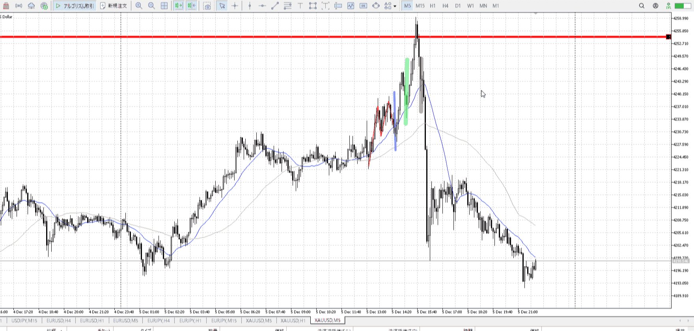

もう一つ

青線が二回目押し。買いは包み足時点でもう決めてる。
すぐに落ちるほうが確率低いので試すべき。

上からの下降は、小さくレンジ内に含まれる限り一般的。
なので実体止まり下髭程度で止まると考える
流れとかuuuとかも含めて止まる。

緑線は下がる理由が薄い。なので放っておける。

灰線は上に触れたという下がる理由がある。しっかり受け止める必要がある。受け止めるだけの横幅を取る前に落ちていった。

[2025-12-06](./Daily_Note/2025-12-06.md)

## 抜けで入る
基本は押し戻りを取る
そっちが確実

大前提、勢いがないとダメ

予想される動きを裏切る場合
これは単純な例、1h全体などから見る予想から外れるタイプでもこれに入る

平均線より上でレンジやって一気に上へ
凄く勢いがあるので
ちゃんとレンジ抜けで入る

### 抜け例

レンジ抜きではないが、20pipsくらい一本で抜いてる超速度
なのでここで買える

ガチで勢いがあるなら、レンジ抜けの前に直近抜いた瞬間入れる
普段は確定で入る

### 抜け注意
これで入る場合、押し戻りが一回はある想定をしておく
利確位置は押し戻りと変わらない、損切は状況で決めるので分からない
押し戻りがあっても決めた想定利確まで

[2025-12-03](./Daily_Note/2025-12-03.md)

場所によっては押しよりも確実になる
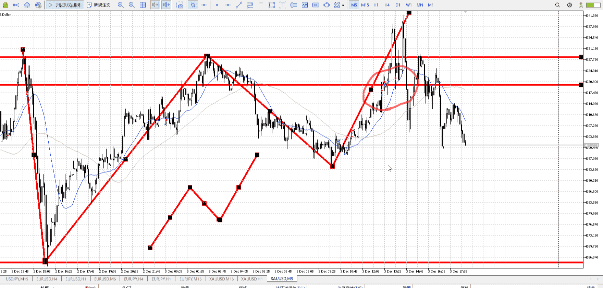
これは指標で大きく抜けたやつ
押しが入るほど居ない可能性があるので、抜けの方がいい

これはエッジケース的に下目線なせいで想定利確が近いので、期待しすぎてはいけない場面だが

[2025-12-03](./Daily_Note/2025-12-03.md)

### 抜け別
もう一つ、小さい時間足で見た時の小さな戻りで入る
これでも抜け扱いになる、というかなってしまうので同じような注意が必要

![[../images/エントリー 2025-11-20 18.05.08.excalidraw]]

## エントリー他例

赤の部分は買いのみ
横線が買いの利確、○が新規買い

ここに合わせて買った場合、同じ高さが損切
**損切より下に返ってくる根拠がない**から損切

## 確定買いと深押し買い
実際の損切は入った時間足に合ったところ、つまりレンジ下
取引としても入った時間足でレンジを割ったなら、一旦下を警戒して止めるもの

![[../images/2025-11-24 2025-11-24 22.48.01.excalidraw]]

ちゃんと売られないよの横幅は取ってからの話

![[../images/エントリー 2025-11-24 22.52.47.excalidraw]]

元々の買い場がある
この場合は多少損を増やしても確実性を上げるため、確定が良い
損が増えても大差がなく、それより確実な方が良い

![[../images/エントリー 2025-11-24 23.01.29.excalidraw]]

一方、後からの買い場
損切が既に大きいので、それを小さくする方を優先

上の方なので最大利確に行くまでのレンジを耐えられない可能性がある
第二利確で止めるのを考える

![[../images/エントリー 2025-11-24 23.42.03.excalidraw]]

かなり上が近い場合、安定を取って直近レンジ上で利確を置いておくのも有効
**普通は抜け狙いで7割**、普通はレンジの上から入らないため
[2025-12-29](./Daily_Note/2025-12-29.md)

エントリーも本来損切する位置、このレンジの一番下から入るくらいにする。そうでないなら損切許容。

[2025-11-24](./Daily_Note/2025-11-24.md)
[2025-12-26](./Daily_Note/2025-12-26.md)

損切は中ほどと変わらず。

[2025-12-03](./Daily_Note/2025-12-03.md)

## 上から買う
直前がとても早く上がって、上で落ちずに小レンジしてるみたいなとき
これはちょっとやそっと小レンジを抜いた程度では返せない、抜けた後でも下髭を二本ほど待ってから買える

![[../images/エントリー 2026-01-07 19.01.07.excalidraw]]

[2025-11-13](./Daily_Note/2025-11-13.md)

## 一つ目買い
買いたい高さがある時、一つ下の足を見て確実な二本髭確定などを見る
これを繰り返すと、5mに当たりそれより小さい足が使えなくなることがある

その場合のみ、一つ目の確定で入る。決め打ち
でないと上昇に対して間に合わない

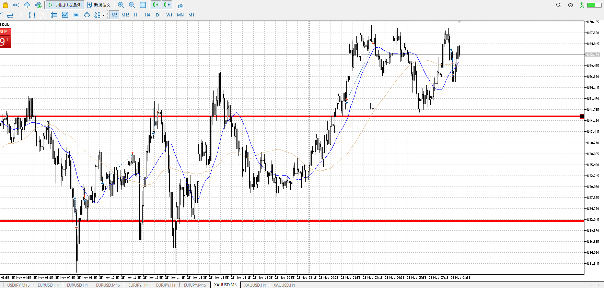

この時重要なのは、買いたい高さドンピシャで買うしかない事
でないと損切を増やすだけ

![[../images/エントリー 2025-11-26 18.20.52.excalidraw]]

この上昇中の四角は、ここで買われているという印
ここで売られて下から押し目買いを予定していたが、上がってしまった
つまりここで買われている、そこで上がる可能性がある

[2025-11-26](./Daily_Note/2025-11-26.md)

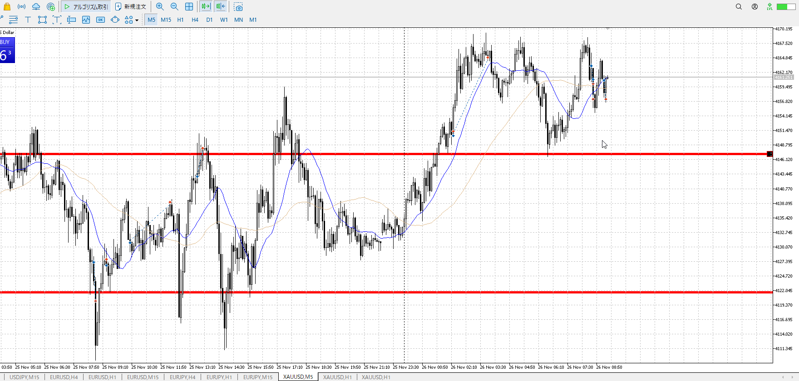

これは悪い例
3回目もここではなく、もっと下　その入っている足確定したくらい
損切したあたりがまさにそうだった、そこから直近安値に合わせる

## 無視できない下降
[大きい足](大きい足.md)

## 反転買い売り
反転はここではトレンド逆を指す。
目線が逆転するときは普通その前から入っている。

もちろん1hは上
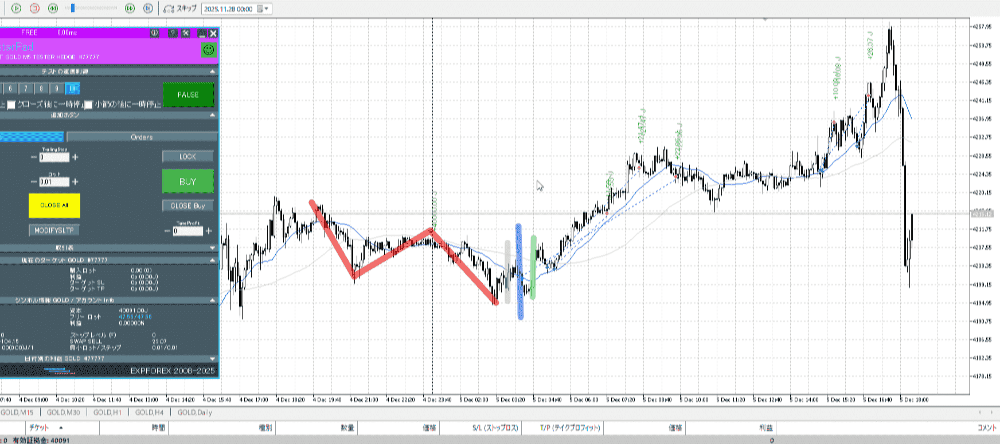

[2025-12-06](./Daily_Note/2025-12-06.md)のテスター。
下降によりネックを割り、5mは下向きに。いったん上向きになる理由が欲しい。

それが緑。5mを全包みしている。これなら上向きとしてひきつけて買える。平均の上にも行ける。

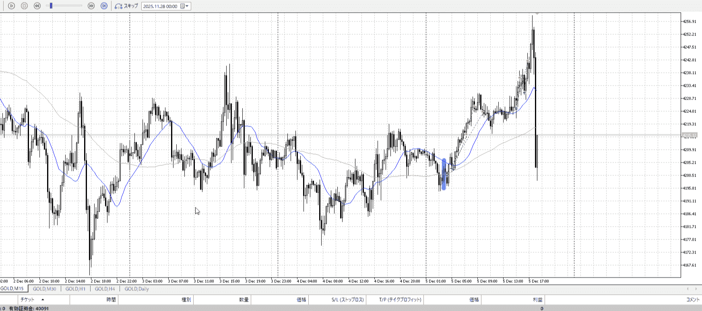

15m。
青部分を見ると包むような足が出ているが、これでは足りない。
その後の包む足が欲しい。

下向きトレンドを返すには、~~横幅~~売り場抜きとPAがいる。横幅の最小は二度目の下止め。

これは逆だけど。
そのうえでPAが出て返している。

5mの下トレンド、3本だけでは戻らない。
青や灰をこれらとして見るには、小さすぎる。下降に対する横幅を一度取ること。
[調整の横幅](./平均線.md#調整の横幅)

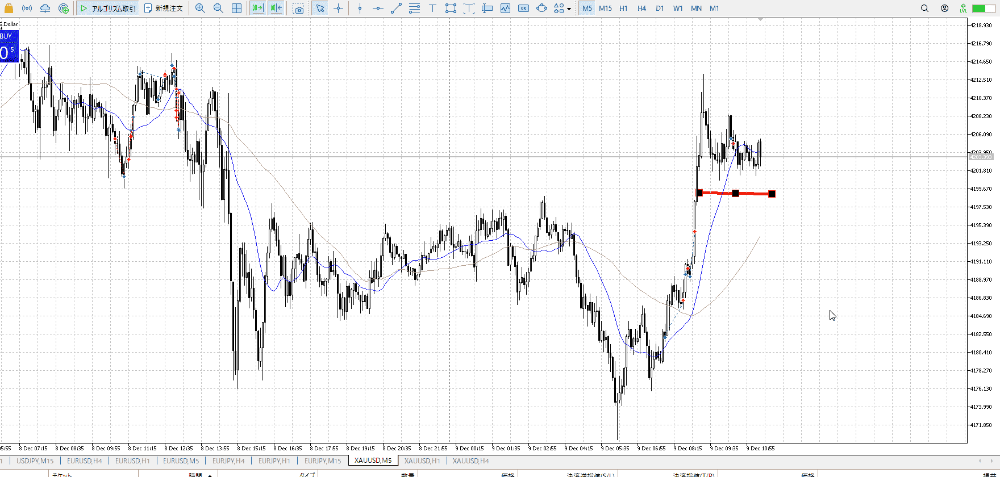

逆にエントリーする場合、トレンドはせめて逆を剥く必要がある
つまり売りから買いを取る場合、**エントリー足の**売り場を抜く。

レンジも上に売り場を作り、それを抜くこと。
レンジは利確の下げもあるので同じでない

今回は15mレンジ下が売り場
Wは小さく見すぎ

二回目は早すぎ、普通に持ってていい

三回目はちゃんと平均線的な利確迄持つ
[2025-12-09](./Daily_Note/2025-12-09.md)

## 短期
1hがレンジにいるときは、短期だけで取引することになる
その時に気を付けること
[2025-12-08](./Daily_Note/2025-12-08.md)
### フラクタル
慣習に基づくと15mで全体俯瞰、5mで場を確認、1mでエントリーになる。
もちろん実際にノイズが多い1mを見る必要はなく、5m確定で入ればいい。

### 即応
普段の15mでレンジ出して、とやってると間に合わない。そもそも15m->5mで3倍速。
売り場買い場、小さいレンジを抜いたなどに即応する。

## 瞬発
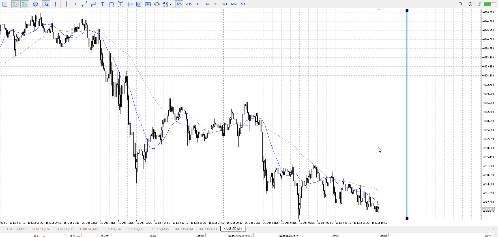

指標前。下から引きつけ確定で入る。
切り下げもあって伸びない。上髭見えたらすぐ切る。
[2025-12-16](./Daily_Note/2025-12-16.md)

## すぐ動く
入った後にすぐ動けば、利確損切関係なくいいエントリー。あとに繋がる。
[2025-12-29](./Daily_Note/2025-12-29.md)

## 上位足上髭後
上位足が上髭を出すようであれば、一旦そこでは買わない
それより下がらないを確認し、それに引きつけ買う
[2026-02-25](Daily_Note/2026-02-25.md)