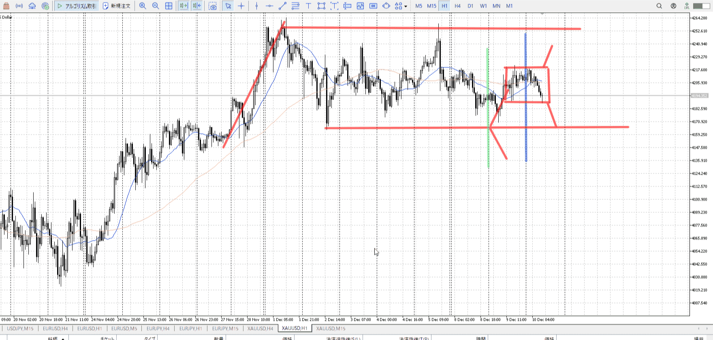
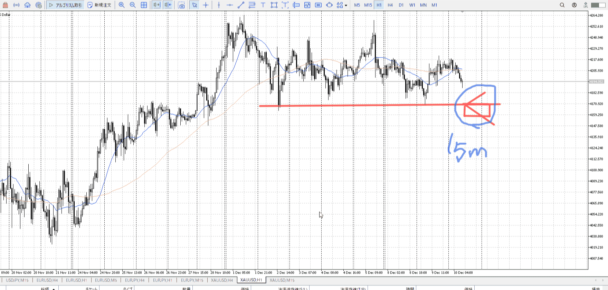

直近の買い売り想定

## 基礎
![[../images/シナリオ 2025-11-19 16.10.44.excalidraw]] 
例えば緑縦線までで止まっていたら、青線のように高値を抜けていくのが買いのシナリオ。
赤のように高値で落ちていくのが売りのシナリオ。

エントリー**ではない。**
どうしたらどうするではなく、直近で一番可能性が高い買いと売りの提示だけ。

これで目線を無視してはいけない。
目線の条件も揃って、横幅含めプライスアクションを入れてようやく入れる

一行で率直に書く。

これが出来てると、プライスアクション同様証拠の一つとして扱える
伸びない場所を無視できる

一日に二度三度書くのは見てる時間足の違い。
1hなら1hの情報だけ使う
[2025-12-03](../Daily_Note/2025-12-03.md)

![[../images/シナリオ 2025-12-10 23.21.54.excalidraw]]
![[../images/シナリオ 2025-12-10 23.22.33.excalidraw]]
基本この二パターン
レンジは抜けることを前提に、内部は内部だけの取引になる
抜ける瞬間だけを指すのではない、内部で横幅PAがあったりしたら内部で終わるのでなく抜けを考えるということ

シナリオ達成後、再度シナリオを立てる
伸びていった時点で立て直し

## 例

それぞれの線時点でのシナリオを描いている

[2025-12-10](../Daily_Note/2025-12-10.md)

## 小さくなる時
シナリオ達成後、再度シナリオを立てる
しかし途中で止まったりした場合、足を小さくして小さい足で別途シナリオを立てる

どちらに行っても、立てたシナリオに乗っていく

