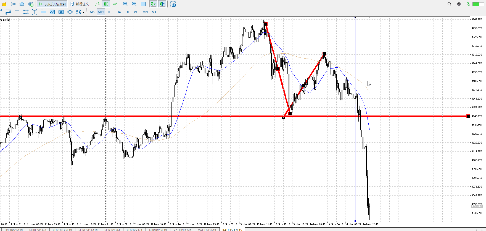

## 基礎

トレンド以外
（高値更新安値切り上げ、安値更新高値切り下げのどちらでもない）

幅は売り場、買い場の間であり高安ではない

直前の動きを受け止める役がある
これに包みなどが出て逆側が完全にいないと言われたら取引、が通常
[プライスアクション](<./プライスアクション.md>)

こうあった場合、押し目が買い場になる
    もしレンジにならず赤線で抜けた場合、この押し目を買い場として扱う
    これはレンジになった場合でも同じく買い場として扱えるため

そして高値を更新しない、というのが青線の時点でわかる
これで高値を売り場、押し目を買い場として使えるのでこれが幅になる

この場合、安値は更新したが高値は切り下げてない
なのでトレンドではない。レンジ。

レンジ幅はとりあえずこうなる
なお目線は売りに変わるので、使うかどうかはともかく
[2025-09-05](<../Daily_Note/2025-09-05.md>)

レンジ成立は平均線を跨ぐくらいまで
じゃないとレンジというよりトレンドの一部

## 圧力

レンジは場所によって圧力がかかり、やり方も変わってくる

青位置は買いが強く、戻ってきやすい
売るなら戻りを待った方が得策（あんまり売らないが）

赤位置は売りが強く、伸びていきやすい
目線が変わる位置、それだけ買いの損切を巻き込める
売るなら抜け

緑はいろいろ
ただ左の上昇にレンジがあったりして、引っかかる要素があるなら戻り売りを考える

時間足に合わせた戻り、抜けで見ること

[my2025-10-04](<./my2025-10-04.md>)

力の差は、レンジ真ん中の強さにも関わってくる

[2025-10-09](<../Daily_Note/2025-10-09.md>)

こういう長いレンジは、それだけ多く買いの損切が溜まるので抜け売り
もちろん前振りは必要だし、時間足に合わせた抜けが必要

[ぶつかり](<./ぶつかり.md>)

## ぐだあがり
だらあがり、だら上がり
![[../images/Untitled 2025-11-13 18.28.23.excalidraw]]
レンジ作りながらの上昇とぐだあがりは違う
レンジ作りながらは売られた際にレンジで引っかかって止まってくれる
ぐだあがりはそれが無いので落ちた時にさっと落ちていく

## 早買い
[2025-11-14](../Daily_Note/2025-11-14.md)

こっちの買いは、本来プライスアクションの為のレンジを想定しての早買い

![[../images/2025-11-14 2025-11-14 23.00.33.excalidraw]]

もう一度返されないとレンジとして成立しないのだが、それを期待しての買い
かなり早い、平均も下だし
ただ不可能ではない買い