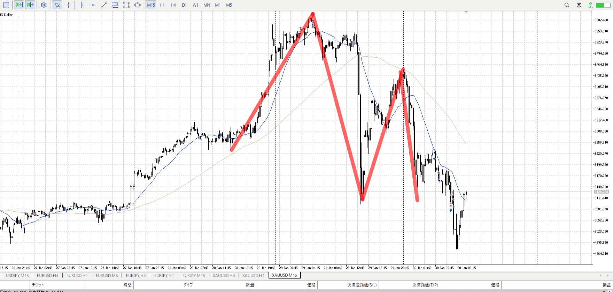

ローソクのものと、切り上げ切り下げのものと。
後者は[切り上げ切り下げ](切り上げ切り下げ.md)で。ここでは前者。

[2026-01-30](../Daily_Note/2026-01-30.md)
上昇に対して下降が明らかに強い場面
上昇の傾きに対し、明らかに下降が一直線で傾きも強い

この相場は線を引いたとこまでだと1h目線を更新できてなかったが、15mは更新しており下向き、かつ下降がこれほど強い
なら売り
[フラクタル](フラクタル.md)

これ意識してると縦軸偏重しがちだが、もちろん横軸も必要
[推進調整](推進調整.md)でもやったこと

分析内でも結構意識されるもの