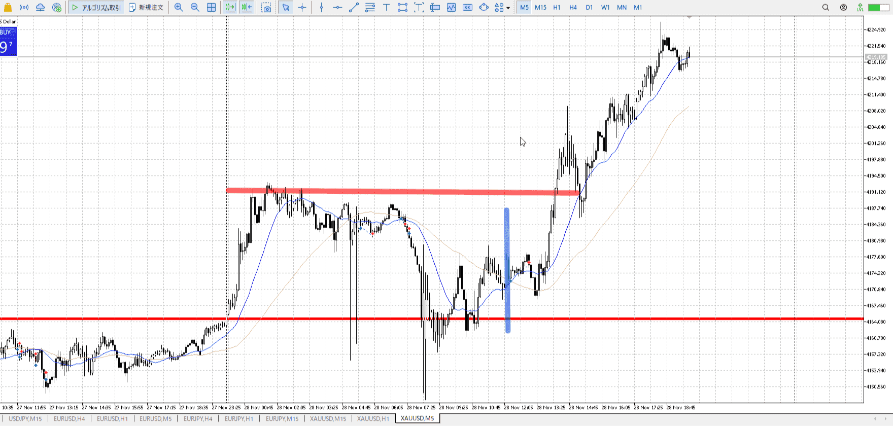
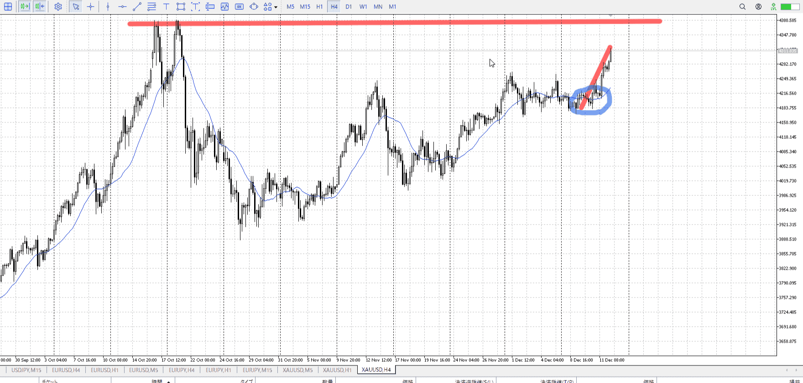
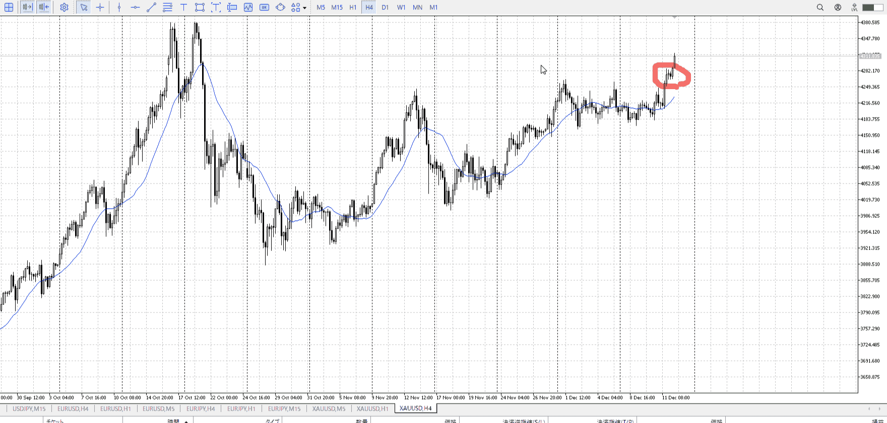
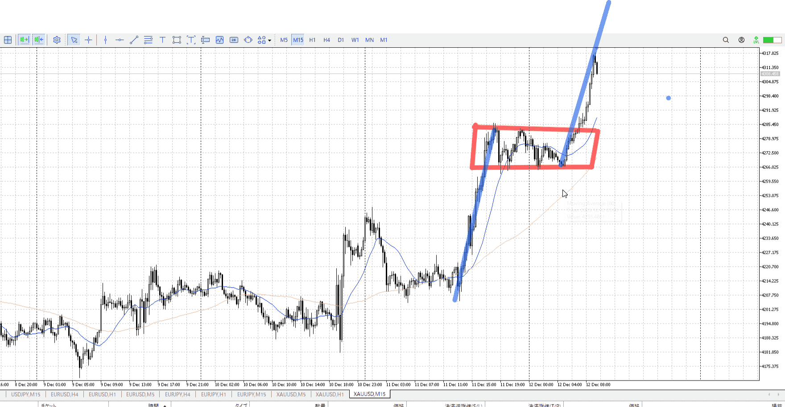

## 基本
入った時間足と利確損切を合わせる

この図のXは何でこの位置に利確があるのか、この時間足から分からない
つまりもっと下の時間足で入ったと考えられる

利確損切は近くのレンジや目立つ箇所以外にも、前回波と同じ長さや161などが使える
161は他でたいてい代用できるが
[2025-10-08](Teino/Daily_Note/2025-10-08.md)

同じ長さも同じ時間足のもののみ
[フラクタル](<./フラクタル.md>)

この原則があるので、レンジ抜けはそんなに上で利確できない
めり込んでる分下の方

1hの一伸びが、5mの一波程度
[フラクタル](<./フラクタル.md>)

## 利確予想まで落ち耐え
きちんと分析してれば、落ちないところは耐えたい
ちゃんと利確予想まで持つこと

この場合の青線の利確予想は赤線
そこまでは耐えるべき

これだと途中で0利確されるかもだけど、それも含めてデータ
その後入り直せばいい

[2025-11-28](../Daily_Note/2025-11-28.md)

## 想定利確

![[../images/Untitled 2025-12-04 03.04.40.excalidraw]]
下向きの中で、更新してないなら上に至っても利確の根拠の決め方は同じ
[2025-12-03](../Daily_Note/2025-12-03.md)

## 入った高さと利確時間足

4hの上まで取るなら、4hの底から入らないといけない

この中段あたりから入った場合、その根拠が見える時間足を元に利確を決定する
今回は15m

他に利確の目安が無いので、前回高さを元に、さらにその七割をとってマージン
フィボナッチ引くと分かりやすい

[2025-12-12](../Daily_Note/2025-12-12.md)

[基本](#基本)と言っていることは一緒。

## 時間帯
深夜～朝だと逆の動きが出来るほど人がいないので、現在の方向に従ったエントリーが出来る
もちろん逆の場に到達したらその限りでない

ただ利確もそんな伸びない
やるなら安定ラインで止めておく

## 取る量
一日の七割が取れたら一人前。
1hの人並みがだいたい一日分になる。
[2025-12-29](../Daily_Note/2025-12-29.md)