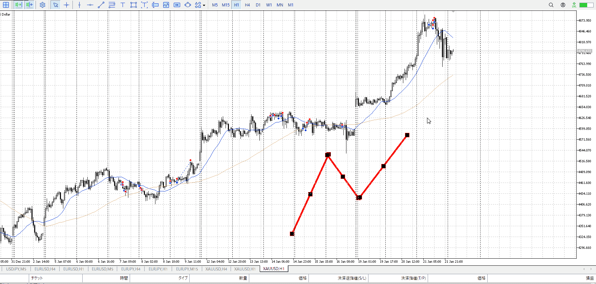

天井圏で買いを掴みがち
これは推進波の中から残りの推進を掴もうとしてるため

![[../images/天井圏と底値圏 2026-01-22 13.39.06.excalidraw]]

元々1hで取引してる
基本的には調整から推進を掴む、底が決まってから上昇を掴む
1hAが離れている中、5mで割り出した大き目の下降はむしろ調整の始まり
推進->調整の始まりを買いで掴めば、当然天井圏

![[../images/天井圏と底値圏 2026-01-22 13.41.02.excalidraw]]

推進->調整は調整->推進とやってることは同じ
レンジ後方向反転のはじめを取ってる

天井圏で買ってるときは調整終了->推進始めを掴んでるつもりだが、5m程度では調整にならない
調整なら1hAに触れるくらいは必要

天井圏で買ってるときは大きくは推進波の中、小さく調整終了->推進始めを掴んでるつもり
それでも上がるなら一旦1hAに近づきたい、元々1hの波を狙ってるわけだから1hで上がる理由を持たせておくべき

[2026-01-21](./Daily_Note/2026-01-21.md)

あとこの時は初の目立つ陰線上髭、降下に対して上昇緩やか、既に100000移動などがあった
前二つは分かるまで少し時間が必要なので、その意味でも1hAに近づけ

天井圏で掴みがちは、反対に入れれば取れるということ
天井圏データを持ってればそれまでは買う、天井圏始めで入らない、天井圏で売って調整波取るが出来る
最後は伸びないので後で良いが
なので今最も個人的に必要なデータ

調整波の端、底値圏でも同じことが出来る
それまでは売る、底値圏始めで入らない、底値圏で買って推進波取る
いずれにせよ、今推進か、調整か、その間のどれにいて何を待つべきかを1h（今のメイン足）から見て、小さい足での間（レンジ）挟んだ後の変わり目を取る
もちろん天井・底引きつけから売り・買いも含める

天井圏、底値圏のデータは個人的に重要だが
それ以外で入らないというわけでない

![[../images/エントリー 2025-11-24 23.01.29.excalidraw]]

例えばこういう底値圏より上、後からの買い場で入った場合
損切はレンジ下にしつつ、入る

RR的に納得できるし、取引としてもレンジを割ったから一旦下警戒でわかる

