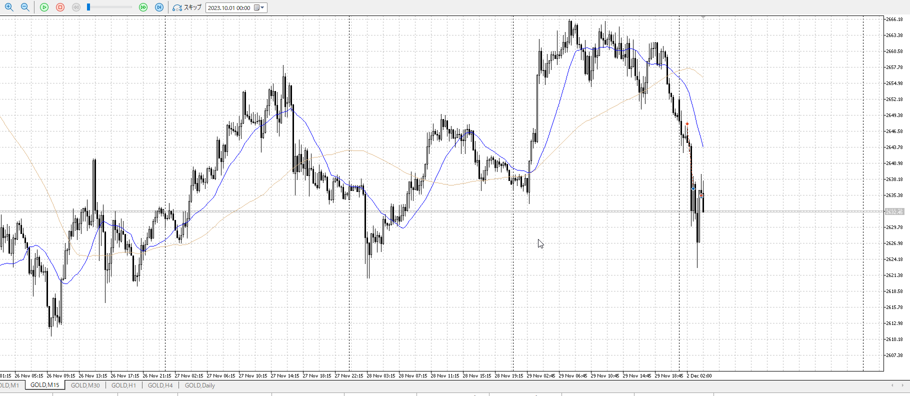
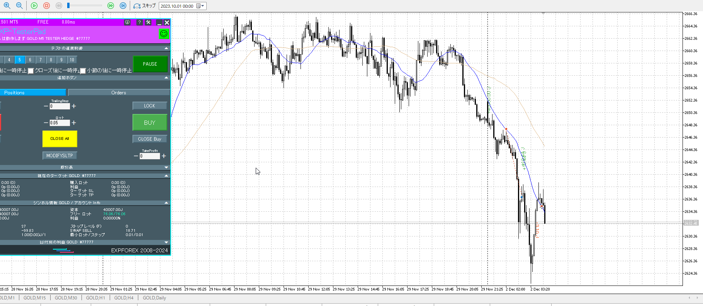

一旦買いとして話す

利確線はそこで売られる
それを急激に近づける操作が出た時、それは小さく見てる可能性が高い

基本的にトレンドがつづくと思って入る
そしてトレンドの利確で確実なのは直近高値

![[../images/2025-10-31 2025-10-31 22.32.45.excalidraw]]

この下からを取るためにレンジを待ったりその抜け押しを待ったりする
ここで、**抜け押しの上は利確ではない**。流れは変わらない。

![[../images/2025-10-31 2025-10-31 22.34.41.excalidraw]]

抜け押し上が利確になるのは、小さく見てる時
このレンジ周りだけ切り出すと利確は抜け押し上になる
直近高値がここにしかないため

![[../images/2025-10-31 2025-10-31 22.36.21.excalidraw]]

しかし大きく見たし、その**大きい流れを考慮に入れている**。
なら利確は大きい流れ、大きいトレンドの直近高値。

![[../images/2025-10-31 2025-10-31 22.32.45.excalidraw]]

---

なんか馬鹿みたいに跳ね返った時

![[../images/小さく見てる時 2025-11-01 22.51.55.excalidraw]]

でもこれ気になる部分は上髭で止まってるし
せめてこれを抜いてくれないと話にならない、15mで

5mで抜いていたとしても、やっぱり上髭
だったら届かずに折れてるし、そもそも抜けてその戻りでも遅くないし確実
逆なんだからせめて15mでも分かるくらいに売りが止まってないといけない

一応1hの押し目買い
ただそれで買いがいるというより、売りが止まるのが重要
それが出るまでは待つ

もしくは下から入る
ここは1h押し目を根拠に普通に買うにしても高すぎるので無理筋

見てる根拠に引き付けろ
前の売りはちゃんと上昇止まりを待ち、15mでわかる方向に沿って入った
[my2025-11-01](<./my2025-11-01.md>)

