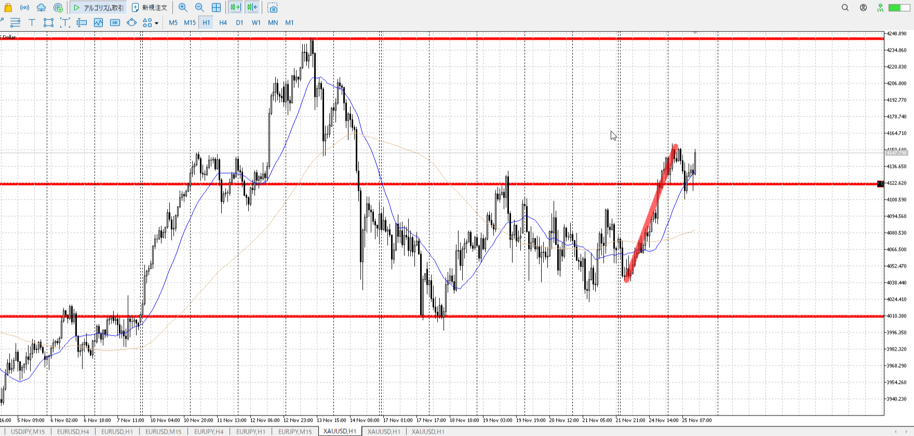
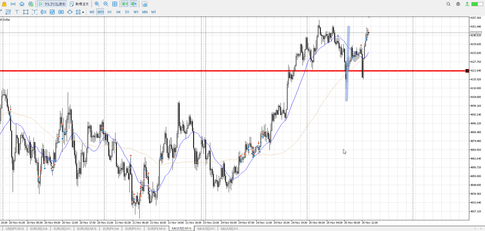
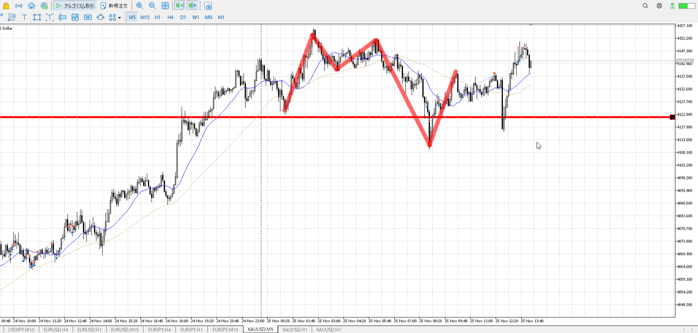
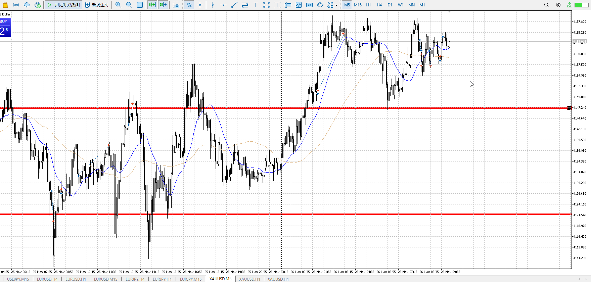
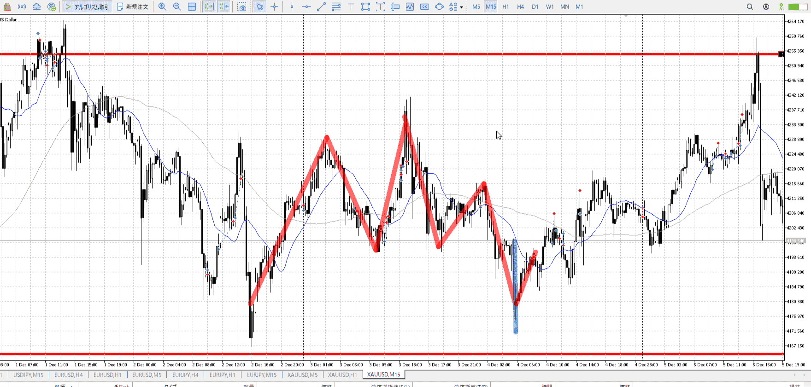
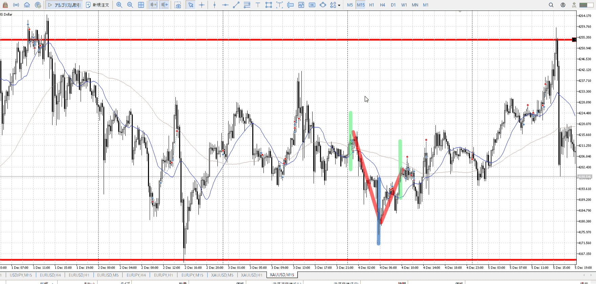
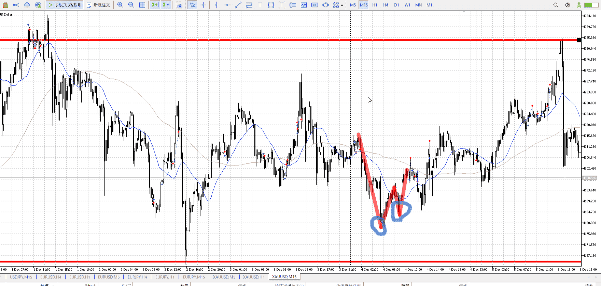
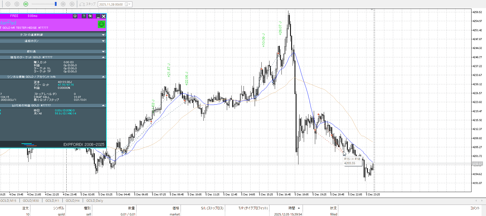
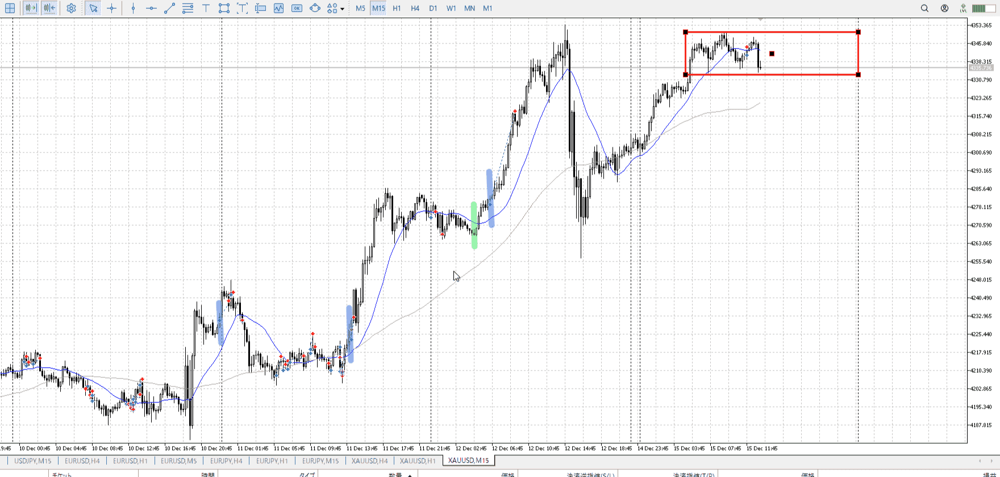

波の頂点をローソクの高安に割り当てる

ローソク→平均線→ローソク高安→目線判断

余りに離れてると逆の力がかかる
が、それに頼れるのは小さい足でトレンドとか作った場合
[2025-10-07](<../Daily_Note/2025-10-07.md>)

![[../images/Untitled 2025-11-25 22.54.56.excalidraw]]

波を取る
でもどうやって波になる？
->平均線

![[../images/Untitled 2025-11-25 22.56.00.excalidraw]]
平均が下を向き始めるから、その部分が2波と分かる

3波、推進波を狙うのが本筋
そのためには1波を見て上昇を認識、2波の**調整波を見て**これ以上**下がらないを確定**する必要がある

## 例

1h
この1波を見て、3波を狙いたい
平均が下向いてないので3波を狙えない、**この時間足で買えない**

15m
この時点ではどこまで下がるか分からない
2波が分からない
![[../images/Untitled 2025-11-25 23.02.40.excalidraw]]
縦線では買えない
買うときの2回目の触れ確定という話があったが、あれはそもそも一回目で2波の底が決まっているから使える
[戻りで入る](../FX/エントリー.md#戻りで入る)

![[../images/Untitled 2025-11-25 23.07.02.excalidraw]]
これは平均線がこのような形で、一切下に降りてないので
そもそも線はこうであり、どこにも一回目に使える部分が無い

- 目立つ部分云々は？
    - 利確に使ったり、波がいったん止まるかもねの場所に使ったりするもの。
      エントリー時には使えない。
- 小さいネックは？
    - 小さい足の方向も揃い、どこでも買えるみたいな状態の時
    - それでも買う場所が欲しいとなったら出すもの。
      平均線の下にいるここで使うものではない。

5m
上にVで折れる
本来ならこの下が無いことを丁寧に横幅取って平均線を返すが、Vなら別
平均がすぐに上を向き始めるので、その辺で買い（T）
これは短期の買いなので5m高値まで、上昇が妙に遅いので止め

[2025-11-25](../Daily_Note/2025-11-25.md)

## 用途外

ダウ転もしてないのに買うなという話であり、
5mが敏感に相場に反応するという話であり、
平均が下向いたときに買いが無理になる話じゃない。
[2025-11-26](../Daily_Note/2025-11-26.md)

この場合は上ついて買いが消費されている割り、下を割らない。まだ買い。
なら底を決めてから[二回目押し](エントリー.md#二回目押し)が出来る。

## 横幅
平均線を使用し、必要な横幅を測る方法がある

全体は買い、下トレンドが出て注意する場面

~~青線部から上に買いたい場合、下トレンドを否定するために調整が欲しい。~~
赤線の端では平均線が追いついている。ここまでが調整として、ここまでは何もできないことがさっとわかる。

他にも落ちと同じだけの横幅取ったり（正確に落ち本数以上ではない）

ダブルボトム(二回下付き)＋戻りでレンジ成立を待ったり。これは小さく見てる場合だが。

どれも大体同じ場所で確定する
それらにPAが合わさると、買いが出来るようになる。

ただしこのケースはネックがあることに注意。すぐに抜けられずレンジを下割るようなら一旦やめること。下割らないのを見て＝[調整の横幅](#調整の横幅)を見てもう一回[二回目押し](エントリー.md#二回目押し)を狙う。

（大きい目線の流れを取り）横幅を取る意識があれば、こんな感じで取れる
右の売りは大きい足がなぜ売れてるか（買いがいない理由）を理解して、遊び程度で入る
2回目は[二回目押し](エントリー.md#二回目押し)の逆
3回目は普通に入れる、下確信

## 良いエントリー目安
あくまで入った後の話であって、これを目安に入らない事。

入った方向に対し、平均線より向こう側にあればいいエントリー。青線。
買いなら上、売りなら下。

普段は1h->15mで見てるので、15mの平均線を使用。

気にしなくても、横幅->PAで大抵抜いてる

**それより下で入る場合もある**、引きつけになる。緑線。
だからリスク高い、ギリギリまでひきつけること
[2025-12-15](../Daily_Note/2025-12-15.md)