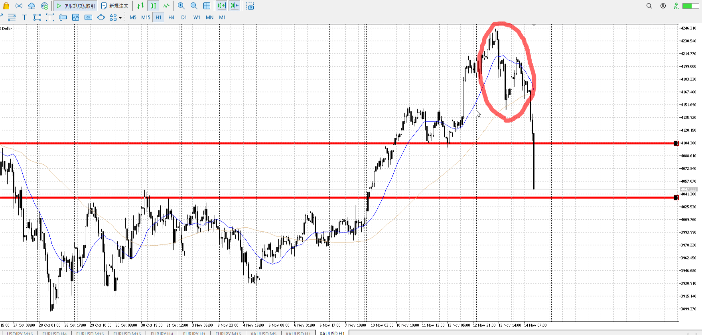
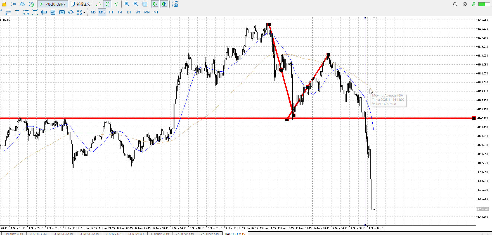

---
aliases:
  - 仕草
  - 流れ
---

[平均線用途](../../Teino/FX/平均線用途.md)

まず平均線、その後どちらが優勢かの強弱を見る
目線が定まっていても今どちらが優勢なのかは
**方向の足の大きさに応じた**切り上げ下げ、髭、ローソクの大きさ、[横軸](<./横軸.md>)の長さなどで判別可能

これで片方に行かないな、と分かったら一つローソク足のシグナル待って取引
下髭や大きいローソクなど

[2023-10-15](<./My_Test/my2025-10-29.md#2023-10-15>)

## 実例
[2025-11-13](<../Daily_Note/2025-11-13.md>)

もともと上昇に対して売りが弱く、上でとどまっている
＋前日からこの高さ

新規売りによる落ちが少ない、利確ばかりであると予想できる
つまり最初から買いが多い

## その勢いは生きているか
生きてる死んでるは目線的な話で決める

[目線](目線.md)

[2025-11-14](../Daily_Note/2025-11-14.md)

1hを元にするが、ここの急降下が生きていることは念頭
その急降下について上昇が時間がかかっていることも

足流れ的にどっちが強いで買い場で買いがしたいという話があった

それはそうだが、突っ込んだ瞬間ではなくプライスアクションが出てから
下降で突っ込んできた瞬間ではない

![[../images/2025-11-14 2025-11-14 22.55.13.excalidraw]]

突っ込んできた瞬間は無理で、このようにしっかり横幅を取って止まってから
今回は平均も下で、急降下が生きている中で、5mでも目線が上ではなく、突き抜けかねないような勢いを持ったままの奴を買うのは大変難しい

急降下が生きているのは目線が変更されていないため
生きてる死んでるは目線的な話で決める