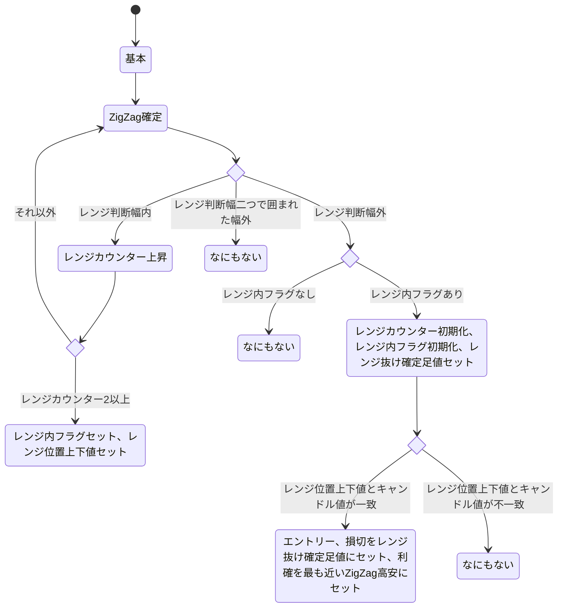

up:: [FX](<../Bar/FX.md>)

EA
300本分ZigZagを見て、目線を把握

一本の両端を高値、安値とする
方向によって上下決める
ある一本を次と比較

次の次が決まるまで、基本的に高安は動かない
例外として、更新が起きた場合は高安の方向に応じた側を移動させる
現在相場が動いている方向と逆の値は据え置きになるはず

据え置き状態は特に特別視しなくていい
次の次を見る、やることは何も変わらないはず

380本分内で一番の高安範囲内で、ある一定以下の値幅（便宜上これをレンジ判断幅と呼ぶ）で跳ね返ることを上下二回ずつ繰り返したらレンジ
（一つ下のZigZagでわかるかも）

更新が起きても起きなくても、レンジ判断幅内で跳ね返った=一つ下のZigZagがレンジ判断幅で返ってる場合はレンジフラグを立てる
このフラグが2つ重なったらレンジ、上下をいろんな判断基準として使う

レンジを抜ける、ある一定以上離れたうえで足が確定したらレンジ抜け

一定は一旦レンジ判定幅の二倍とする
この時確定した足で、全体の動きと反対側の実体値+レンジ判定幅を損切とする

レンジ抜けからレンジ上とある一定以下の値幅まで近づいたら戻り、そこで取引

一定以下は一旦レンジ判定幅と同値とする

レンジ抜け足の始まりから、レンジ判定と同じ範囲を使用し少し離して損切
損切はレンジが始まったら、その一つ前のレンジに都度移動

利確は基本1H300本分ZigZagに基づいた、入った場所より向こう側にある高安
１Hで見えなければ４Hを使用

一定以下の値幅(ひげなし)
10500,15
4850,10
とりあえず10~15で良さそう

必要なデータ
300本分ZigZag
高安
方向
380本分高安範囲（今は使わない）
レンジ判断幅
レンジカウンター
各所レンジ位置（今は使わない）
レンジ内フラグ
レンジ抜け確定足値

必要なロジック
- 高安とZigZagを受け、ZigZag値を比較し、新しい高安を返す
- ZigZag比較時、レンジ判断幅内だったらレンジカウンターを上昇
- レンジカウンターが2以上なら、レンジ内フラグを立て、レンジ位置上下値をセット
- レンジ判定幅外に実数値が出た場合、レンジカウンターをリセット、かつレンジ抜け確定足値をセット
- リセット後、レンジ位置上下値にレンジ判断幅まで近づいたら入る
- 入った際、損切はレンジ抜け確定足値、利確は最も近いZigZag高安とする
    - 存在しなければ4hを見る
- 損切利確は新たにレンジが成立するたびに書き換える

これはフローのような。
それぞれの状態において、どの関数を適用するかが変わってくる。複合的に関数を使う状態もある。

なんやかんや、状態を制御してるのはレンジカウンター、レンジ内フラグ、エントリーフラグ位な気がする。
ならこれらを使ってもう一回状態図を書いたほうがよさそう。

レンジカウンター(0,1,2)、レンジ内フラグ、エントリーフラグがあり、それぞれがONOFFをもつ組合せ。
ただしレンジカウンター同士の組み合わせは排除され、0がある以上どれも選ばれない奴は存在しないから、全体から一個だけ選んでる奴だけ使う。つまり3x2^2=12通り。

|       | ZigZag確定 | レンジ内 | レンジ抜け | レンジ戻り | 利確損切移動 |
| ----- | -------- | ---- | ----- | ----- | ------ |
| 10000 |          |      |       |       |        |
| 10001 |          |      |       |       |        |
| 10010 |          |      |       |       |        |
| 10011 |          |      |       |       |        |
| 01000 |          |      |       |       |        |
| 01001 |          |      |       |       |        |
| 01010 |          |      |       |       |        |
| 01011 |          |      |       |       |        |
| 00100 |          |      |       |       |        |
| 00101 |          |      |       |       |        |
| 00110 |          |      |       |       |        |
| 00111 |          |      |       |       |        |

